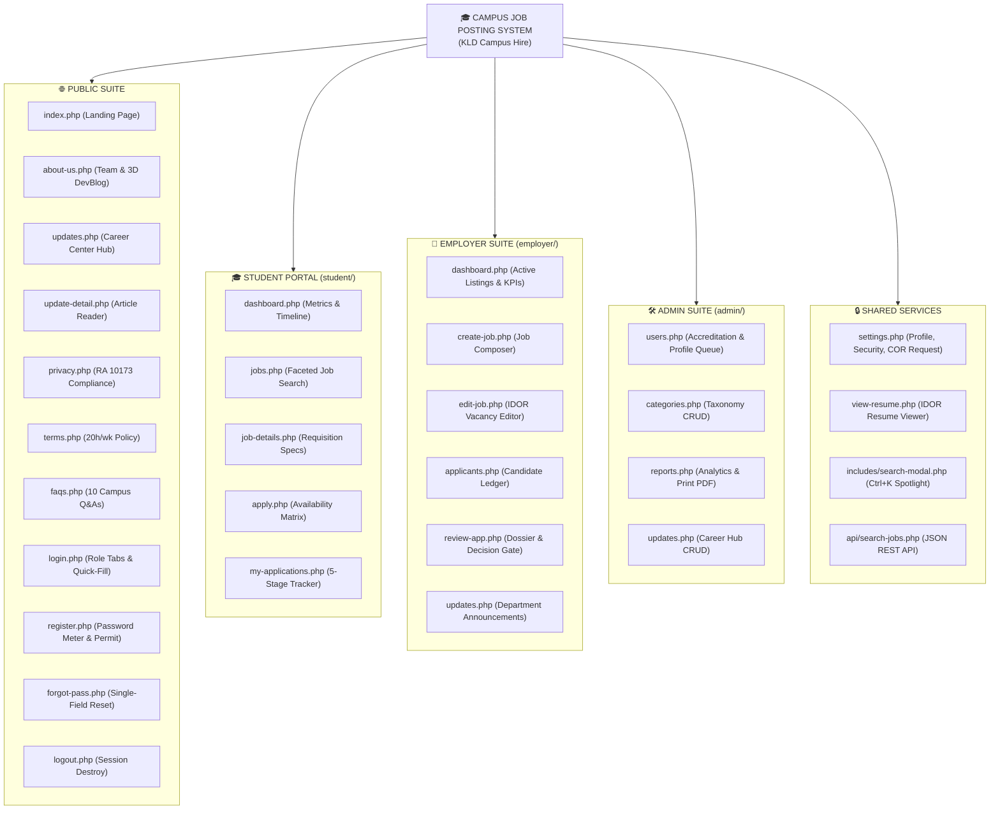

# 🎓 Campus Job Posting System — System Blueprint & Project Draft

[[COAL101 Notes MOC|◀ COAL101 Notes MOC]] · [[../1st SEM Notes MOC|🗓️ 1st Sem MOC]] · [[Campus Job Posting System - System Architecture & User Process Mapping|🗺️ System Architecture & Process Mapping]]

---

> [!abstract] 📌 Executive Summary
> The **Campus Job Posting System** (KLD Campus Hire) is an institutional web platform designed for **Kolehiyo ng Lungsod ng Dasmariñas (KLD)** to connect students with on-campus employment opportunities (e.g., Student Assistants, Office Clerks, IT Lab Assistants, Library Aides, Peer Tutors, and approved campus-affiliated employers). 
> 
> The platform streamlines job discovery, weekly schedule availability matching, application submission, multi-stage status tracking, employer candidate evaluation, administrative accreditation, institutional analytics, and a centralized Career Center updates hub.

> [!important] ⚠️ Technical & Environmental Constraints
> * **Approved Tech Stack:** ==Native PHP 8.2== (Modular Architecture), ==Bootstrap 5.3== (Local Assets / CDN) + ==Bootstrap Icons==, and ==Vanilla JavaScript (ES6)==.
> * **Database Constraint:** ==NO DATABASE / NO XAMPP MySQL YET==. All dynamic features, session persistence, and data rendering rely on ==PHP Sessions (`$_SESSION`)==, ==Flat-File JSON datastores (`data/*.json` backed by `data/.htaccess`)==, and structured PHP helper functions (`includes/data-helper.php`).
> * **Aesthetic Theme:** ==Tactile Paper Sheet Design System== (Warm neutrals `#f8f7f2`, subtle paper borders, elevated card stacks, and KLD institutional green `#0d5c3a` / gold accents).
> * **Project Deadline:** ==September 2, 2026== (Strict 7-day sprint).
> * **Development Team:** ==6 Members (BSIS201 — ICDI)==.

---

## 🧭 System Architecture & Site Map



---

## 📑 Core Module Specifications & Page Requirements

### 1. 🌐 Public & Informational Pages

#### 1.1 🏠 Index / Landing Page (`index.php`)
* **Hero Section & Multi-Role CTA:** Dynamic headline (*"Empowering Students, Supporting Campus Offices"*), quick spotlight search trigger (`Ctrl+K`), direct call-to-action buttons (*"Find Opportunities"* & *"Post a Vacancy"*), and live developer team avatar badge.
* **Key Metrics Strip:** Total Active Postings, Partnered Campus Offices, Students Hired to date, Average Hourly Pay.
* **Featured Job Postings:** Curated card grid with priority badges (*Student Assistant*, *Part-time*, *Flexible Schedule*, *Urgent*, *Featured Opportunity*).
* **KLD Bento Grid Category Explorer:** Visual interactive department bento cards (IT & Tech Support, Library Services, Registrar, Student Affairs, Laboratories, Academic Peer Tutors) with live position counters.
* **Treasure Map Journey:** 3-step visual onboarding guide illustrating the student assistantship lifecycle (*Discover -> Apply with Schedule -> Get Hired & Work*).
* **Differentiated Value Proposition:** Dual benefit showcase detailing why students gain valuable experience without sacrificing academics and why campus offices gain dependable student talent.
* **Universal Footer:** Quick links, institutional accreditation, social channels, Data Privacy & Terms links.

---

#### 1.2 👥 About Us / Developers & 3D DevBlog Section (`about-us.php`)
> [!tip] 📸 Developer Photo Specifications Compliance
> * **Standard:** Clean, high-resolution 1:1 square or 3:4 portrait photo.
> * **Attire:** Formal KLD Green blazer / semi-formal campus attire.
> * **Rules:** ==Strictly no accessories== (No sunglasses, caps, casual beanies, bulky headphones, or facial stickers). Neutral background.

* **Developer Profile Cards (6 Members):**
  1. **Bustamante, Alwinson (Lead System Architect & Core Backend):** System routing, session state engine, IDOR guards, datastore helpers, architecture blueprint.
  2. **Baco, Nico (Public Suite & Legal Compliance Specialist):** Landing page, Treasure Map journey, Data Privacy Policy, Terms of Service.
  3. **Cruzpe, Julius Robert (Authentication & Client Validation Engineer):** Login, multi-role registration, real-time JS password strength evaluator, forgot password flow.
  4. **Layco, Andrei Von Breydan (Student Portal & Application Flow Engineer):** Student dashboard, job filter catalog, requisition details, application modal with weekly schedule matrix, application tracker.
  5. **Salognon, Joeven (Department & Hiring Workflow Engineer):** Employer dashboard, requisition composer/editor, candidate roster, applicant evaluation drawer, employer updates hub.
  6. **Jurado, Marl Jordan (System Administration & QA Lead):** Category taxonomy, user directory & partner accreditation, printable analytics reports, E2E Playwright test suite.
* **3D Stage Coverflow DevBlog & Daily Chronicles:** Interactive CSS 3D perspective stage displaying Alwinson's daily engineering devlogs loaded from `data/devblogs.json`, complete with development timeline, design philosophy, and architecture reflections.
* **Tech Stack Badges:** Native PHP 8.2, Bootstrap 5.3, Custom Paper CSS3, JavaScript ES6, Flat-File JSON Datastore.

---

#### 1.3 📰 Career Center Updates Hub & Article Reader (`updates.php`, `update-detail.php`)
* **Updates Catalog (`updates.php`):**
  * Multi-category filtering (*All, News, Career Tips, System Updates, Employer Notices*).
  * Featured article banner highlighting key institutional deadlines and hiring announcements.
  * Search bar for filtering update titles, summaries, and tags.
  * Card grid with publishing dates, estimated read time, author badge, and category tags.
  * Client-side & server-side pagination controls.
* **Full Article Reader (`update-detail.php`):**
  * Full article typography, author metadata, publish timestamp, and rich text content.
  * Related articles recommendation rail.
  * Social sharing helpers and back navigation to the Updates Hub.

---

#### 1.4 🔒 Data Privacy Policy (`privacy.php`)
* **Compliance:** Full statutory alignment with the Philippine **Data Privacy Act of 2012 (Republic Act No. 10173)**.
* **Collected Information:** Student ID Number, Full Name, Institutional Email (`@kld.edu.ph`), Degree Program & Year Level, Resume Document, Weekly Availability Shift Matrix, Academic Standing.
* **Purpose of Collection:** Internal evaluation for campus student assistantships and department office staffing.
* **Data Subject Rights:** Right to access, correct, delete application information, and withdraw active applications.
* **Designated DPO Contact:** University Data Protection Officer contact email and ICDI office location.

---

#### 1.5 📜 Terms of Service (`terms.php`)
* **Eligibility Clause:** Currently enrolled bona fide KLD students in good academic standing.
* **20 Hours/Week Labor Regulation:** Strict maximum of **20 hours per week** during active semesters to safeguard academic priorities (expandable to 40 hrs/wk during semester breaks).
* **Employer Obligations:** Accurate job requisitions, fair stipend disbursement, flexible scheduling during midterm/final examination weeks.
* **Code of Conduct:** Zero tolerance for credential misrepresentation, ghost attendance, or harassment.

---

#### 1.6 ❓ Frequently Asked Questions (`faqs.php` — 10 Q&As)
* Comprehensive searchable Bootstrap 5 accordion covering eligibility, labor limits, concurrent assistantship policies, payment disbursement schedules, exam period adjustments, required application documents, employer posting rules, and password recovery.

---

### 2. 🔐 Authentication & Security Suite

```
  ┌────────────────────────────────────────────────────────────────────────┐
  │                           AUTHENTICATION FLOWS                         │
  ├────────────────────────────────────┬───────────────────────────────────┤
  │ Registration                       │ Login                             │
  │ • Student / Dept / Partner Role    │ • Institutional Email             │
  │ • Conditional Dynamic Form Inputs  │ • Password + Toggle Show/Hide     │
  │ • Business Permit Upload (Partner) │ • Role Selector Tab               │
  │ • Password + Real-time JS Meter    │ • "Remember Me" Checkbox          │
  │ • Confirm Password Validation      │ • Demo Account Quick-Fill Helpers │
  └────────────────────────────────────┴───────────────────────────────────┘
```

#### 2.1 🔑 Login & Logout (`login.php`, `logout.php`)
* **Role Switcher Tabs:** Seamless toggle between `[ Student Sign In ]` and `[ Campus Employer / Admin Sign In ]`.
* **Demo Quick-Fill Helpers:** One-click test credential chips for quick evaluation (`Student`, `Employer`, `Admin`).
* **Validation & Security:** Bcrypt verification (`password_verify`), CSRF session token initialization, and error state alerts.
* **Logout (`logout.php`):** Clears `$_SESSION`, invalidates cookies, and redirects with confirmation message.

---

#### 2.2 📝 Registration Gateway (`register.php`)
* **Multi-Role Registration Selector:**
  1. **Student Assistant:** Student ID, Full Name, Course/Year, `@kld.edu.ph` email.
  2. **University Office:** Office Name, Department, Office Location, `@kld.edu.ph` email (Automatically receives `verified` status).
  3. **Approved Partner Employer:** Company Name, Industry, Business Permit Number & Document Upload (Placed in `pending_approval` queue for Admin review).
* **Dynamic Password Strength Algorithm (`assets/js/password-strength.js`):**
  * Evaluates 5 criteria: Minimum 8 characters, Uppercase (`[A-Z]`), Lowercase (`[a-z]`), Numbers (`[0-9]`), and Symbols (`[!@#$%^&*]`).
  * Visual progress bar: 🔴 **Weak** (<40%), 🟡 **Medium** (40%-75%), 🟢 **Strong** (>75%).
  * Prevents form submission if passwords do not match or requirements are unmet.

---

#### 2.3 ❓ Forgot Password Page (`forgot-pass.php`)
> [!important] 🎯 Strict Minimalist Requirement
> * **Single Visible Input:** Institutional Email Address input field only.
> * **Anti-Enumeration Protection:** Displays generic success notice regardless of email existence: *"If an account exists with this email, password reset instructions have been dispatched."*

---

### 3. 🎓 Student Experience & Job Application Suite

```
  ┌──────────────┐     ┌──────────────┐     ┌──────────────┐     ┌──────────────┐
  │   Student    │ ──> │ Browse Jobs  │ ──> │ View Details │ ──> │    Apply     │
  │  Dashboard   │     │ (Live Filter)│     │ & Schedule   │     │ (Shift Grid) │
  └──────┬───────┘     └──────────────┘     └──────────────┘     └──────┬───────┘
         │                                                              │
         └───────────────────> My Applications <────────────────────────┘
                               (5-Stage Tracker)
```

#### 3.1 📊 Student Dashboard (`student/dashboard.php`)
* **Personalized Welcome:** Student Name, Student ID number, Enrolled College/Program.
* **Metrics Counters:** Total Applications, In Review, Scheduled Interviews, Accepted Offers.
* **Recommended Requisitions:** Vacancies matching student's department.
* **Activity Timeline:** Real-time chronological status change logs.

#### 3.2 🔍 Browse Campus Vacancies (`student/jobs.php`)
* Multi-facet live filter bar: Keyword search, Category dropdown, Department filter, Work Setup (On-Campus, Hybrid, Remote), Pay Type, Employer Type, Sort order.
* Job cards with slot progress bar, hourly compensation, location, and deadline badges.

#### 3.3 📄 Requisition Specifications (`student/job-details.php`)
* Comprehensive vacancy overview: Duties, qualifications, duty shifts, supervisor contact, office location, slots filled indicator, and dynamic CTA button.

#### 3.4 📥 Apply with Weekly Availability Matrix (`student/apply.php`)
* Cover Letter textarea.
* Contact phone number.
* **Weekly Availability Matrix:** Interactive shift grid (Monday through Saturday across *Morning 8AM-12PM*, *Afternoon 1PM-5PM*, *Evening 5PM-8PM*) to ensure zero academic conflicts.
* PDF Resume upload simulation.
* Guarded against employer/admin roles.

#### 3.5 📋 My Applications & Status Tracker (`student/my-applications.php`)
* 5-Stage visual progress stepper:
  * 🟡 `Pending Review`
  * 🔵 `Under Evaluation`
  * 🟣 `Interview Scheduled` (Shows date, time, venue / Zoom meeting link)
  * 🟢 `Accepted / Hired`
  * 🔴 `Declined / Position Filled`
  * ⚪ `Withdrawn`
* Application withdrawal trigger for pending submissions.
* Direct link to inspect submitted resume (`view-resume.php`).

---

### 4. 🏢 Campus Employer & Office Administration Suite

#### 4.1 📊 Employer Dashboard (`employer/dashboard.php`)
* Department banner with accreditation badge.
* KPI metrics: Active Postings, Total Candidates, Pending Reviews, Hired SAs.
* Quick actions & active vacancies ledger with direct edit and candidate roster links.

#### 4.2 ➕ Create & Edit Requisition (`employer/create-job.php`, `employer/edit-job.php`)
* Requisition form: Title, Category, Department, Vacancy Slots, Compensation Rate/Type, Max Hours/Week (capped at 20h), Minimum Year Level, Application Deadline, Banner Image Upload, Description, Requirements, and **Featured Opportunity Toggle** (`is_featured`).
* **IDOR Authorization Guard:** `can_manage_job($job_id, $user)` prevents cross-department vacancy tampering.

#### 4.3 👥 Applicant Roster & Candidate Drawer (`employer/applicants.php`, `employer/review-app.php`)
* Filterable roster by job title and hiring stage.
* Detailed candidate dossier in `review-app.php`: Cover letter, candidate availability shift heatmap, resume link.
* **3-Way Decision Controls:**
  1. `[ Shortlist for Interview ]` -> Schedule Date, Time, Venue/Zoom link -> Sets status to `interview_scheduled`.
  2. `[ Accept / Hire Candidate ]` -> Updates status to `accepted` and increments `slots_filled` in `jobs.json`.
  3. `[ Decline Application ]` -> Sets status to `declined` with customizable notes.
* **IDOR Authorization Guard:** `can_review_application($app_id, $user)` blocks unauthorized access.

#### 4.4 📢 Employer Updates Manager (`employer/updates.php`)
* Departmental announcement and hiring call publisher.

---

### 5. 🛠️ System Administration, Analytics & Settings

#### 5.1 👤 User Directory & Accreditation (`admin/users.php`)
* Complete user management table with role filters and account status toggles (`Active` / `Suspended`).
* **Partner Employer Accreditation Queue:** Inspect business permits/DTI/SEC proof and execute approval/rejection.
* **Student Profile Change Requests Queue:** Review student requests to update locked academic fields (Course, Year, Student ID) backed by Certificate of Registration (COR) documents.
* **Security:** All administrative actions use POST with CSRF token verification (`verify_csrf_token()`).

#### 5.2 🏷️ Category Taxonomy Management (`admin/categories.php`)
* Job category management, add category modal with Bootstrap Icon selector, active status toggle.

#### 5.3 📈 Institutional Analytics & Printable Reports (`admin/reports.php`)
* Hiring quota fulfillment gauges, in-demand categories charts, department distribution tables, stipend expense projections.
* Dedicated print stylesheet triggered via `window.print()` for institutional board presentations.

#### 5.4 📰 Admin Updates Manager (`admin/updates.php`)
* Full CRUD for system updates, campus news, and career tips published to the Updates Hub.

#### 5.5 ⚙️ Universal Settings & Profile Locking (`settings.php`)
* **Tab 1:** Profile and contact details editing + weekly availability shift matrix.
* **Tab 2:** Password change requiring current password verification before rehashing with Bcrypt.
* **Tab 3 (Students):** Official profile change request form with COR document upload.

#### 5.6 🔎 Universal Spotlight Search Modal (`includes/search-modal.php`)
* Floating keyboard-driven spotlight search (`Ctrl+K` / search trigger) querying `api/search-jobs.php` with real-time debounced results.

#### 5.7 📄 Secure Resume Viewer (`view-resume.php`)
* IDOR-protected document viewer (`can_view_student_resume()`) restricting access to student self, hiring employer, or admin.

---

## 🗄️ Database-Less Architecture & Directory Structure

```
Campus-Job-Posting-System/
├── assets/
│   ├── css/
│   │   ├── bootstrap.min.css
│   │   ├── custom.css          <-- Paper Sheet Design System & Component Themes
│   │   └── style.css
│   ├── js/
│   │   ├── bootstrap.bundle.min.js
│   │   ├── password-strength.js <-- 5-tier dynamic password evaluator
│   │   └── main.js             <-- Double-submit debounce, search modal, tooltips
│   └── img/
│       ├── logo.png
│       ├── favicon.svg         <-- Institutional brand favicon
│       └── developers/         <-- 6 Formal Developer Portraits
│           ├── BUSTAMANTE.jpg
│           ├── BACO.jpg
│           ├── CRUZPE.jpg
│           ├── LAYCO.jpg
│           ├── SOLOGNON.jpg
│           └── JURADO.jpg
├── includes/
│   ├── header.php
│   ├── navbar.php              <-- Adaptive role-based navigation & mobile drawer
│   ├── footer.php
│   ├── search-modal.php        <-- Floating Spotlight search modal (Ctrl+K)
│   ├── components.php          <-- Reusable UI badges, cards, page heads
│   ├── data-helper.php         <-- JSON engine, IDOR contracts, CSRF helpers
│   └── auth-check.php          <-- RBAC session middleware
├── data/
│   ├── .htaccess               <-- Web server lockdown (Require all denied)
│   ├── users.json              <-- Students, Offices, Partners, Admins
│   ├── jobs.json               <-- Requisitions with slots and featured flags
│   ├── applications.json       <-- Applications, availability, and decisions
│   ├── categories.json         <-- Category taxonomy
│   ├── updates.json            <-- Career Center updates & articles
│   ├── devblogs.json           <-- 3D Coverflow Developer daily chronicles
│   └── profile_requests.json   <-- Student academic profile change queue
├── uploads/
│   ├── .htaccess               <-- Script execution prevention
│   ├── resumes/                <-- Candidate PDF resumes
│   ├── permits/                <-- Employer business permits
│   └── proofs/                 <-- Student COR verification files
├── student/
│   ├── dashboard.php
│   ├── jobs.php
│   ├── job-details.php
│   ├── apply.php
│   └── my-applications.php
├── employer/
│   ├── dashboard.php
│   ├── create-job.php
│   ├── edit-job.php
│   ├── applicants.php
│   ├── review-app.php
│   └── updates.php
├── admin/
│   ├── users.php
│   ├── categories.php
│   ├── reports.php
│   └── updates.php
├── api/
│   └── search-jobs.php         <-- Type-guarded JSON search API
├── tests/
│   └── e2e/                    <-- Playwright automated test suite (100+ assertions)
│       ├── security.spec.ts
│       ├── employer.spec.ts
│       ├── admin.spec.ts
│       ├── student.spec.ts
│       ├── smoke.spec.ts
│       ├── e2e-regression.spec.ts
│       ├── comprehensive-audit.spec.ts
│       └── half-screen.spec.ts
├── favicon.svg                 <-- Root brand SVG favicon
├── index.php
├── about-us.php
├── updates.php
├── update-detail.php
├── privacy.php
├── terms.php
├── faqs.php
├── login.php
├── register.php
├── forgot-pass.php
├── settings.php
├── view-resume.php
└── logout.php
```

---

## 👥 6-Member Team Deliverables Matrix (WBS)

| Member | Assigned Role & ID | Primary Deliverables & Codebase Ownership |
| :--- | :--- | :--- |
| **Bustamante, Alwinson** | **Lead System Architect & Core Backend**<br>`2025-2-000065` | • `includes/header.php`, `navbar.php`, `footer.php`<br>• `includes/data-helper.php` (JSON engine, IDOR contracts, CSRF)<br>• Universal architecture, routing, session security, and blueprint |
| **Baco, Nico** | **Public Suite & Legal Compliance Specialist**<br>`2025-2-000032` | • `index.php` (Landing page, Bento Grid, Treasure Map journey)<br>• `about-us.php` (Developer showcase & mission)<br>• `privacy.php` (RA 10173 clauses) & `terms.php` (20h/wk policy) |
| **Cruzpe, Julius Robert** | **Authentication & Client Validation Engineer**<br>`2025-2-000091` | • `login.php` & `logout.php` (Multi-role authentication)<br>• `register.php` (Dynamic role inputs & permit upload)<br>• `assets/js/password-strength.js` & `forgot-pass.php` |
| **Layco, Andrei Von Breydan** | **Student Portal & Flow Engineer**<br>`2025-2-000176` | • `faqs.php` (10 interactive campus Q&As)<br>• `student/dashboard.php` & `student/jobs.php` (Live filter)<br>• `student/job-details.php`, `student/apply.php`, `student/my-applications.php` |
| **Salognon, Joeven** | **Department & Hiring Workflow Engineer**<br>`2025-2-000269` | • `employer/dashboard.php`, `employer/create-job.php`, `employer/edit-job.php`<br>• `employer/applicants.php` & `employer/review-app.php`<br>• `employer/updates.php` (Department announcements) |
| **Jurado, Marl Jordan** | **System Administration & QA Lead**<br>`2025-2-000166` | • `admin/users.php`, `admin/categories.php`, `admin/reports.php`<br>• `admin/updates.php` (Career Center update management)<br>• Automated Playwright test suite (`tests/e2e/`), cross-browser audit |

---

## 📅 7-Day Sprint Roadmap & Implementation Milestones

```
Day 1 (Aug 26)  ━━━> Project Setup, Blueprint Approval, Shared Layouts (Navbar/Footer)
Day 2 (Aug 27)  ━━━> Public Suite: Index, About Us, Privacy Policy, Terms, 10 FAQs
Day 3 (Aug 28)  ━━━> Auth Suite: Login, Register + JS Password Meter, Forgot Password
Day 4 (Aug 29)  ━━━> Student Suite: Dashboard, Job Search, Job Details, Availability Matrix & Apply Flow
Day 5 (Aug 30)  ━━━> Employer Suite: Dashboard, Job Composer, IDOR-Guarded Review & Interview Decision Flow
Day 6 (Aug 31)  ━━━> Admin & Reporting: User Directory, Accreditation Queue, Category Taxonomy, Printable Reports
Day 7 (Sep 01)  ━━━> Updates Hub, 3D DevBlog Coverflow, Spotlight Search Modal, E2E Security Hardening & Polish
D-Day (Sep 02)  ━━━> 🚀 FINAL SUBMISSION, DEMO PRESENTATION & CODEBASE HANDOVER
```

---

## ✅ Quality Assurance & Security Checklist

- [x] **Bootstrap 5 UI Responsiveness:** Verified on mobile (375px), tablet (768px), desktop split/half-screen (680px-960px), and wide desktop (1200px+).
- [x] **No Database Dependency:** Verified without MySQL/XAMPP database — session & flat-file JSON datastore fully functional.
- [x] **Developer Photos Verified:** All 6 developer images are formal, clear, wearing green institutional blazers, free of accessories.
- [x] **Auth Validation:** Password strength meter accurately verifies lowercase, uppercase, digits, symbols, and length.
- [x] **Forgot Password Layout:** Strictly single institutional email field with anti-enumeration response.
- [x] **10 FAQs:** Interactive accordion answering 10 university employment questions.
- [x] **IDOR & CSRF Security:** Zero unauthorized parameter tampering across jobs, applicant reviews, and resumes; anti-CSRF token verification on all POST actions.
- [x] **Automated Testing:** 100% pass rate across full Playwright E2E test suite (100+ assertions across 9 test specifications).
