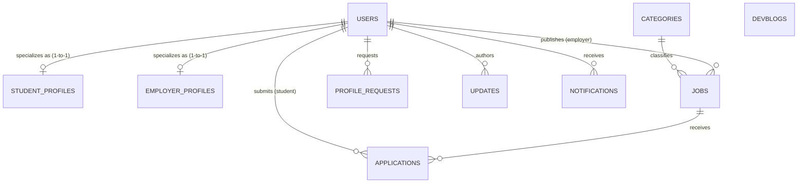
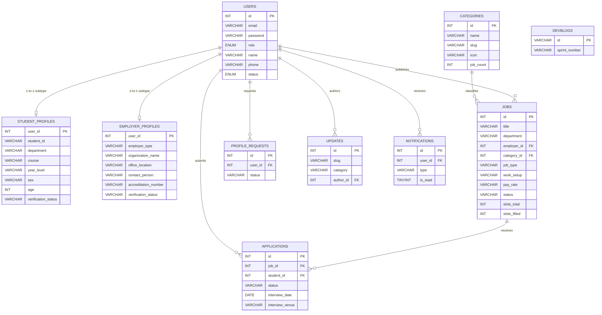
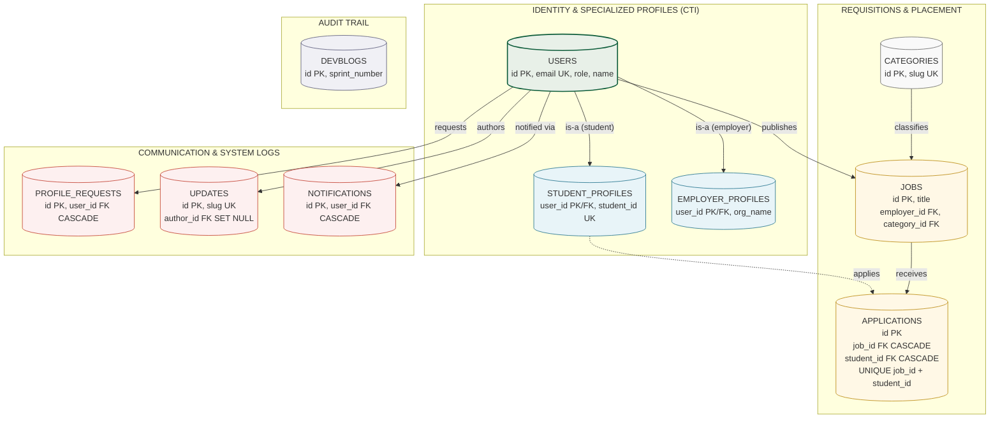

<div align="center">

# Web-Based Campus Job Posting and Application Tracking System for Kolehiyo ng Lungsod ng Dasmariñas (KLD Campus Hire)

**KISS STUDY**

Bustamante, Alwinson<br>
Baco, Nico<br>
Cruzpe, Julius Robert<br>
Jurado, Marl Jordan<br>
Layco, Andrei Von Breydan<br>
Salognon, Joeven

</div>

---

## Objective of the Study

<p align="justify">To design and develop a web-based Campus Job Posting and Application Tracking System for Kolehiyo ng Lungsod ng Dasmariñas (KLD Campus Hire) that automates on-campus job discovery, application submission, candidate evaluation, and administrative accreditation through a Native PHP 8.2 and MySQL/MariaDB application. The system implements a full multi-role authentication mechanism that supports three verified roles, Student, Employer (University Office / Approved Partner), and Admin, to control access to system features, ensuring that sensitive functions such as job creation, applicant review, user accreditation, and institutional reports remain restricted by centralized authorization contracts in <code>includes/data-helper.php</code> (<code>can_manage_job()</code>, <code>can_review_application()</code>, <code>can_view_student_resume()</code>) combined with CSRF token verification (<code>verify_csrf_token()</code>), Bcrypt password hashing, and <code>@kld.edu.ph</code> institutional domain validation. It also designs and implements a requisition composer module that allows verified employers to publish vacancies with title, category, department, vacancy slots, compensation rate and type, maximum 20 hours per week, application deadline, banner image (which dynamically highlights the posting as a featured opportunity), description, responsibilities, and qualifications, while recording each posting under the <code>jobs</code> table linked to <code>users</code> and <code>categories</code>.</p>

<p align="justify">The system creates a student portal module that maintains applicant profiles, including student ID number, full name, institutional email, degree program and year level, contact phone, weekly availability shift matrix, and resume document, with built-in validations to prevent duplicate applications, enforce the statutory 20-hour weekly cap on job creation, and restrict unauthorized role access, while supporting application withdrawal that immediately releases quota slots back to fellow students. It integrates a dashboard and application tracking feature that provides real-time summaries of total applications, in-review counts, scheduled interviews, and accepted offers, with a 4-step visual progress stepper (Pending Review, Under Evaluation, Interview Scheduled, Accepted / Hired, with a terminal Declined / Filled state), interview schedule details with date, time, and venue or online meeting link, and direct resume inspection via an IDOR-protected viewer. These features collectively ensure that the student has full visibility over hiring status and schedule compatibility at all times.</p>

<p align="justify">The system implements employer review and system administration functionalities that record all job postings, applications, profile change requests, announcements, and notifications, stored in the <code>jobs</code>, <code>applications</code>, <code>profile_requests</code>, <code>updates</code>, and <code>notifications</code> tables, support filtering by job title, hiring stage, category, and department, and display detailed candidate dossiers with cover letter, availability heatmap, and resume link to facilitate fair evaluation and performance analysis. It also designs a user-friendly, responsive graphical user interface using server-side rendered HTML5 with Bootstrap 5.3 and a Tactile Paper Sheet Design System with clear navigation, adaptive role-based navbar, Spotlight search modal (<code>Ctrl+K</code> via <code>api/search-jobs.php</code>), and printable institutional analytics, improving usability for non-technical students, office staff, and administrators. Together, these functionalities discuss the purpose of the system, to serve as a practical, all-in-one management tool tailored to the day-to-day campus employment operations of KLD.</p>

---

## Scope and Limitation

This study focuses on the design and development of a web-based Campus Job Posting and Application Tracking System specifically tailored for a single academic institution, Kolehiyo ng Lungsod ng Dasmariñas (KLD). The system is implemented using Native PHP 8.2 with modular request handling for the application layer and MySQL/MariaDB with PDO for the relational database backend (`campus_job_portal`), with Bootstrap 5.3, Bootstrap Icons, and Vanilla JavaScript (ES6) for the presentation layer.

### Scope

* The system can automate job requisition publishing, vacancy slot tracking (`slots_total` / `slots_filled`), and category taxonomy management with live position counters for a single KLD campus.
* The system is able to process student applications with cover letter, contact details, weekly availability matrix (Monday to Saturday across Morning 8AM–12NN, Afternoon 1PM–5PM, Evening 5PM–8PM), and resume upload while recording submissions in the `applications` table with a `UNIQUE(job_id, student_id)` guard against duplicates.
* The system can generate student dashboards with application metrics and activity timelines, employer dashboards with active listings and hiring KPIs, and admin analytics with quota fulfillment, in-demand categories, department distribution, and stipend projections with print stylesheet support.
* The system provides history and review modules that allow filtering applicant rosters by job and hiring stage, with detailed candidate dossiers, multi-stage evaluation decision controls (Shortlist & Schedule Interview, Accept & Officially Hire, Decline / Position Filled with supervisor notes), and automatic slot increment on hire for review and performance analysis.
* The system implements full role-based access control with a dedicated `users` table (student, employer, admin), accreditation queues for partner employers (business permit inspection) and student profile change requests (COR proof), with IDOR guards and CSRF protection on all state-changing POST actions without requiring an external identity provider.
* The system provides shared services including Career Center updates hub with article reader, universal Spotlight search, secure resume viewer, notifications center, and multi-role registration with conditional inputs and real-time password strength evaluation.

To maintain feasibility for implementation and align with the course's time and resource constraints, the study is limited by the following considerations:

### Limitations

* The system cannot support multi-institution or multi-campus job consolidation with separate labor policies; it is designed exclusively for a single KLD institution with a statutory 20 hours per week cap (40 hours during breaks).
* The system is limited to web-browser operation over a PHP/MySQL/XAMPP stack; it does not provide offline desktop operation, native mobile application integration, or cloud auto-scaling beyond a single database instance.
* The system is limited to mouse-and-keyboard and file-upload input and does not integrate with hardware devices such as ID card scanners, biometric attendance terminals, or dedicated payroll disbursement hardware.
* The system cannot automate payroll payout, tax computation, or government benefits remittance, as compensation handling is limited to displayed pay rates, pay types, and stipend expense projections for planning.
* The system does not include advanced AI matching, automated resume parsing, or comprehensive human-resource information features such as employee contracts, performance appraisals, or alumni employment tracking; evaluation remains a human-supervised workflow with system-assisted filtering and status tracking.

---

## ER Diagram



*Figure 1. Conceptual ER Diagram — 10 normalized entities with Class Table Inheritance (CTI).*



*Figure 2. Logical Relational Diagram — primary keys, foreign keys, unique keys, and subtype specializations across 10 tables.*

<p align="justify">The Entity-Relationship architecture of the KLD Campus Job Posting System is rigorously designed in Third Normal Form (3NF) across ten discrete relational tables: <code>users</code>, <code>student_profiles</code>, <code>employer_profiles</code>, <code>categories</code>, <code>jobs</code>, <code>applications</code>, <code>profile_requests</code>, <code>updates</code>, <code>notifications</code>, and <code>devblogs</code>. To eliminate the proliferation of nullable attributes and polymorphic pollution in user storage, the architecture implements Class Table Inheritance (CTI). The base <code>users</code> table functions strictly as an identity and authentication supertype, holding shared credentials (<code>email</code>, <code>password</code> hash, <code>role</code>, <code>name</code>, <code>phone</code>, <code>status</code>). Specific domain roles specialize into dedicated 1-to-1 subtype tables, <code>student_profiles</code> and <code>employer_profiles</code>, where the primary key <code>user_id</code> simultaneously serves as a foreign key with cascading referential integrity. This ensures that student-only attributes (such as <code>student_id</code>, degree <code>course</code>, <code>year_level</code>, and weekly shift matrix) and employer-only attributes (such as <code>employer_type</code>, <code>organization_name</code>, <code>office_location</code>, and business permit proofs) are physically partitioned without leaving dozens of null fields.</p>

<p align="justify">In addition, the <code>applications</code> table is structured as a pure 3NF junction table resolving the many-to-many relationship between student candidates (<code>users</code>) and vacancy postings (<code>jobs</code>). Departing from legacy architectures that duplicated candidate profile and job title snapshots into application rows, the normalized schema eliminates all transitive and redundant column dependencies (such as candidate course, year level, phone, email, status labels, and job titles). Instead, live candidate and requisition data are dynamically joined at query time through indexed foreign keys (<code>job_id</code>, <code>student_id</code>) with a composite unique guard (<code>UNIQUE(job_id, student_id)</code>) preventing duplicate submissions. Similarly, redundant denormalizations in <code>jobs</code> (category names, employer company labels), <code>profile_requests</code> (snapshot user names and student numbers), and <code>updates</code> (hardcoded author names and office strings) have been fully refactored to relational foreign keys referencing canonical records, establishing a true single-source-of-truth data model.</p>

<p align="justify">Referential integrity across the ten entities is enforced via explicit foreign key constraints: deleting a job or user automatically cascades to associated applications (<code>ON DELETE CASCADE</code>) to prevent orphan records, while deleting an employer or category referenced by jobs safely preserves published job history by setting the foreign key to null (<code>ON DELETE SET NULL</code>). Audit trails and engineering chronologies (<code>devblogs</code>) remain structurally isolated from account lifecycles to ensure institutional permanence.</p>

---

## Parts of the ER Diagram

**USERS (Identity & Authentication Supertype)**

* One-to-One with `student_profiles` via `student_profiles.user_id` (subtype specialization for students)
* One-to-One with `employer_profiles` via `employer_profiles.user_id` (subtype specialization for employers)
* One-to-Many with `jobs` via `jobs.employer_id` (one employer can publish many vacancies)
* One-to-Many with `applications` via `applications.student_id` (one student can submit many applications)
* One-to-Many with `profile_requests` via `profile_requests.user_id` (one user can file many COR correction requests)
* One-to-Many with `updates` via `updates.author_id` (one admin or employer can author many announcements)
* One-to-Many with `notifications` via `notifications.user_id` (one user can receive many notifications)

**STUDENT_PROFILES (Student Subtype, 1-to-1 with USERS)**

* One-to-One with `users` via `user_id` PK/FK (`ON DELETE CASCADE`)
* Stores student academic credentials: `student_id` (UNIQUE), `department`, `course`, `year_level`, `sex`, `birthdate`, `age`, `availability` (JSON weekly timeslot matrix), and `verification_status`

**EMPLOYER_PROFILES (Employer Subtype, 1-to-1 with USERS)**

* One-to-One with `users` via `user_id` PK/FK (`ON DELETE CASCADE`)
* Stores campus office or industry partner attributes: `employer_type` (`university_office` or `approved_partner`), `organization_name`, `office_location`, `contact_person`, `accreditation_number`, and `business_permit`

**CATEGORIES (Taxonomy)**

* One-to-Many with `jobs` via `jobs.category_id` (one category classifies many job requisitions)

**JOBS (Requisition Header)**

* Many-to-One with `users` (each vacancy belongs to one publishing employer; `ON DELETE SET NULL`)
* Many-to-One with `categories` (each vacancy references one taxonomy entry; `ON DELETE SET NULL`)
* One-to-Many with `applications` via `applications.job_id` (one vacancy receives many applications)

**APPLICATIONS (Pure 3NF Junction Table)**

* Many-to-One with `jobs` via `job_id` (`ON DELETE CASCADE`)
* Many-to-One with `users` via `student_id` (`ON DELETE CASCADE`)
* Enforces `UNIQUE(job_id, student_id)` to prevent duplicate submissions per student per vacancy

**PROFILE_REQUESTS (Governance Queue)**

* Many-to-One with `users` via `user_id` (`ON DELETE CASCADE`)
* Stores requested profile changes, proof documents, review status, and administrative resolution timestamps

**UPDATES (Career Center News & Announcements)**

* Many-to-One with `users` via `author_id` (`ON DELETE SET NULL` to preserve historical dispatches upon author deletion)

**NOTIFICATIONS (System Delivery Log)**

* Many-to-One with `users` via `user_id` (`ON DELETE CASCADE`)
* Manages user-targeted alerts, unread counts, action links, and visual severity badges

**DEVBLOGS (Engineering Sprint Audit Trail)**

* Standalone chronicle repository (`id`, `sprint_number`, `sprint_title`, `daily_logs` JSON) intentionally decoupled from user accounts for persistent development auditing.

---

## Database Table



*Figure 3. Relational table architecture — Class Table Inheritance, pure 3NF junction placement, and isolated audit trail.*

### 1. USERS

| USERS | Attribute |
|---|---|
| Primary Key | `id` |
| Unique Key | `email` |
| Simple attribute | `password` (Bcrypt hash) |
| Simple attribute | `role` (student / employer / admin) |
| Simple attribute | `name` |
| (nullable) attribute | `phone` |
| Simple attribute | `status` (active / suspended) |
| Simple attribute | `created_at` |
| Simple attribute | `updated_at` |

### 2. STUDENT_PROFILES

| STUDENT_PROFILES | Attribute |
|---|---|
| Primary Key / Foreign Key | `user_id` → `users.id` (CASCADE) |
| Unique Key | `student_id` (Institutional ID) |
| Simple attribute | `department` |
| Simple attribute | `course` |
| Simple attribute | `year_level` |
| (nullable) attribute | `sex` |
| (nullable) attribute | `birthdate` |
| (nullable) attribute | `age` |
| (nullable) attribute | `availability` (JSON shift matrix) |
| Simple attribute | `verification_status` (verified / pending_approval / rejected) |
| (nullable) attribute | `rejection_reason` |
| (nullable) attribute | `registration_proof` (COR file path) |
| Simple attribute | `created_at` |
| Simple attribute | `updated_at` |

### 3. EMPLOYER_PROFILES

| EMPLOYER_PROFILES | Attribute |
|---|---|
| Primary Key / Foreign Key | `user_id` → `users.id` (CASCADE) |
| Simple attribute | `employer_type` (university_office / approved_partner) |
| Simple attribute | `organization_name` |
| Simple attribute | `office_location` |
| (nullable) attribute | `contact_person` |
| (nullable) attribute | `accreditation_number` |
| Simple attribute | `verification_status` (verified / pending_approval / rejected) |
| (nullable) attribute | `rejection_reason` |
| (nullable) attribute | `business_permit` (Permit file path) |
| Simple attribute | `created_at` |
| Simple attribute | `updated_at` |

### 4. CATEGORIES

| CATEGORIES | Attribute |
|---|---|
| Primary Key | `id` |
| Simple attribute | `name` |
| Unique Key | `slug` |
| Simple attribute | `icon` (Bootstrap Icons class) |
| (nullable) attribute | `description` |
| Simple attribute | `theme` |
| (nullable) attribute | `badge_tag` |
| (nullable) attribute | `badge_icon` |
| Simple attribute (cached counter) | `job_count` |
| (nullable) attribute | `hourly_range` |
| (nullable) attribute | `image` |
| (nullable) attribute | `popular_roles` (JSON) |
| Simple attribute | `created_at` |
| Simple attribute | `updated_at` |

### 5. JOBS

| JOBS | Attribute |
|---|---|
| Primary Key | `id` |
| Simple attribute | `title` |
| Simple attribute | `department` |
| Foreign Key | `category_id` → `categories.id` (SET NULL) |
| Foreign Key | `employer_id` → `users.id` (SET NULL) |
| Simple attribute | `job_type` |
| Simple attribute | `work_setup` |
| (nullable) attribute | `location` |
| Simple attribute | `pay_rate` |
| Simple attribute | `pay_type` |
| Simple attribute | `hours_per_week` |
| Simple attribute | `vacancies` |
| Simple attribute | `slots_total` |
| Simple attribute (managed counter) | `slots_filled` |
| (nullable) attribute | `deadline` |
| Simple attribute | `status` (active / paused / closed / filled) |
| (nullable) attribute | `image` |
| (nullable) attribute | `tags` (JSON) |
| (nullable) attribute | `badges` (JSON) |
| (nullable) attribute | `description` |
| (nullable) attribute | `responsibilities` (JSON) |
| (nullable) attribute | `qualifications` (JSON) |
| Simple attribute | `created_at` |
| Simple attribute | `updated_at` |

### 6. APPLICATIONS

| APPLICATIONS | Attribute |
|---|---|
| Primary Key | `id` |
| Foreign Key | `job_id` → `jobs.id` (CASCADE) |
| Foreign Key | `student_id` → `users.id` (CASCADE) |
| (nullable) attribute | `cover_letter` |
| (nullable) attribute | `availability` (JSON candidate schedule) |
| (nullable) attribute | `resume_file` |
| (nullable) attribute | `study_load_file` |
| Simple attribute | `status` (pending / under_review / interview_scheduled / accepted / declined) |
| (nullable) attribute | `interview_date` |
| (nullable) attribute | `interview_time` |
| (nullable) attribute | `interview_venue` |
| (nullable) attribute | `supervisor_notes` |
| Simple attribute | `applied_at` |
| Simple attribute | `updated_at` |
| Unique (composite) | `UNIQUE(job_id, student_id)` |

### 7. PROFILE_REQUESTS

| PROFILE_REQUESTS | Attribute |
|---|---|
| Primary Key | `id` |
| Foreign Key | `user_id` → `users.id` (CASCADE) |
| (nullable) attribute | `current_profile` (JSON snapshot) |
| (nullable) attribute | `requested_profile` (JSON target changes) |
| (nullable) attribute | `proof_file` (COR document) |
| (nullable) attribute | `reason` |
| Simple attribute | `status` (pending / approved / rejected) |
| (nullable) attribute | `admin_notes` |
| Simple attribute | `dismissed_by_user` |
| Simple attribute | `created_at` |
| (nullable) attribute | `resolved_at` |

### 8. UPDATES

| UPDATES | Attribute |
|---|---|
| Primary Key | `id` |
| Unique Key | `slug` |
| Simple attribute | `title` |
| Simple attribute | `category` |
| Simple attribute | `published_at` |
| Simple attribute | `read_time` |
| Foreign Key | `author_id` → `users.id` (SET NULL) |
| (nullable) attribute | `author_avatar` |
| (nullable) attribute | `image` |
| (nullable) attribute | `summary` |
| (nullable) attribute | `content` |
| Simple attribute | `created_at` |
| Simple attribute | `updated_at` |

### 9. NOTIFICATIONS

| NOTIFICATIONS | Attribute |
|---|---|
| Primary Key | `id` |
| Foreign Key | `user_id` → `users.id` (CASCADE) |
| Simple attribute | `type` |
| Simple attribute | `title` |
| Simple attribute | `message` |
| (nullable) attribute | `link` |
| Simple attribute | `icon` |
| Simple attribute | `badge_color` |
| Simple attribute | `is_read` |
| Simple attribute | `created_at` |

### 10. DEVBLOGS

| DEVBLOGS | Attribute |
|---|---|
| Primary Key | `id` (VARCHAR, e.g. `day-14`) |
| Simple attribute | `sprint_number` |
| Simple attribute | `sprint_title` |
| (nullable) attribute | `sprint_dates` |
| (nullable) attribute | `sprint_focus` |
| (nullable) attribute | `daily_logs` (JSON) |
| Simple attribute | `created_at` |

---

## SQL Queries

> Full schema source: `database/schema.sql`. Full demo seeds: `database/seed_data.sql` and `database/migrate.php`. Samples below are shortened for paper readability; column order matches production.

```sql
CREATE DATABASE IF NOT EXISTS `campus_job_portal`
CHARACTER SET utf8mb4
COLLATE utf8mb4_unicode_ci;

USE `campus_job_portal`;
```

```sql
DROP TABLE IF EXISTS `notifications`;
DROP TABLE IF EXISTS `devblogs`;
DROP TABLE IF EXISTS `updates`;
DROP TABLE IF EXISTS `profile_requests`;
DROP TABLE IF EXISTS `applications`;
DROP TABLE IF EXISTS `jobs`;
DROP TABLE IF EXISTS `categories`;
DROP TABLE IF EXISTS `employer_profiles`;
DROP TABLE IF EXISTS `student_profiles`;
DROP TABLE IF EXISTS `users`;
```

```sql
CREATE TABLE IF NOT EXISTS `users` (
    `id` INT AUTO_INCREMENT PRIMARY KEY,
    `email` VARCHAR(191) NOT NULL UNIQUE,
    `password` VARCHAR(255) NOT NULL,
    `role` ENUM('student', 'employer', 'admin') NOT NULL,
    `name` VARCHAR(191) NOT NULL,
    `phone` VARCHAR(50) NULL,
    `status` ENUM('active', 'suspended') NOT NULL DEFAULT 'active',
    `created_at` DATETIME NOT NULL DEFAULT CURRENT_TIMESTAMP,
    `updated_at` DATETIME NOT NULL DEFAULT CURRENT_TIMESTAMP ON UPDATE CURRENT_TIMESTAMP,
    INDEX `idx_users_role` (`role`),
    INDEX `idx_users_status` (`status`)
) ENGINE=InnoDB DEFAULT CHARSET=utf8mb4 COLLATE=utf8mb4_unicode_ci;
```

```sql
CREATE TABLE IF NOT EXISTS `student_profiles` (
    `user_id` INT PRIMARY KEY,
    `student_id` VARCHAR(50) NOT NULL UNIQUE,
    `department` VARCHAR(255) NOT NULL,
    `course` VARCHAR(255) NOT NULL,
    `year_level` VARCHAR(50) NOT NULL,
    `sex` VARCHAR(20) NULL,
    `birthdate` DATE NULL,
    `age` INT NULL,
    `availability` LONGTEXT NULL,
    `verification_status` ENUM('verified', 'pending_approval', 'rejected') NOT NULL DEFAULT 'verified',
    `rejection_reason` TEXT NULL,
    `registration_proof` VARCHAR(255) NULL,
    `created_at` DATETIME NOT NULL DEFAULT CURRENT_TIMESTAMP,
    `updated_at` DATETIME NOT NULL DEFAULT CURRENT_TIMESTAMP ON UPDATE CURRENT_TIMESTAMP,
    INDEX `idx_sp_student_id` (`student_id`),
    INDEX `idx_sp_department` (`department`),
    INDEX `idx_sp_course` (`course`),
    INDEX `idx_sp_verification` (`verification_status`),
    CONSTRAINT `fk_student_user` FOREIGN KEY (`user_id`)
        REFERENCES `users` (`id`) ON DELETE CASCADE ON UPDATE CASCADE
) ENGINE=InnoDB DEFAULT CHARSET=utf8mb4 COLLATE=utf8mb4_unicode_ci;
```

```sql
CREATE TABLE IF NOT EXISTS `employer_profiles` (
    `user_id` INT PRIMARY KEY,
    `employer_type` ENUM('university_office', 'approved_partner') NOT NULL DEFAULT 'university_office',
    `organization_name` VARCHAR(255) NOT NULL,
    `office_location` VARCHAR(255) NOT NULL,
    `contact_person` VARCHAR(191) NULL,
    `accreditation_number` VARCHAR(100) NULL,
    `verification_status` ENUM('verified', 'pending_approval', 'rejected') NOT NULL DEFAULT 'verified',
    `rejection_reason` TEXT NULL,
    `business_permit` VARCHAR(255) NULL,
    `created_at` DATETIME NOT NULL DEFAULT CURRENT_TIMESTAMP,
    `updated_at` DATETIME NOT NULL DEFAULT CURRENT_TIMESTAMP ON UPDATE CURRENT_TIMESTAMP,
    INDEX `idx_ep_type` (`employer_type`),
    INDEX `idx_ep_org` (`organization_name`),
    INDEX `idx_ep_verification` (`verification_status`),
    CONSTRAINT `fk_employer_user` FOREIGN KEY (`user_id`)
        REFERENCES `users` (`id`) ON DELETE CASCADE ON UPDATE CASCADE
) ENGINE=InnoDB DEFAULT CHARSET=utf8mb4 COLLATE=utf8mb4_unicode_ci;
```

```sql
CREATE TABLE IF NOT EXISTS `categories` (
    `id` INT AUTO_INCREMENT PRIMARY KEY,
    `name` VARCHAR(191) NOT NULL,
    `slug` VARCHAR(191) NOT NULL UNIQUE,
    `icon` VARCHAR(100) NOT NULL DEFAULT 'bi-briefcase',
    `description` TEXT NULL,
    `theme` VARCHAR(50) NOT NULL DEFAULT 'kld-green',
    `badge_tag` VARCHAR(100) NULL,
    `badge_icon` VARCHAR(100) NULL,
    `job_count` INT NOT NULL DEFAULT 0,
    `hourly_range` VARCHAR(100) NULL,
    `image` VARCHAR(500) NULL,
    `popular_roles` LONGTEXT NULL,
    `created_at` DATETIME NOT NULL DEFAULT CURRENT_TIMESTAMP,
    `updated_at` DATETIME NOT NULL DEFAULT CURRENT_TIMESTAMP ON UPDATE CURRENT_TIMESTAMP,
    INDEX `idx_categories_slug` (`slug`)
) ENGINE=InnoDB DEFAULT CHARSET=utf8mb4 COLLATE=utf8mb4_unicode_ci;
```

```sql
CREATE TABLE IF NOT EXISTS `jobs` (
    `id` INT AUTO_INCREMENT PRIMARY KEY,
    `title` VARCHAR(255) NOT NULL,
    `department` VARCHAR(255) NOT NULL,
    `category_id` INT NULL,
    `employer_id` INT NULL,
    `job_type` VARCHAR(100) NOT NULL DEFAULT 'Student Assistant',
    `work_setup` VARCHAR(50) NOT NULL DEFAULT 'On-Campus',
    `location` VARCHAR(255) NULL,
    `pay_rate` VARCHAR(100) NOT NULL DEFAULT '₱85.00 / hour',
    `pay_type` VARCHAR(50) NOT NULL DEFAULT 'Hourly',
    `hours_per_week` VARCHAR(100) NOT NULL DEFAULT '15 - 20 hrs/week',
    `vacancies` INT NOT NULL DEFAULT 1,
    `slots_total` INT NOT NULL DEFAULT 1,
    `slots_filled` INT NOT NULL DEFAULT 0,
    `deadline` DATE NULL,
    `status` ENUM('active', 'paused', 'closed', 'filled') NOT NULL DEFAULT 'active',
    `image` VARCHAR(500) NULL,
    `tags` LONGTEXT NULL,
    `badges` LONGTEXT NULL,
    `description` LONGTEXT NULL,
    `responsibilities` LONGTEXT NULL,
    `qualifications` LONGTEXT NULL,
    `created_at` DATETIME NOT NULL DEFAULT CURRENT_TIMESTAMP,
    `updated_at` DATETIME NOT NULL DEFAULT CURRENT_TIMESTAMP ON UPDATE CURRENT_TIMESTAMP,
    INDEX `idx_jobs_category_id` (`category_id`),
    INDEX `idx_jobs_employer_id` (`employer_id`),
    INDEX `idx_jobs_status` (`status`),
    INDEX `idx_jobs_deadline` (`deadline`),
    INDEX `idx_jobs_job_type` (`job_type`),
    INDEX `idx_jobs_work_setup` (`work_setup`),
    CONSTRAINT `fk_jobs_category` FOREIGN KEY (`category_id`)
        REFERENCES `categories` (`id`) ON DELETE SET NULL ON UPDATE CASCADE,
    CONSTRAINT `fk_jobs_employer` FOREIGN KEY (`employer_id`)
        REFERENCES `users` (`id`) ON DELETE SET NULL ON UPDATE CASCADE
) ENGINE=InnoDB DEFAULT CHARSET=utf8mb4 COLLATE=utf8mb4_unicode_ci;
```

```sql
CREATE TABLE IF NOT EXISTS `applications` (
    `id` INT AUTO_INCREMENT PRIMARY KEY,
    `job_id` INT NOT NULL,
    `student_id` INT NOT NULL,
    `cover_letter` LONGTEXT NULL,
    `availability` LONGTEXT NULL,
    `resume_file` VARCHAR(255) NULL,
    `study_load_file` VARCHAR(255) NULL,
    `status` ENUM('pending', 'under_review', 'interview_scheduled', 'accepted', 'declined') NOT NULL DEFAULT 'pending',
    `interview_date` DATE NULL,
    `interview_time` VARCHAR(50) NULL,
    `interview_venue` VARCHAR(255) NULL,
    `supervisor_notes` TEXT NULL,
    `applied_at` DATETIME NOT NULL DEFAULT CURRENT_TIMESTAMP,
    `updated_at` DATETIME NOT NULL DEFAULT CURRENT_TIMESTAMP ON UPDATE CURRENT_TIMESTAMP,
    INDEX `idx_applications_job_id` (`job_id`),
    INDEX `idx_applications_student_id` (`student_id`),
    INDEX `idx_applications_status` (`status`),
    UNIQUE KEY `unique_student_job` (`job_id`, `student_id`),
    CONSTRAINT `fk_applications_job` FOREIGN KEY (`job_id`)
        REFERENCES `jobs` (`id`) ON DELETE CASCADE ON UPDATE CASCADE,
    CONSTRAINT `fk_applications_student` FOREIGN KEY (`student_id`)
        REFERENCES `users` (`id`) ON DELETE CASCADE ON UPDATE CASCADE
) ENGINE=InnoDB DEFAULT CHARSET=utf8mb4 COLLATE=utf8mb4_unicode_ci;
```

```sql
CREATE TABLE IF NOT EXISTS `profile_requests` (
    `id` INT AUTO_INCREMENT PRIMARY KEY,
    `user_id` INT NOT NULL,
    `current_profile` LONGTEXT NULL,
    `requested_profile` LONGTEXT NULL,
    `proof_file` VARCHAR(255) NULL,
    `reason` TEXT NULL,
    `status` ENUM('pending', 'approved', 'rejected') NOT NULL DEFAULT 'pending',
    `admin_notes` TEXT NULL,
    `dismissed_by_user` TINYINT(1) NOT NULL DEFAULT 0,
    `created_at` DATETIME NOT NULL DEFAULT CURRENT_TIMESTAMP,
    `resolved_at` DATETIME NULL,
    INDEX `idx_profile_requests_user_id` (`user_id`),
    INDEX `idx_profile_requests_status` (`status`),
    CONSTRAINT `fk_profile_requests_user` FOREIGN KEY (`user_id`)
        REFERENCES `users` (`id`) ON DELETE CASCADE ON UPDATE CASCADE
) ENGINE=InnoDB DEFAULT CHARSET=utf8mb4 COLLATE=utf8mb4_unicode_ci;
```

```sql
CREATE TABLE IF NOT EXISTS `updates` (
    `id` INT AUTO_INCREMENT PRIMARY KEY,
    `slug` VARCHAR(191) NOT NULL UNIQUE,
    `title` VARCHAR(255) NOT NULL,
    `category` VARCHAR(100) NOT NULL DEFAULT 'Campus News',
    `published_at` DATETIME NOT NULL DEFAULT CURRENT_TIMESTAMP,
    `read_time` VARCHAR(50) NOT NULL DEFAULT '3 min read',
    `author_id` INT NULL,
    `author_avatar` VARCHAR(50) NULL,
    `image` VARCHAR(500) NULL,
    `summary` TEXT NULL,
    `content` LONGTEXT NULL,
    `created_at` DATETIME NOT NULL DEFAULT CURRENT_TIMESTAMP,
    `updated_at` DATETIME NOT NULL DEFAULT CURRENT_TIMESTAMP ON UPDATE CURRENT_TIMESTAMP,
    INDEX `idx_updates_slug` (`slug`),
    INDEX `idx_updates_category` (`category`),
    INDEX `idx_updates_published_at` (`published_at`),
    INDEX `idx_updates_author_id` (`author_id`),
    CONSTRAINT `fk_updates_author` FOREIGN KEY (`author_id`)
        REFERENCES `users` (`id`) ON DELETE SET NULL ON UPDATE CASCADE
) ENGINE=InnoDB DEFAULT CHARSET=utf8mb4 COLLATE=utf8mb4_unicode_ci;
```

```sql
CREATE TABLE IF NOT EXISTS `devblogs` (
    `id` VARCHAR(50) PRIMARY KEY,
    `sprint_number` VARCHAR(50) NOT NULL,
    `sprint_title` VARCHAR(255) NOT NULL,
    `sprint_dates` VARCHAR(100) NULL,
    `sprint_focus` TEXT NULL,
    `daily_logs` LONGTEXT NULL,
    `created_at` DATETIME NOT NULL DEFAULT CURRENT_TIMESTAMP,
    INDEX `idx_devblogs_sprint_number` (`sprint_number`)
) ENGINE=InnoDB DEFAULT CHARSET=utf8mb4 COLLATE=utf8mb4_unicode_ci;
```

```sql
CREATE TABLE IF NOT EXISTS `notifications` (
    `id` INT AUTO_INCREMENT PRIMARY KEY,
    `user_id` INT NOT NULL,
    `type` VARCHAR(50) NOT NULL DEFAULT 'system',
    `title` VARCHAR(255) NOT NULL,
    `message` TEXT NOT NULL,
    `link` VARCHAR(255) NULL,
    `icon` VARCHAR(100) NOT NULL DEFAULT 'bi-bell',
    `badge_color` VARCHAR(50) NOT NULL DEFAULT 'primary',
    `is_read` TINYINT(1) NOT NULL DEFAULT 0,
    `created_at` DATETIME NOT NULL DEFAULT CURRENT_TIMESTAMP,
    INDEX `idx_notifications_user_id` (`user_id`),
    INDEX `idx_notifications_user_read` (`user_id`, `is_read`),
    INDEX `idx_notifications_created_at` (`created_at`),
    CONSTRAINT `fk_notifications_user` FOREIGN KEY (`user_id`)
        REFERENCES `users` (`id`) ON DELETE CASCADE ON UPDATE CASCADE
) ENGINE=InnoDB DEFAULT CHARSET=utf8mb4 COLLATE=utf8mb4_unicode_ci;
```

```sql
-- Sample seed: categories
INSERT INTO `categories` (`id`, `name`, `slug`, `icon`, `hourly_range`) VALUES
(1, 'IT & Technical Support', 'it-technical-support', 'bi-laptop', '₱85.00 / hr'),
(2, 'Library Services', 'library-services', 'bi-book', '₱80.00 / hr'),
(3, 'Administrative Clerk', 'administrative-clerk', 'bi-folder2-open', '₱80.00 / hr'),
(4, 'Science & Computer Lab Assistant', 'science-computer-lab-assistant', 'bi-radioactive', '₱85.00 / hr'),
(5, 'Peer Tutor', 'peer-tutor', 'bi-mortarboard', '₱100.00 / hr'),
(6, 'Sports & Athletics Aide', 'sports-athletics-aide', 'bi-trophy', '₱85.00 / hr');

-- Sample seed: users (supertype base credentials)
INSERT INTO `users` (`id`, `email`, `password`, `role`, `name`, `phone`, `status`) VALUES
(1, 'student@kld.edu.ph', '$2y$10$92IXUNpkjO0rOQ5byMi.Ye4oKoEa3Ro9llC/.og/at2.uheWG/igi', 'student', 'Juan Dela Cruz', '+63 920 111 2222', 'active'),
(2, 'maria.santos@kld.edu.ph', '$2y$10$92IXUNpkjO0rOQ5byMi.Ye4oKoEa3Ro9llC/.og/at2.uheWG/igi', 'student', 'Maria Santos', '+63 928 234 5678', 'active'),
(3, 'registrar@kld.edu.ph', '$2y$10$92IXUNpkjO0rOQ5byMi.Ye4oKoEa3Ro9llC/.og/at2.uheWG/igi', 'employer', 'Prof. Roberto Hernandez', '(046) 416-4341', 'active'),
(4, 'itdept@kld.edu.ph', '$2y$10$92IXUNpkjO0rOQ5byMi.Ye4oKoEa3Ro9llC/.og/at2.uheWG/igi', 'employer', 'Engr. Clara Villanueva', '+63 917 555 6789', 'active'),
(5, 'admin@kld.edu.ph', '$2y$10$92IXUNpkjO0rOQ5byMi.Ye4oKoEa3Ro9llC/.og/at2.uheWG/igi', 'admin', 'KLD Campus System Admin', '(046) 416-0000 loc 101', 'active');

-- Sample seed: student_profiles (1-to-1 subtype)
INSERT INTO `student_profiles` (`user_id`, `student_id`, `department`, `course`, `year_level`, `sex`, `birthdate`, `age`, `verification_status`) VALUES
(1, '2024-00123', 'Institute of Computing and Digital Innovation (ICDI)', 'BS Information Systems (BSIS)', '2nd Year', 'Male', '2005-03-12', 20, 'verified'),
(2, '2024-00456', 'Institute of Computing and Digital Innovation (ICDI)', 'BS Computer Science (BSCS)', '3rd Year', 'Female', '2004-09-20', 21, 'verified');

-- Sample seed: employer_profiles (1-to-1 subtype)
INSERT INTO `employer_profiles` (`user_id`, `employer_type`, `organization_name`, `office_location`, `contact_person`, `verification_status`) VALUES
(3, 'university_office', 'Office of the University Registrar', 'KLD Admin Building, 1st Floor, Room 102', 'Prof. Roberto Hernandez', 'verified'),
(4, 'university_office', 'Management Information Systems (MIS)', 'KLD Tech Building, Room 305', 'Engr. Clara Villanueva', 'verified');

-- Sample seed: jobs (normalized requisition header)
INSERT INTO `jobs` (`id`, `title`, `department`, `category_id`, `employer_id`, `job_type`, `work_setup`, `pay_rate`, `hours_per_week`, `vacancies`, `slots_total`, `slots_filled`, `deadline`, `status`) VALUES
(1, 'Computer Lab Technical Assistant', 'Management Information Systems (MIS)', 1, 4, 'Student Assistant', 'On-Campus', '₱85.00 / hour', '15 - 20 hrs/week', 5, 5, 3, '2026-11-15', 'active'),
(2, 'Student Records & Archival Assistant', 'Office of the University Registrar', 3, 3, 'Student Assistant', 'On-Campus', '₱80.00 / hour', '10 - 15 hrs/week', 4, 4, 2, '2026-11-20', 'active'),
(3, 'Digital Cataloging & Library Aid', 'University Library Services', 2, 3, 'Student Assistant', 'On-Campus', '₱80.00 / hour', '12 - 18 hrs/week', 3, 3, 1, '2026-11-25', 'active');

-- Sample seed: applications (pure 3NF junction table)
INSERT INTO `applications` (`id`, `job_id`, `student_id`, `status`, `interview_date`, `interview_venue`) VALUES
(1, 1, 1, 'pending', '2026-08-30', 'KLD Tech Building, Room 305 (MIS Office)'),
(2, 2, 1, 'pending', '2026-08-28', 'KLD Admin Building, 1st Floor, Room 102'),
(3, 3, 2, 'accepted', '2026-08-23', 'KLD Main Library 2nd Floor Office');
```
