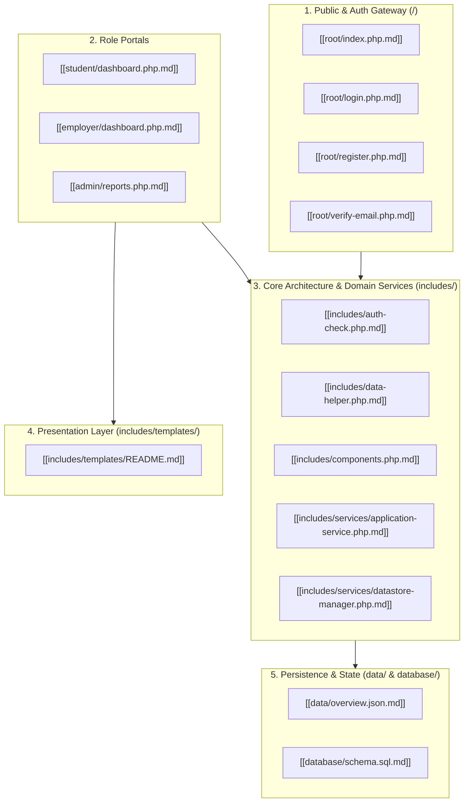

# 🏛️ Campus Job Posting System — Codebase Map of Content (MOC)

> [!abstract] 📖 Vault Purpose & Defense Context
> This documentation vault mirrors the exact directory structure of the **KLD Campus Job Posting System (Campus Hire)**. Each file in the production repository is represented by a dedicated Markdown (`.md`) file named after its full filename and extension (e.g., `index.php.md`, `student/apply.php.md`).
> 
> Designed for the **BSIS201 Midterm / Capstone Defense**, each walkthrough provides:
> 1. **Architectural Role & MVC Placement**
> 2. **Visual Logic Flow (Mermaid Sequence / Flowchart)**
> 3. **Line-by-Line & Function-by-Function Technical Breakdown**
> 4. **Security, Gating, and Data Integrity Analysis**
> 5. **High-Yield Panel Defense Q&A Talking Points**
> 6. **Bidirectional Obsidian Connections** (Dense graph navigation via standard double-bracket wikilinks)

---

## 🗺️ Architectural Layer Navigation

---

## 📂 Vault Directory Index

### 1. Root Gateway & Public Suite (`root/`)
* [[root/index.php.md]] — Public landing page, live campus metrics, 3D mascot integration.
* [[root/about-us.php.md]] — 6-developer team matrix, university dress code showcase, 3D DevBlog stage.
* [[root/login.php.md]] — Centralized authentication controller, role routing, 1-click evaluation chips.
* [[root/register.php.md]] — Dynamic role registration gateway, student/office/partner validation.
* [[root/verify-email.php.md]] — Verification quarantine controller, 6-digit OTP engine.
* [[root/forgot-pass.php.md]] — Anti-enumeration password reset dispatcher.
* [[root/reset-password.php.md]] — Cryptographic reset token validation & password updater.
* [[root/logout.php.md]] — Session invalidation, cookie destruction, and exit redirection.
* [[root/notifications.php.md]] — User notification hub and mark-as-read dispatcher.
* [[root/settings.php.md]] — Account profile updater & Student COR change request submitter.
* [[root/updates.php.md]] & [[root/update-detail.php.md]] — Institutional announcements and patch logs.
* [[root/faqs.php.md]] — Searchable FAQ accordion.
* [[root/privacy.php.md]] — RA 10173 (Data Privacy Act of 2012) statutory compliance page.
* [[root/terms.php.md]] — Institutional terms of service & 20-hr weekly student work limit policy.
* [[root/view-resume.php.md]] — Secure authorization-gated document streamer.
* [[root/data-toggle.php.md]] — Runtime switch between Demo Mode and Real Mode.

### 2. Student Experience Suite (`student/`)
* [[student/dashboard.php.md]] — Student portal home, metric counters, recommended jobs.
* [[student/jobs.php.md]] — Faceted job search, live category filters, slot capacity meters.
* [[student/job-details.php.md]] — Requisition brief, qualification criteria, apply gating.
* [[student/apply.php.md]] — Application submission & 6×3 Weekly Availability Matrix.
* [[student/my-applications.php.md]] — 4-stage visual progress stepper & withdrawal trigger.

### 3. Employer & Campus Office Suite (`employer/`)
* [[employer/dashboard.php.md]] — Department workspace, vacancy tables, hiring metrics.
* [[employer/create-job.php.md]] — Vacancy composer enforcing 20-hr labor cap.
* [[employer/edit-job.php.md]] — Vacancy modifier and slot capacity manager.
* [[employer/applicants.php.md]] — Filterable candidate ledger across all postings.
* [[employer/review-app.php.md]] — Candidate evaluation drawer, availability heatmap, 3-way decision gates.
* [[employer/updates.php.md]] — Department announcements and hiring advisories.

### 4. System Administration Suite (`admin/`)
* [[admin/index.php.md]] — Admin root router (routes to reports).
* [[admin/reports.php.md]] — Institutional analytics, quota gauges, printable monochrome report engine.
* [[admin/users.php.md]] — Account manager, Partner Permit Queue, and Student COR Change Queue.
* [[admin/categories.php.md]] — Campus department taxonomy & icon picker.
* [[admin/updates.php.md]] — Institutional announcement broadcast manager.
* [[admin/ai-settings.php.md]] — NVIDIA NIM AI inference parameters, failover testing & rate limits.
* [[admin/settings.php.md]] — Administrative settings router.

### 5. API Endpoints (`api/`)
* [[api/check-account.php.md]] — Asynchronous Student ID and email uniqueness validator.
* [[api/notifications.php.md]] — Real-time notification poller and state updater.
* [[api/search-jobs.php.md]] — Live search backend powering `Ctrl+K` Spotlight Search.
* [[api/robot-chat.php.md]] — AI assistant chatbot orchestrator.
* [[api/robot-models.php.md]] — Supported AI model catalog.

### 6. Core Architecture & Domain Services (`includes/`)
* [[includes/auth-check.php.md]] — `SessionGuard`: authentication gating, quarantine, role authorization.
* [[includes/data-helper.php.md]] — Primary unified data facade bridging controllers to services.
* [[includes/components.php.md]] — Central UI design system component rendering engine.
* [[includes/db.php.md]] — Database connection handler (PDO MySQL).
* [[includes/mailer.php.md]] — Transactional SMTP email engine via PHPMailer.
* [[includes/navbar.php.md]] — Dynamic role-aware navigation bar.
* [[includes/header.php.md]] & [[includes/footer.php.md]] — Master HTML layout wrappers.
* [[includes/search-modal.php.md]] — Global `Ctrl+K` spotlight search overlay.
* [[includes/ai-config.php.md]] — AI security gateway & subsystem aggregator.
* **Services Subsystem (`includes/services/`)**:
  * [[includes/services/application-service.php.md]] — Candidate eligibility, status transitions, quota gates.
  * [[includes/services/attachment-store.php.md]] — Secure file validation, MIME check, and storage.
  * [[includes/services/datastore-manager.php.md]] — Dual-mode JSON/MySQL state synchronization engine.
  * [[includes/services/job-service.php.md]] — Requisition CRUD and category queries.
  * [[includes/services/user-service.php.md]] — User lifecycle, password hashing, and profile changes.
  * [[includes/services/system-service.php.md]] — Metric calculations, notification dispatch, and devblogs.
  * [[includes/services/system-checks.php.md]] — Environment diagnostics and directory integrity.
  * [[includes/services/common-service.php.md]] — Shared sanitization and string helpers.
* **AI Subsystem (`includes/ai/`)**:
  * [[includes/ai/core.php.md]], [[includes/ai/env.php.md]], [[includes/ai/local-fallback.php.md]], [[includes/ai/models.php.md]], [[includes/ai/rate-limit.php.md]], [[includes/ai/security.php.md]].

### 7. Presentation & View Layer (`includes/templates/`)
* [[includes/templates/README.md]] — Master Presentation Layer & MVC View Architecture: Controller-to-Template contract, zero SQL in views, universal escaping (`htmlspecialchars`), Anti-FOUC design tokens, and catalog of all 32 view templates and transactional emails.

### 8. Persistence & Datastore Layer (`data/` & `database/`)
* [[database/schema.sql.md]] — Relational database schema, keys, and constraints.
* [[database/seed_data.sql.md]] — Initial SQL database seeds.
* [[database/migrate.php.md]] — Dual datastore migration runner.
* [[data/overview.json.md]] — JSON datastore architecture and demo fixtures.
