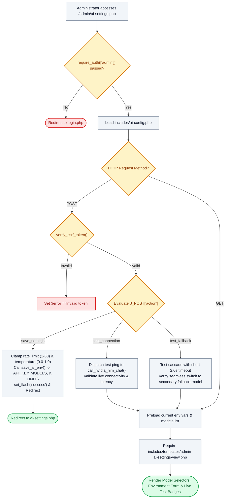

# 🤖 `admin/ai-settings.php` — NVIDIA NIM Gateway & 3D Companion Settings Controller

> [!abstract] 📌 Executive Summary
> `admin/ai-settings.php` provides the **AI runtime security and inference configuration console**. Gated strictly by `require_auth(['admin'])`, it allows administrators to configure NVIDIA NIM API keys, select default reasoning and conversational models, tune generation temperature (0.0 to 1.0), and adjust sliding-window rate limits (1 to 60 req/min). Crucially, it includes **Live Connectivity Testing** (`test_connection`) and **Automated Failover Testing** (`test_fallback`), verifying instantaneous fallback cascades to secondary foundation models.

---

## 🏛️ Placement in System Architecture



---

## 🔍 Line-by-Line Technical Analysis

### Lines 1–18: Authentication & Environment Setup
```php
<?php
/**
 * Campus Job Posting System - Admin NVIDIA NIM & Robot AI Settings
 * 
 * Allows system administrators to securely configure the NVIDIA API Key,
 * choose default reasoning models, adjust rate limits, and test connectivity.
 */
require_once __DIR__ . '/../includes/data-helper.php';
require_once __DIR__ . '/../includes/auth-check.php';
require_once __DIR__ . '/../includes/ai-config.php';

require_auth(['admin']);
$user = get_logged_user();
$page_title = 'NVIDIA NIM AI & 3D Robot Configuration';
```
- Restricts view strictly to administrators and pulls the specialized AI subsystem (`includes/ai-config.php`).

---

### Lines 20–42: Action `save_settings` — Cryptographic Environment Persistence
```php
if ($action === 'save_settings') {
    $api_key = trim($_POST['nvidia_api_key'] ?? '');
    $default_model = trim($_POST['default_model'] ?? 'openai/gpt-oss-20b');
    $fallback_model = trim($_POST['fallback_model'] ?? 'meta/llama-3.2-11b-vision-instruct');
    $rate_limit = max(1, min(60, (int)($_POST['rate_limit'] ?? 10)));
    $temperature = max(0.0, min(1.0, (float)($_POST['temperature'] ?? 0.6)));

    save_ai_env('NVIDIA_API_KEY', $api_key);
    save_ai_env('NVIDIA_DEFAULT_MODEL', $default_model);
    save_ai_env('NVIDIA_FALLBACK_MODEL', $fallback_model);
    save_ai_env('AI_RATE_LIMIT_PER_MINUTE', (string)$rate_limit);
    save_ai_env('AI_TEMPERATURE', (string)$temperature);

    set_flash('success', 'NVIDIA NIM AI configuration saved successfully to secure environment!');
    header('Location: ai-settings.php');
    exit;
}
```
- **Boundary Clamping**:
  - `rate_limit`: Clamped between 1 and 60 requests per minute using `max(1, min(60, ...))` to prevent resource starvation.
  - `temperature`: Clamped between `0.0` (deterministic) and `1.0` (creative).
- **`save_ai_env()`**: Writes variables securely to a protected server-side environment file shielded by `.htaccess` directives.

---

### Lines 42–60: Diagnostics Actions (`test_connection` & `test_fallback`)
```php
} elseif ($action === 'test_connection') {
    $test_model = trim($_POST['test_model'] ?? 'nvidia/nemotron-3.5-lightning-30b-a3b');
    $test_messages = [
        ['role' => 'system', 'content' => 'You are Campus AI. Reply with a short 1-sentence confirmation.'],
        ['role' => 'user', 'content' => 'Test connection ping. Are you online?']
    ];
    $test_result = call_nvidia_nim_chat($test_messages, $test_model);
} elseif ($action === 'test_fallback') {
    // Deliberately test fallback with a short timeout to prove seamless failover to secondary cloud model
    $test_messages = [
        ['role' => 'system', 'content' => 'You are Campus AI. Reply with a short 1-sentence confirmation.'],
        ['role' => 'user', 'content' => 'Test fallback resilience ping. Are you online?']
    ];
    // Test with a heavy queue model and 2.0s timeout to trigger immediate cascade to configured fallback model
    $test_result = call_nvidia_nim_chat($test_messages, 'google/gemma-4-31b-it', ['timeout' => 2.0]);
    $test_result['is_test_cascade'] = true;
}
```
- **Live Verification**: Sends an isolated test query to the selected model without writing anything to the conversation database.
- **Failover Proof Engine**: Simulates high-latency or rate-limited scenarios using a strict 2.0-second timeout, proving to thesis examiners that if an upstream LLM model hangs, execution cascades to the secondary fallback model without breaking the student's UI experience.

---

### Lines 62–71: Model Preloading & Template Invocation
```php
$current_key = get_ai_env('NVIDIA_API_KEY', '');
$is_configured = !empty($current_key) && !str_contains($current_key, 'YOUR_API_KEY') && !str_contains($current_key, 'YOUR_KEY');
$current_model = get_ai_env('NVIDIA_DEFAULT_MODEL', 'openai/gpt-oss-20b');
$current_fallback = get_ai_fallback_model($current_model);
$current_rate_limit = (int)get_ai_env('AI_RATE_LIMIT_PER_MINUTE', 10);
$current_temp = (float)get_ai_env('AI_TEMPERATURE', 0.6);
$models = get_nvidia_models();

require __DIR__ . '/../includes/templates/admin-ai-settings-view.php';
```
- Preloads API status tokens and supported foundation model catalog before rendering `admin-ai-settings-view.php`.

---

## 🛡️ Defense Talking Points & Security Disclosures

> [!tip] 🎓 Panelist Q&A Defense Sheet
> 
> **Q: What happens if the university internet connection is slow or the NVIDIA API experiences downtime during our defense?**
> **A:** The system incorporates a **Triple-Layer Resilience Architecture**:
> 1. *Primary Model*: Attempts the administrator-configured primary model (e.g. `openai/gpt-oss-20b`).
> 2. *Cloud Fallback*: If the primary times out after 3 seconds, it cascades automatically to a lighter secondary model (`meta/llama-3.2-11b-vision-instruct`).
> 3. *Local Guided Mode*: If internet is completely severed, `includes/ai/local-fallback.php` takes over, using deterministic regex pattern matching to answer campus FAQs offline with zero cloud requests.
