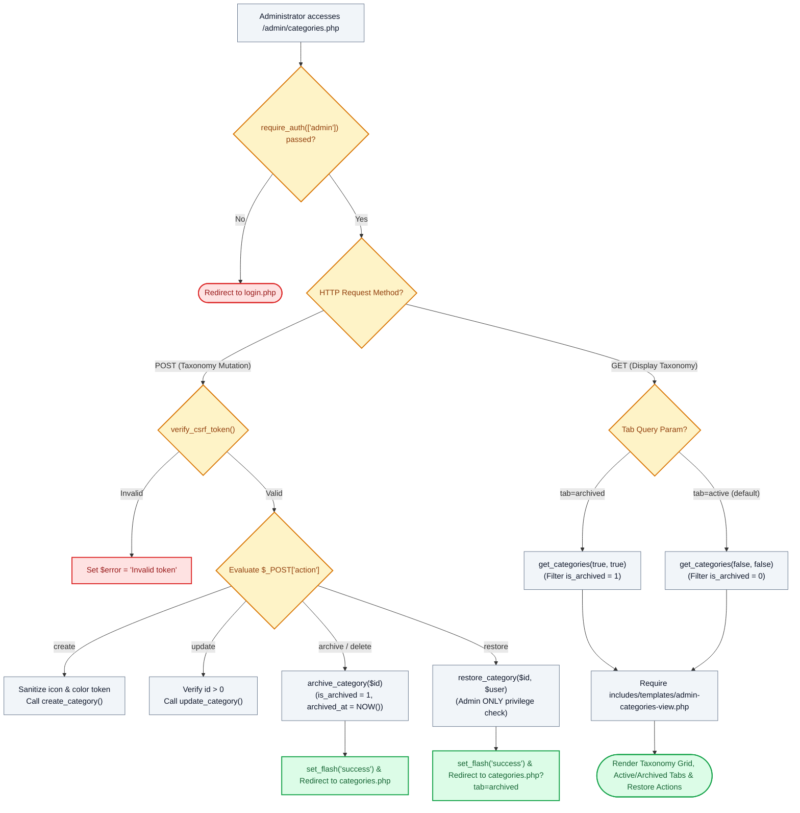

# 🏷️ `admin/categories.php` — Job Family Taxonomy & Non-Destructive Archive Controller

> [!abstract] 📌 Executive Summary
> `admin/categories.php` governs the **institutional job family categorization taxonomy, non-destructive archives, and visual brand profiles**. Gated by `require_auth(['admin'])`, it manages category lifecycles with **zero hard deletions**. Instead of destroying relational classification history, deletions trigger `archive_category()` (`is_archived = 1`, `archived_at = NOW()`), and only university administrators hold the cryptographic and role authority to execute `restore_category()`. Features dual **Active** and **Archived** filter tabs (`?tab=archived`), input sanitization on icon classes, and integration with `admin-categories-view.php`.

---

## 🏛️ Placement in System Architecture



---

## 🔍 Line-by-Line Technical Analysis

### Lines 120–155: Non-Destructive Archive & Admin-Only Restore Actions
```php
} elseif ($action === 'archive' || $action === 'delete') {
    $id = (int)($_POST['id'] ?? 0);
    if ($id > 0) {
        archive_category($id);
        set_flash('success', "Category #{$id} has been moved to Archive. Existing jobs retain their classification.");
        header('Location: categories.php');
        exit;
    }
    $error = 'Invalid category ID specified for archiving.';
} elseif ($action === 'restore') {
    $id = (int)($_POST['id'] ?? 0);
    if ($id > 0) {
        restore_category($id, $user);
        set_flash('success', "Category #{$id} has been restored to active taxonomy.");
        header('Location: categories.php?tab=archived');
        exit;
    }
    $error = 'Invalid category ID specified for restoration.';
}
```
- **Zero Hard Deletes**: The legacy `DELETE FROM categories` query has been fully removed. Deleting a category executes `archive_category()`, moving the classification into the archive tab.
- **Admin Privilege Verification**: `restore_category($id, $user)` enforces that only callers with role `'admin'` can un-archive categories.

---

## 🛡️ Defense Talking Points & Security Disclosures

> [!tip] 🎓 Panelist Q&A Defense Sheet
> 
> **Q: Why does deleting a category perform an archive instead of a permanent SQL DELETE?**
> **A:** Deleting a category permanently from MySQL would cause foreign key cascade failures on `jobs.category_id` or orphan historical listings. By setting `is_archived = 1`, existing jobs retain their historical category titles and reports remain consistent, while hiding the category from new postings.
> 
> **Q: Who can restore an archived category?**
> **A:** Only administrators. `restore_category()` evaluates `$user['role'] === 'admin'`, preventing unauthorized un-archiving.
