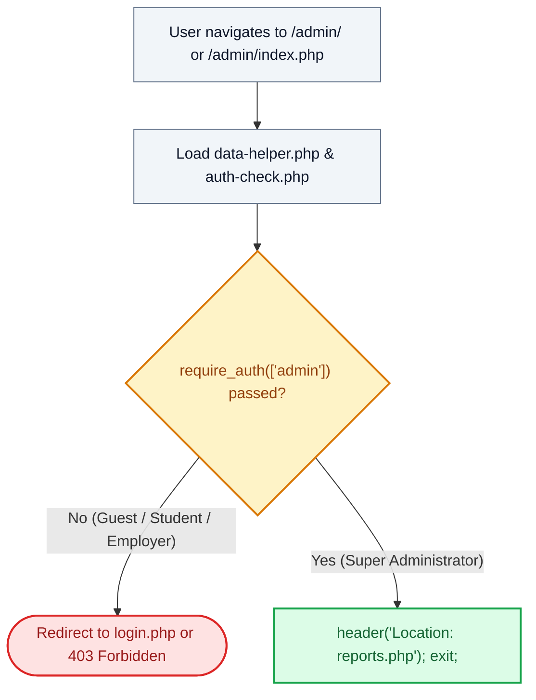

# 🚪 `admin/index.php` — Administration Suite Root Router

> [!abstract] 📌 Executive Summary
> `admin/index.php` serves as the **secure entry point and router** for the administration subsystem. Gated by `require_auth(['admin'])`, it blocks unauthorized students, employers, and unauthenticated guests before cleanly issuing an HTTP 302 redirect forwarding authenticated administrators to the operational intelligence overview (`reports.php`).

---

## 🏛️ Placement in System Architecture



---

## 🔍 Line-by-Line Technical Analysis

### Lines 1–12: Role Enforcement & Dispatch
```php
<?php
/**
 * Campus Job Posting System - Admin Root Router
 * Securely redirects authenticated administrators to the reports overview.
 */
require_once __DIR__ . '/../includes/data-helper.php';
require_once __DIR__ . '/../includes/auth-check.php';

require_auth(['admin']);
header('Location: reports.php');
exit;
```
- **Line 9 (`require_auth(['admin'])`)**: Invokes `SessionGuard::enforce()`. If the user session lacks an active role of `'admin'`, script execution halts immediately. Unauthenticated visitors are routed to `login.php?next=admin/index.php`.
- **Line 10–11**: Issues an HTTP 302 redirect header pointing to `reports.php` and halts execution (`exit;`) to prevent trailing code execution.

---

## 🛡️ Defense Talking Points & Security Disclosures

> [!tip] 🎓 Panelist Q&A Defense Sheet
> 
> **Q: Why does `admin/index.php` exist if it only redirects to `reports.php`?**
> **A:** It provides a canonical directory root handler for the `/admin/` URL path. Without an `index.php`, Apache web servers with directory indexing enabled could inadvertently expose directory file listings. This file ensures that visiting `/admin/` immediately triggers role authentication and routes the administrator to the primary dashboard.
