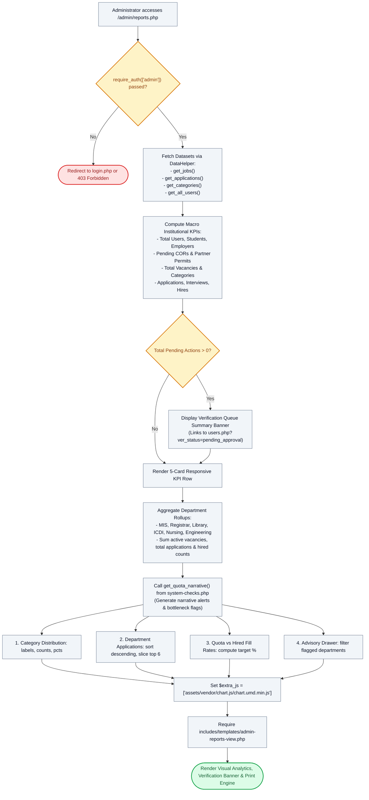

# 📊 `admin/reports.php` — Institutional Analytics, Verification Pipeline & Macro KPI Engine

> [!abstract] 📌 Executive Summary
> `admin/reports.php` serves as the **macro-level institutional intelligence and reporting console**. Accessible strictly to system administrators (`require_auth(['admin'])`), it aggregates campus assistantship key performance indicators across a **5-KPI Metrics Row** (`Total Users` with Student/Partner demographic breakdown and pending verification link to `users.php`, `Total Vacancies`, `Applications Filed`, `Interviews Held` with % Interview Rate, and `Officially Hired` with % Placement Yield). It provides a high-visibility **Verification Queue Summary** alert banner for pending student CORs, employer accreditation permits, and profile corrections, computes department quota fulfillment percentages, calls `get_quota_narrative()` for automated advisory triage, synthesizes 4 structured Chart.js visualization datasets, and pre-renders data for the high-contrast **Monochrome Printable Audit Report** via `admin-reports-view.php`.

---

## 🏛️ Placement in System Architecture



---

## 🔍 Line-by-Line Technical Analysis

### Lines 1–45: Authentication, User Demographics & Verification Pipeline Analytics
```php
require_once __DIR__ . '/../includes/data-helper.php';
require_once __DIR__ . '/../includes/auth-check.php';

require_auth(['admin']);
$user = get_logged_user();
$page_title = 'Reports & Institutional Analytics';

$all_jobs = get_jobs();
$all_apps = get_applications();
$categories = get_categories();
$all_users = get_all_users();

$total_jobs = count($all_jobs);
$total_apps = count($all_apps);
$total_hired = count(array_filter($all_apps, function($a) {
    $st = strtolower($a['status'] ?? '');
    return in_array($st, ['accepted', 'accepted / hired', 'hired'], true);
}));
$total_interviews = count(array_filter($all_apps, function($a) {
    $st = strtolower($a['status'] ?? '');
    return in_array($st, ['interview_scheduled', 'interview scheduled', 'interview'], true);
}));

// User population & verification pipeline analytics
$total_users = count($all_users);
$total_students = count(array_filter($all_users, fn($u) => ($u['role'] ?? '') === 'student'));
$total_employers = count(array_filter($all_users, fn($u) => ($u['role'] ?? '') === 'employer'));
$total_admins = count(array_filter($all_users, fn($u) => ($u['role'] ?? '') === 'admin'));

$pending_students_count = count(array_filter($all_users, fn($u) => ($u['role'] ?? '') === 'student' && ($u['verification_status'] ?? '') === 'pending_approval'));
$pending_employers_count = count(array_filter($all_users, fn($u) => ($u['role'] ?? '') === 'employer' && ($u['verification_status'] ?? '') === 'pending_approval'));
$total_pending_verifications = $pending_students_count + $pending_employers_count;

$all_profile_requests = get_profile_requests();
$pending_profile_requests = array_filter($all_profile_requests, fn($r) => ($r['status'] ?? '') === 'pending');
$pending_profile_count = count($pending_profile_requests);
$total_pending_actions = $total_pending_verifications + $pending_profile_count;
```
- **5 Macro KPIs**: Expanded from 4 to 5 cards to incorporate institutional user population metrics requested by faculty evaluators.
- **Dynamic Yield Calculations**: Calculates Interview Rate (`$total_apps > 0 ? round(($total_interviews / $total_apps) * 100) : 0`) and Placement Yield (`$total_apps > 0 ? round(($total_hired / $total_apps) * 100) : 0`) with zero-division safety.
- **Verification Pipeline Triage**: Pre-computes pending student CORs, employer business permits, and profile correction requests for the high-priority header banner.

---

## 🛡️ Defense Talking Points & Security Disclosures

> [!tip] 🎓 Panelist Q&A Defense Sheet
> 
> **Q: Why was the KPI row expanded to 5 metrics, and what operational value does Total Users add?**
> **A:** As suggested by our university capstone professor, understanding student and employer adoption is essential for administrative governance. Rather than a static count, `Total Users` displays dynamic subtext (`X Students • Y Partners`), reveals pending accreditation badges, and acts as an interactive shortcut directly into `users.php`.
> 
> **Q: How does the Verification Queue Summary banner improve administrative turnaround?**
> **A:** Prior to this banner, administrators had to navigate into `users.php` to check if students had uploaded new study loads or if external employers had submitted business permits. The banner immediately surfaces the pending backlog at the top of the analytics dashboard with a 1-click **Review Queue** shortcut.
> 
> **Q: Does Chart.js require an active internet connection to render during our defense?**
> **A:** No. As shown on line 135, Chart.js is bundled locally in `assets/vendor/chart.js/chart.umd.min.js`. The system functions 100% offline in air-gapped evaluation environments.
