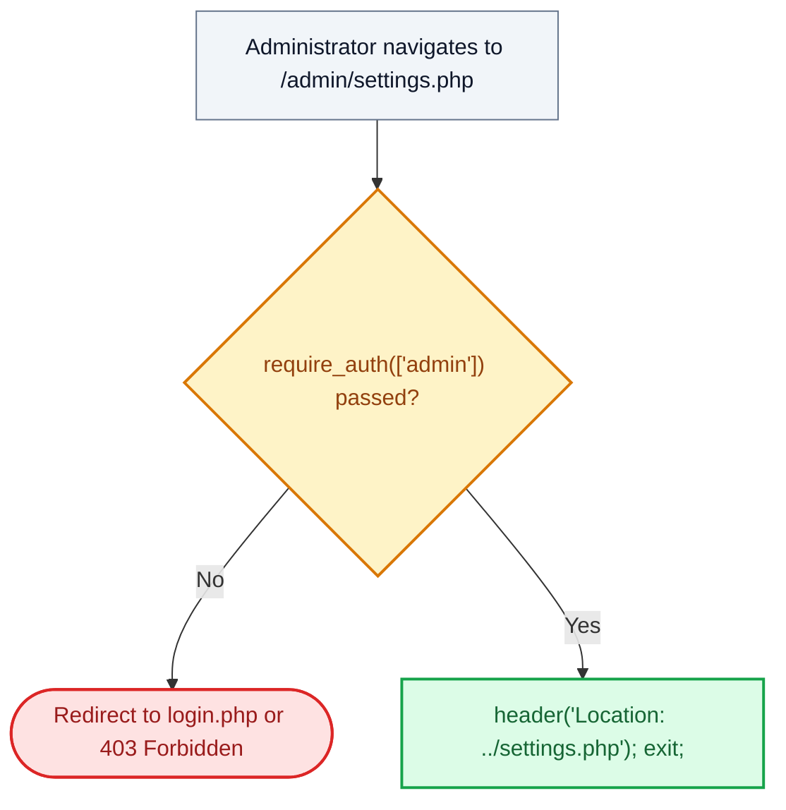

# ⚙️ `admin/settings.php` — Administration Settings Gateway Router

> [!abstract] 📌 Executive Summary
> `admin/settings.php` routes administrative settings requests to the unified system profile and preferences controller at `../settings.php`. It ensures that administrators attempting to navigate to `/admin/settings.php` pass strict role authentication before arriving at the centralized settings controller, preserving the **Single Source of Truth** for account credential rotation.

---

## 🏛️ Placement in System Architecture



---

## 🔍 Line-by-Line Technical Analysis

### Lines 1–11: Route Authentication & Redirection
```php
<?php
/**
 * Campus Job Posting System - Admin Settings Redirector
 * Smoothly routes requests to the centralized system settings page.
 */
require_once __DIR__ . '/../includes/auth-check.php';

require_auth(['admin']);
header('Location: ../settings.php');
exit;
```
- **Line 8 (`require_auth(['admin'])`)**: Guarantees that only users with active administrator sessions can invoke this redirector.
- **Lines 9–10**: Forwards the browser to the root `settings.php` controller where profile information, email preferences, and password hashing logic reside.

---

## 🛡️ Defense Talking Points & Security Disclosures

> [!tip] 🎓 Panelist Q&A Defense Sheet
> 
> **Q: Why does the system redirect to `../settings.php` rather than maintaining a separate settings file inside `/admin/`?**
> **A:** This implements the **Don't Repeat Yourself (DRY)** architectural principle. All user password rotations, CSRF checks, Bcrypt hashing algorithms, and session re-hydrations are centralized within `root/settings.php`. Having duplicate settings logic in `admin/settings.php` would introduce code divergence, maintenance overhead, and security patch drift.
