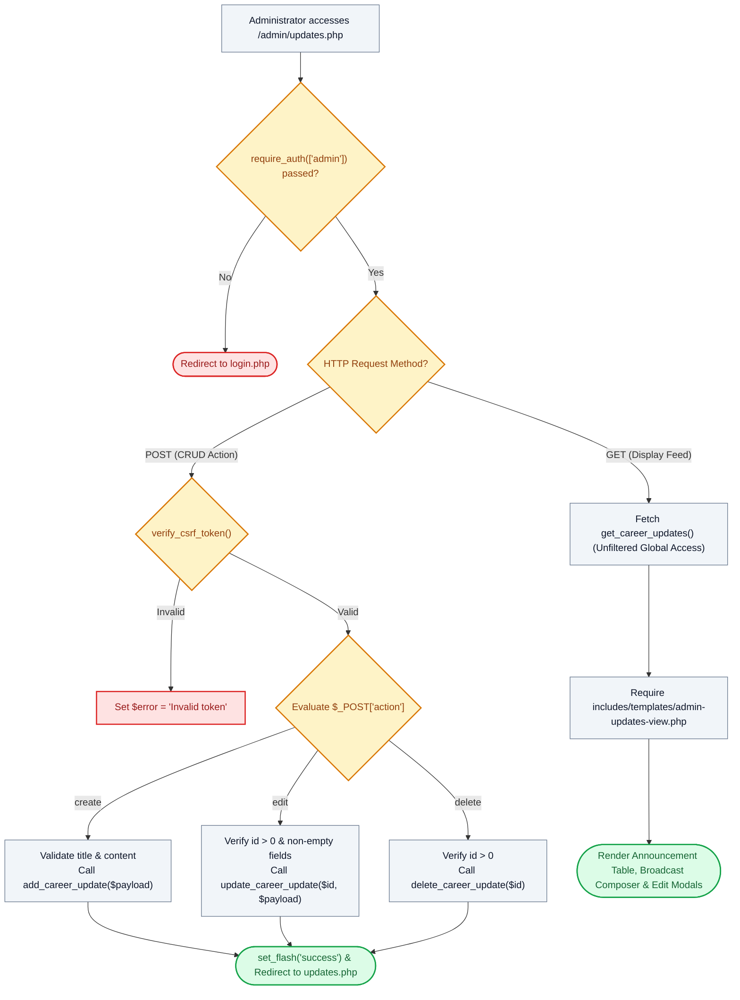

# 📢 `admin/updates.php` — University Career Bulletins & Broadcast Manager Controller

> [!abstract] 📌 Executive Summary
> `admin/updates.php` functions as the **system-wide broadcast and editorial administration console**. Gated by `require_auth(['admin'])`, it empowers administrators to manage all university-wide announcements, policy circulars, and career advisories. It provides complete CSRF-protected CRUD lifecycle management (`add_career_update`, `update_career_update`, `delete_career_update`) with global authoring authority and delegates rendering to `includes/templates/admin-updates-view.php`.

---

## 🏛️ Placement in System Architecture



---

## 🔍 Line-by-Line Technical Analysis

### Lines 1–16: Role Gating & Setup
```php
<?php
/**
 * Campus Job Posting System - Admin Career Updates & Dispatches Management
 * Archetype B: Administration & Bulletin Management (COAL101 Blueprint)
 */
require_once __DIR__ . '/../includes/data-helper.php';
require_once __DIR__ . '/../includes/auth-check.php';

require_auth(['admin']);
$user = get_logged_user();
$page_title = 'Career Center Dispatches Management';

$error = null;
$action = $_POST['action'] ?? null;
```
- Restricts route strictly to administrators.

---

### Lines 17–46: Action `create` — Publishing Official Bulletins
```php
if ($_SERVER['REQUEST_METHOD'] === 'POST') {
    if (!verify_csrf_token($_POST['csrf_token'] ?? '')) {
        $error = 'Security validation failed: Invalid or expired security token. Please try again.';
    } elseif ($action === 'create') {
        $title = trim($_POST['title'] ?? '');
        $category = trim($_POST['category'] ?? 'Campus News');
        $summary = trim($_POST['summary'] ?? '');
        $content = trim($_POST['content'] ?? '');
        $image = trim($_POST['image'] ?? '');
        $author_name = trim($_POST['author_name'] ?? $user['name']);
        $author_role = trim($_POST['author_role'] ?? 'System Administrator');
        $author_office = trim($_POST['author_office'] ?? 'KLD Career Development & Placement Office');

        if (empty($title) || empty($content)) {
            $error = 'Headline title and article content are required.';
        } else {
            add_career_update([...]);
            set_flash('success', "Career dispatch '{$title}' was published successfully.");
            header('Location: updates.php');
            exit;
        }
```
- Publishes institutional career advisories tagged with official authority badges (`'KLD Career Development & Placement Office'`).

---

### Lines 47–84: Actions `edit` and `delete`
```php
    } elseif ($action === 'edit') {
        $id = (int)($_POST['id'] ?? 0);
        // Validates inputs and executes update_career_update($id, $payload)
    } elseif ($action === 'delete') {
        $id = (int)($_POST['id'] ?? 0);
        if ($id > 0) {
            delete_career_update($id);
            set_flash('success', "Dispatch #{$id} has been removed.");
            header('Location: updates.php');
            exit;
        }
    }
```
- Grants administrators universal authority to edit or purge any announcement, including those submitted by individual department supervisors.

---

### Lines 86–90: Global Feed Ingestion & View Handover
```php
$all_updates = get_career_updates();
require __DIR__ . '/../includes/templates/admin-updates-view.php';
```
- Unfiltered feed fetch, giving administrators an exhaustive overview of all published bulletins.

---

## 🛡️ Defense Talking Points & Security Disclosures

> [!tip] 🎓 Panelist Q&A Defense Sheet
> 
> **Q: How does `admin/updates.php` differ from `employer/updates.php`?**
> **A:** `employer/updates.php` is tenant-scoped; an office supervisor can only view, edit, or delete notices belonging to their own department. `admin/updates.php` is the **Super Admin Console**, providing unconstrained institutional oversight with the authority to moderate, correct, or delete any notice across all colleges.
