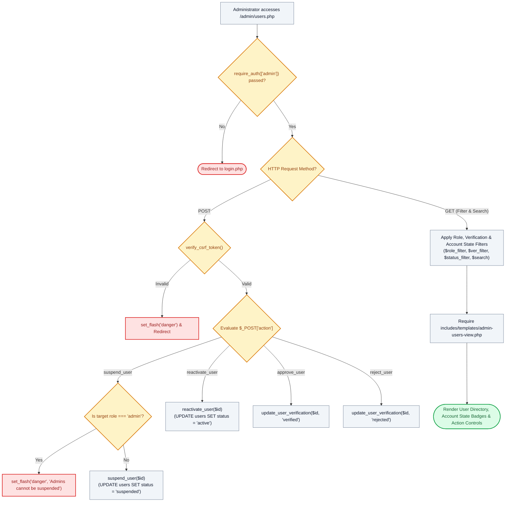

# 👥 `admin/users.php` — User Directory, Account State & Suspension Cockpit

> [!abstract] 📌 Executive Summary
> `admin/users.php` manages **system user administration, partner employer accreditation, student academic record audits, and account state governance**. Strictly guarded by `require_auth(['admin'])`, it provides comprehensive user governance:
> 1. **Account State Governance (Active vs Suspended)**: Features administrative `suspend_user()` and `reactivate_user()` controls. Suspended accounts are immediately blocked from authenticating across standard login and quick login flows.
> 2. **Superadmin Immunity**: Administrators are programmatically protected from accidental suspension or lockout.
> 3. **Accreditation & Profile Queues**: Manages partner employer accreditation vetting and student academic record change requests.

---

## 🏛️ Placement in System Architecture



---

## 🔍 Line-by-Line Technical Analysis

### Lines 50–75: Account Suspension & Reactivation Mutations
```php
} elseif ($action === 'suspend_user') {
    $suspend_id = (int)($_POST['id'] ?? 0);
    $target_user = get_user_by_id($suspend_id);
    if (!$target_user || ($target_user['role'] ?? '') === 'admin') {
        set_flash('danger', 'System Administrators cannot be suspended or deactivated.');
        header('Location: users.php');
        exit;
    }
    if (suspend_user($suspend_id)) {
        $u_name = $target_user['name'] ?? 'User';
        set_flash('warning', "Account '{$u_name}' has been suspended and archived.");
        header('Location: users.php');
        exit;
    }
} elseif ($action === 'reactivate_user') {
    $reactivate_id = (int)($_POST['id'] ?? 0);
    $target_user = get_user_by_id($reactivate_id);
    if (reactivate_user($reactivate_id)) {
        $u_name = $target_user['name'] ?? 'User';
        set_flash('success', "Account '{$u_name}' has been reactivated successfully!");
        header('Location: users.php');
        exit;
    }
}
```
- **Administrative Account Protection**: Protects system admins from accidental suspension or malicious lockout attempts.
- **Instant Login Intercept**: Suspended users are immediately blocked in `user-service.php` at `login_user()` and `quick_login()`.

---

## 🛡️ Defense Talking Points & Security Disclosures

> [!tip] 🎓 Panelist Q&A Defense Sheet
> 
> **Q: How does the system handle account suspension, and what happens when a suspended user tries to log in?**
> **A:** When an administrator clicks Suspend, `suspend_user()` updates `status = 'suspended'`. All applications, evaluations, and timestamps remain preserved in the database. When the user attempts to log in, `login_user()` intercepts the session and displays an advisory: *"Account Suspended: This account has been archived or deactivated by institutional administration. Please contact the Career Services Office."*
> 
> **Q: Can an administrator suspend another administrator?**
> **A:** No. Lines 53-56 explicitly verify `($target_user['role'] ?? '') === 'admin'` and abort with a security warning.
