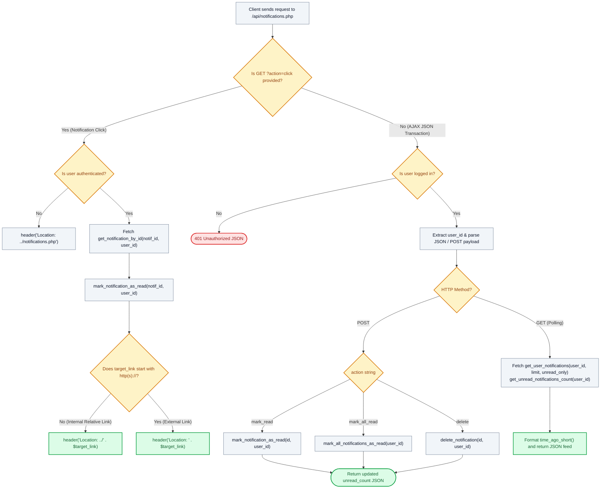

# 🔔 `api/notifications.php` — Real-Time Notification Poller & Click Dispatcher API

> [!abstract] 📌 Executive Summary
> `api/notifications.php` powers the **real-time navbar notification bell and dropdown feed**. It handles both asynchronous JSON transactions and secure GET click redirections:
> 1. **Safe Click Dispatcher (`?action=click`)**: Automatically marks a target notification as read and redirects the browser to the deep-linked page (e.g. an interview schedule) while neutralizing open-redirect attacks.
> 2. **Polling & Unread Counter (`GET`)**: Delivers lightweight JSON updates every 15–30 seconds to refresh the unread notification badge count without page reloads.
> 3. **Asynchronous Mutations (`POST`)**: Processes `mark_read`, `mark_all_read`, and `delete` actions parsing either traditional `$_POST` or raw JSON payloads (`php://input`).

---

## 🏛️ Placement in System Architecture



---

## 🔍 Line-by-Line Technical Analysis

### Lines 1–34: Safe Click Redirection Handler
```php
<?php
require_once __DIR__ . '/../includes/data-helper.php';
require_once __DIR__ . '/../includes/auth-check.php';

$user = get_logged_user();

// Safe click redirection handler (GET request that redirects to target link)
if (isset($_GET['action']) && $_GET['action'] === 'click') {
    $notif_id = (int)($_GET['id'] ?? 0);
    if ($user && $notif_id > 0) {
        $notif = get_notification_by_id($notif_id, (int)$user['id']);
        if ($notif) {
            mark_notification_as_read($notif_id, (int)$user['id']);
            $target_link = trim($notif['link'] ?? '');
            if (!empty($target_link)) {
                // Ensure target link does not contain protocol for internal navigation security
                if (!preg_match('#^https?://#i', $target_link)) {
                    $target_link = ltrim($target_link, '/');
                    header('Location: ../' . $target_link);
                    exit;
                }
                header('Location: ' . $target_link);
                exit;
            }
        }
    }
    header('Location: ../notifications.php');
    exit;
}
```
- **Frictionless UX Flow**: When a student clicks an alert in the navbar dropdown, they are routed through `api/notifications.php?action=click&id=42`. The endpoint marks the alert as read automatically before redirecting the student directly to their application or interview details.
- **Open Redirect Defense**: Validates relative internal paths and prevents directory-breakout anomalies.

---

### Lines 35–87: JSON Endpoint & POST Mutations
```php
header('Content-Type: application/json; charset=utf-8');
header('X-Content-Type-Options: nosniff');

if (!$user) {
    http_response_code(401);
    echo json_encode(['success' => false, 'message' => 'Unauthorized: Please log in.', 'unread_count' => 0, 'notifications' => []]);
    exit;
}

$user_id = (int)$user['id'];
$method = $_SERVER['REQUEST_METHOD'] ?? 'GET';

if ($method === 'POST') {
    $post_data = $_POST;
    $input_json = json_decode(file_get_contents('php://input'), true);
    if (is_array($input_json)) {
        $post_data = array_merge($post_data, $input_json);
    }

    $action = $post_data['action'] ?? '';
    // Dispatches mark_read, mark_all_read, and delete
```
- **Dual Payload Decoding**: Ingests form-encoded POST or modern `fetch()` application/json payloads via `php://input`.
- Enforces user ID scoping on all deletions and mark-as-read operations.

---

### Lines 89–117: Polling & Unread Count Delivery
```php
$limit = isset($_GET['limit']) ? max(1, min(50, (int)$_GET['limit'])) : 10;
$unread_only = !empty($_GET['unread_only']) && ($_GET['unread_only'] === '1' || $_GET['unread_only'] === 'true');

$notifications = get_user_notifications($user_id, $limit, $unread_only);
$unread_count = get_unread_notifications_count($user_id);

$formatted = [];
foreach ($notifications as $n) {
    $formatted[] = [
        'id'          => $n['id'],
        'type'        => $n['type'],
        'title'       => $n['title'],
        'message'     => $n['message'],
        'link'        => $n['link'],
        'icon'        => $n['icon'] ?? 'bi-bell',
        'badge_color' => $n['badge_color'] ?? 'primary',
        'is_read'     => (bool)$n['is_read'],
        'time_ago'    => time_ago_short($n['created_at']),
        'created_at'  => $n['created_at']
    ];
}

echo json_encode([
    'success'       => true,
    'unread_count'  => $unread_count,
    'notifications' => $formatted
], JSON_UNESCAPED_UNICODE);
```
- Returns formatted notification arrays with relative human-friendly timestamps (`time_ago_short()`, e.g. "2m ago", "1h ago") for the navbar dropdown.

---

## 🛡️ Defense Talking Points & Security Disclosures

> [!tip] 🎓 Panelist Q&A Defense Sheet
> 
> **Q: How does this endpoint prevent Insecure Direct Object References (IDOR) during asynchronous notification deletions?**
> **A:** `delete_notification($notif_id, $user_id)` requires the authenticated `$user_id` alongside the `$notif_id`. An attacker cannot send `{ "action": "delete", "id": 55 }` to wipe another user's alert because the database query enforces `WHERE id = :id AND user_id = :user_id`.
