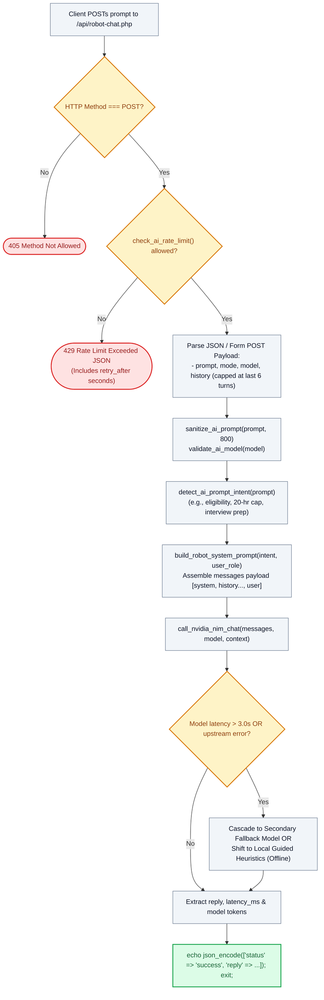

# 🤖 `api/robot-chat.php` — Conversational AI Gateway & NVIDIA NIM Proxy API

> [!abstract] 📌 Executive Summary
> `api/robot-chat.php` operates as the **secure inference proxy connecting the interactive 3D robot companion to cloud foundation models** (NVIDIA NIM). It enforces strict defensive controls before dispatching queries to external endpoints:
> 1. **Sliding-Window Rate Limiting (`check_ai_rate_limit`)**: Limits clients to 10 requests per minute, returning HTTP 429 when throttled.
> 2. **Prompt Sanitization (`sanitize_ai_prompt`)**: Caps prompt lengths at 800 characters and strips HTML tags, script injection tokens, and control characters.
> 3. **Role-Aware Context Synthesis**: Detects whether the caller is a `student`, `employer`, or `guest`, dynamically injecting appropriate institutional system instructions.
> 4. **Multi-Tier Cascade Fallback**: Seamlessly cascades from primary LLMs to secondary models, and falls back to offline local regex heuristics (`is_local_fallback`) if internet connectivity fails.

---

## 🏛️ Placement in System Architecture



---

## 🔍 Line-by-Line Technical Analysis

### Lines 1–38: Rate Limiting & Method Verification
```php
<?php
header('Content-Type: application/json; charset=utf-8');
header('X-Content-Type-Options: nosniff');
header('Cache-Control: no-cache, no-store, must-revalidate');

require_once __DIR__ . '/../includes/ai-config.php';

// Only allow POST requests
if ($_SERVER['REQUEST_METHOD'] !== 'POST') {
    http_response_code(405);
    echo json_encode(['status' => 'error', 'message' => 'Method Not Allowed. POST is required.']);
    exit;
}

// Check Rate Limiting (Session + IP sliding window)
$rate_status = check_ai_rate_limit();
if (!$rate_status['allowed']) {
    http_response_code(429);
    echo json_encode([
        'status' => 'error',
        'error' => 'RATE_LIMIT_EXCEEDED',
        'code' => 'RATE_LIMIT_EXCEEDED',
        'message' => 'Anti-Spam Active: To keep AI free and fast for all students, requests are limited to ' . ($rate_status['limit_max'] ?? 10) . ' questions/min. Please cooldown for ' . $rate_status['retry_after'] . 's.',
        'retry_after' => $rate_status['retry_after'],
        'rate_remaining' => 0,
        'rate_limit_max' => $rate_status['limit_max'] ?? 10
    ], JSON_UNESCAPED_UNICODE);
    exit;
}
```
- **Anti-Abuse Gating**: Combines session tokens and IP sliding windows to enforce a strict quota (default 10 requests/min), preventing API credit exhaustion and denial-of-service attempts.

---

### Lines 40–83: Payload Extraction & Prompt Sanitization
```php
$raw_body = file_get_contents('php://input');
$json_data = json_decode($raw_body, true);
// Ingests prompt, mode, model, and history...

$user_role = $_SESSION['user']['role'] ?? 'guest';

$raw_trimmed = trim((string)$raw_prompt);
$prompt = sanitize_ai_prompt($raw_prompt, 800);
$model = validate_ai_model($raw_model);

// Validate and sanitize sliding conversation history (capped at last 6 messages)
$history = [];
if (is_array($raw_history) && !empty($raw_history)) {
    $sliced_history = array_slice($raw_history, -6);
    foreach ($sliced_history as $item) {
        $role = ($item['role'] ?? '') === 'assistant' ? 'assistant' : (($item['role'] ?? '') === 'user' ? 'user' : '');
        $clean_content = sanitize_ai_prompt((string)($item['content'] ?? ''), 800);
        if ($role !== '' && $clean_content !== '') {
            $history[] = ['role' => $role, 'content' => $clean_content];
        }
    }
}
```
- **Context Ceiling**: Caps conversational history at the last 6 turns (`array_slice(..., -6)`), keeping upstream token payloads small, economical, and fast.
- Sanitizes all inputs through `sanitize_ai_prompt()`, stripping control characters and HTML tags.

---

### Lines 85–106: Intent Classification & System Prompt Assembly
```php
if (!empty($raw_trimmed) && empty($prompt)) {
    $prompt = 'Disallowed code tags or script injection detected.';
    $detected_intent = 'offtopic';
} elseif (empty($prompt)) {
    $prompt = 'Share a helpful tip about working as a student assistant...';
    $detected_intent = 'faq';
} else {
    $detected_intent = detect_ai_prompt_intent($raw_trimmed);
}

$system_prompt = build_robot_system_prompt($detected_intent, $user_role);
$messages = [
    ['role' => 'system', 'content' => $system_prompt]
];
foreach ($history as $h) {
    $messages[] = $h;
}
$messages[] = ['role' => 'user', 'content' => $prompt];
```
- **Domain Intent Detection (`detect_ai_prompt_intent`)**: Identifies topic categories (e.g. eligibility guidelines, interview coaching, hourly caps) and synthesizes a tailored system prompt instructing the AI model on university policies.

---

### Lines 108–132: Cloud Inference & Resilient Fallback Output
```php
$result = call_nvidia_nim_chat($messages, $model, ['user_role' => $user_role]);
$model_name = get_model_display_name($result['model']);
$original_model = $result['original_model'] ?? $model;
$original_model_name = get_model_display_name($original_model);

echo json_encode([
    'status' => 'success',
    'reply' => $result['reply'],
    'model' => $result['model'],
    'model_name' => $model_name,
    'original_model' => $original_model,
    'original_model_name' => $original_model_name,
    'detected_intent' => $detected_intent,
    'latency_ms' => $result['latency_ms'] ?? 0,
    'is_fallback' => $result['is_fallback'] ?? false,
    'is_model_fallback' => $result['is_model_fallback'] ?? false,
    'is_local_fallback' => $result['is_local_fallback'] ?? false,
    'fallback_notice' => $result['fallback_notice'] ?? null,
    'rate_remaining' => $rate_status['remaining'] ?? 0,
    'rate_limit_max' => $rate_status['limit_max'] ?? 10
], JSON_UNESCAPED_UNICODE);
```
- Calls `call_nvidia_nim_chat()`. If cloud inference succeeds, delivers the output with latency metrics. If an error occurs, the response includes `is_fallback: true` and a user-friendly notice indicating failover to local or secondary models.

---

## 🛡️ Defense Talking Points & Security Disclosures

> [!tip] 🎓 Panelist Q&A Defense Sheet
> 
> **Q: What stops a student from jailbreaking or injecting malicious scripts into the AI robot?**
> **A:** As documented in lines 64 and 85–88, all prompts are passed through `sanitize_ai_prompt()`. If an injection payload (e.g. `<script>alert(1)</script>` or raw HTML tags) is detected, the sanitizer purges the string, and the system prompt reinforces institutional persona boundaries, preventing prompt hijacking.
> 
> **Q: How does this endpoint comply with the Philippine Data Privacy Act (RA 10173)?**
> **A:** As disclosed in `root/privacy.php` (Section 4), the AI proxy only transmits the user's typed chat prompt and conversational turns. Student IDs, passwords, GWA grades, and uploaded resumes are **never attached or transmitted** to the external NVIDIA endpoint.
