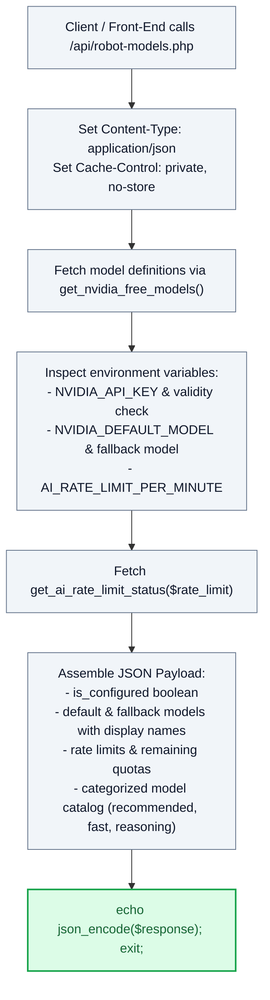

# 🤖 `api/robot-models.php` — Supported AI Models Catalog & Health Status API

> [!abstract] 📌 Executive Summary
> `api/robot-models.php` delivers the **live catalog of supported cloud foundation models and API connectivity metrics**. Consumed by the front-end 3D robot settings drawer and admin controls, it exposes verified NVIDIA NIM inference models, connection health booleans (`is_configured`), active rate-limiting statuses, and categorized model tiers (*Domain MoE*, *Fast Daily Drivers*, and *Deep Reasoning*).

---

## 🏛️ Placement in System Architecture



---

## 🔍 Line-by-Line Technical Analysis

### Lines 1–16: Headers & Model Map Ingestion
```php
<?php
/**
 * Campus Job Posting System - Robot Models Catalog API
 * 
 * Returns list of verified free chat models available on NVIDIA NIM
 * along with connection health status.
 */
header('Content-Type: application/json; charset=utf-8');
header('X-Content-Type-Options: nosniff');
header('Cache-Control: private, no-cache, no-store, must-revalidate');

require_once __DIR__ . '/../includes/ai-config.php';

$models_map = get_nvidia_free_models();
$models_list = array_values($models_map);
```
- Sets strict caching headers to ensure the browser always receives fresh API connection statuses.
- Pulls verified models from `includes/ai-config.php`.

---

### Lines 17–23: Key Configuration & Rate Limit Diagnostics
```php
$api_key = trim(get_ai_env('NVIDIA_API_KEY', ''));
$is_configured = !empty($api_key) && !str_contains($api_key, 'YOUR_API_KEY') && !str_contains($api_key, 'YOUR_KEY');
$default_model = get_ai_env('NVIDIA_DEFAULT_MODEL', 'nvidia/nemotron-3.5-lightning-30b-a3b');
$fallback_model = get_ai_fallback_model($default_model);
$rate_limit = (int)get_ai_env('AI_RATE_LIMIT_PER_MINUTE', 10);
$rate_status = get_ai_rate_limit_status($rate_limit);
```
- **Configuration Sanity Check (`$is_configured`)**: Verifies that the API key is not an empty string or placeholder template.
- Queries `get_ai_rate_limit_status()` to report remaining request capacity for the client session.

---

### Lines 24–42: Categorized Model Delivery
```php
echo json_encode([
    'status' => 'success',
    'is_configured' => $is_configured,
    'default_model' => $default_model,
    'default_model_name' => get_model_display_name($default_model),
    'fallback_model' => $fallback_model,
    'fallback_model_name' => get_model_display_name($fallback_model),
    'rate_limit_per_minute' => $rate_limit,
    'rate_remaining' => $rate_status['remaining'],
    'rate_limit_max' => $rate_status['limit_max'],
    'total_models' => count($models_list),
    'models' => $models_list,
    'categories' => [
        'recommended' => 'Recommended for Campus FAQs (Domain MoE)',
        'fast' => 'Fast & Responsive Daily Drivers',
        'reasoning' => 'Deep Reasoning & Interview Prep'
    ]
], JSON_UNESCAPED_UNICODE);
```
- Categorizes model options so users and examiners can test varying model architectures (e.g. lightweight models for rapid chatting versus deep reasoning models for mock interview coaching).

---

## 🛡️ Defense Talking Points & Security Disclosures

> [!tip] 🎓 Panelist Q&A Defense Sheet
> 
> **Q: Does this endpoint expose the university's private NVIDIA API key to the client browser?**
> **A:** Absolutely not. As seen on lines 17–18 and 26, the endpoint only outputs a boolean flag (`'is_configured' => $is_configured`). The actual raw API key string is stored securely in server environment variables and is never exposed in JSON output.
