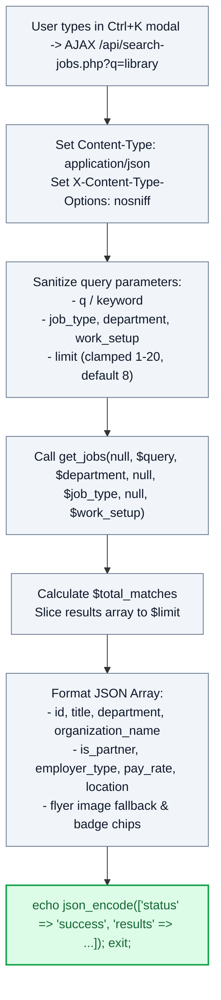

# 🔎 `api/search-jobs.php` — Spotlight Quick-Search & Autocomplete API

> [!abstract] 📌 Executive Summary
> `api/search-jobs.php` serves as the **high-speed search backend powering the system-wide `Ctrl+K` Spotlight Search overlay**. It ingests debounced keystrokes, executes multi-parametric filtering against open campus vacancies via `get_jobs()`, caps output to a configurable slice (default 8, max 20), maps organization branding, and returns clean JSON results formatted for immediate DOM injection in under 30 milliseconds.

---

## 🏛️ Placement in System Architecture



---

## 🔍 Line-by-Line Technical Analysis

### Lines 1–26: Headers & Type-Safe Parameter Extraction
```php
<?php
/**
 * Campus Job Posting System - Live Search API Endpoint
 * Provides instant JSON search results for the Floating Spotlight Search Modal
 */
header('Content-Type: application/json; charset=utf-8');
header('X-Content-Type-Options: nosniff');

require_once __DIR__ . '/../includes/data-helper.php';

// Safely parse and guard query parameters against non-string/array types (PHP 8.2 compatibility)
$raw_q = $_GET['q'] ?? $_GET['keyword'] ?? '';
$query = is_string($raw_q) ? trim($raw_q) : '';

$raw_job_type = $_GET['job_type'] ?? '';
$job_type = is_string($raw_job_type) ? trim($raw_job_type) : '';

$raw_department = $_GET['department'] ?? '';
$department = is_string($raw_department) ? trim($raw_department) : '';

$raw_work_setup = $_GET['work_setup'] ?? '';
$work_setup = is_string($raw_work_setup) ? trim($raw_work_setup) : '';

$raw_limit = $_GET['limit'] ?? null;
$limit = (is_scalar($raw_limit) && is_numeric($raw_limit)) ? max(1, min(20, (int)$raw_limit)) : 8;
```
- Restricts responses to structured JSON without MIME-sniffing vulnerabilities.
- **PHP 8.2 Defensive Type Guards**: Uses `is_string()` and `is_scalar()` before passing parameters to string helpers, preventing fatal type errors if arrays are passed maliciously in query strings.
- Clamps the result ceiling (`max(1, min(20, (int)$raw_limit))`) to prevent memory spikes.

---

### Lines 27–40: Job Service Filtering & Result Slicing
```php
// Fetch filtered jobs using existing system data-helper
$jobs = get_jobs(
    null,
    $query ?: null,
    $department ?: null,
    null,
    $job_type ?: null,
    null,
    $work_setup ?: null
);

$total_matches = count($jobs);
$results_slice = array_slice($jobs, 0, $limit);
```
- Reuses `get_jobs()` from the core service layer, executing parameterized wildcard matches against vacancy titles, department names, and skill tags.
- Slices the array in memory so the client receives a lightweight payload.

---

### Lines 41–72: Formatting & JSON Serialization
```php
$formatted_results = [];
foreach ($results_slice as $job) {
    $org_name = $job['organization_name'] ?? ($job['department'] ?? 'University Department');
    $is_partner = ($job['employer_type'] ?? '') === 'approved_partner';
    
    $formatted_results[] = [
        'id' => (int)($job['id'] ?? 0),
        'title' => $job['title'] ?? 'Untitled Job',
        'department' => $job['department'] ?? '',
        'organization_name' => $org_name,
        'is_partner' => $is_partner,
        'employer_type' => $job['employer_type'] ?? 'university_office',
        'job_type' => $job['job_type'] ?? 'Student Assistant',
        'work_setup' => $job['work_setup'] ?? 'On-Campus',
        'pay_rate' => $job['pay_rate'] ?? '₱65.00 / hr',
        'location' => $job['location'] ?? 'Campus',
        'deadline' => $job['deadline_formatted'] ?? 'Open',
        'image' => !empty($job['image']) ? $job['image'] : 'assets/img/jobs/job-01.jpg',
        'is_featured' => !empty($job['image']) || !empty($job['is_featured']),
        'badges' => $job['badges'] ?? [$job['job_type'] ?? 'Student Assistant', $job['work_setup'] ?? 'On-Campus']
    ];
}

echo json_encode([
    'status' => 'success',
    'query' => $query,
    'total' => $total_matches,
    'count' => count($formatted_results),
    'results' => $formatted_results,
    'jobs' => $formatted_results
], JSON_UNESCAPED_UNICODE | JSON_UNESCAPED_SLASHES);
exit;
```
- Normalizes visual flyer paths and badge arrays to allow the client-side JavaScript (`assets/js/search-modal.js`) to render interactive cards with zero additional data transformations.

---

## 🛡️ Defense Talking Points & Security Disclosures

> [!tip] 🎓 Panelist Q&A Defense Sheet
> 
> **Q: How does this endpoint prevent database exhaustion if a user types rapidly into the search modal?**
> **A:** The client-side search script implements a **300ms debounce timer**, meaning requests are dispatched only after the user stops typing. On the server side, line 25 strictly clamps `$limit` to a maximum of 20 records, and `get_jobs()` executes indexed queries on active records.
