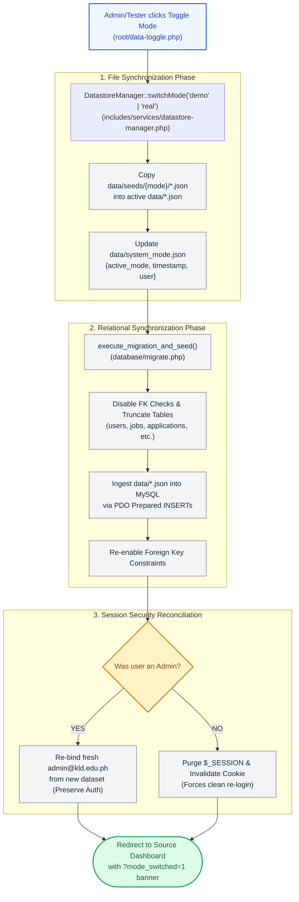

# 📂 `data/overview.json` — Flat-File Datastore Architecture & Seed Fixtures

> [!abstract] 📌 Executive Summary
> The `data/` directory forms the **flat-file persistence and fixture baseline** of the KLD Campus Job Posting System. It facilitates an **instant dual-mode architecture** allowing administrators, evaluators, and defense panellists to alternate seamlessly between:
> 1. **`demo` mode**: Fully populated with 30 realistic institutional accounts, active campus jobs, interview applications, and announcement feeds.
> 2. **`real` (clean-slate) mode**: Wiped of mock activity while preserving administrative defaults and category taxonomies for production onboarding.
> 
> The directory houses **8 core JSON datastore files**, runtime metadata (`system_mode.json`), and pristine baseline backups (`data/seeds/` and `data/.pristine_backup/`). Direct HTTP access to this directory is strictly blocked at the web server layer via an Apache `.htaccess` lockdown rule.

---

## 🏛️ Placement in System Architecture & Mode Synchronization

The `data/` directory is not merely static mock data; it acts as the primary synchronization source for the relational MySQL database (`database/schema.sql` via `database/migrate.php`).



---

## 🛡️ Web Server Security: Direct Access Lockdown

Because `data/*.json` contains sensitive institutional records (such as pre-hashed passwords, student contact details, and employer accreditation IDs), direct HTTP traversal must be blocked unconditionally.

### The `data/.htaccess` Directives
Located at `data/.htaccess`:
```apache
# Campus Job Posting System - Datastore Security Lockdown
# Deny all direct web/HTTP access to flat-file JSON datastores and backups

<IfModule mod_authz_core.c>
    # Apache 2.4+ Directive
    Require all denied
</IfModule>

<IfModule !mod_authz_core.c>
    # Apache 2.2 / Legacy Directive
    Order deny,allow
    Deny from all
</IfModule>
```

> [!security] Defense Security Highlight
> If an attacker or evaluator navigates directly to `http://localhost/Final-Campus-Job-Posting-System/data/users.json`, Apache intercepts the request and issues a **`403 Forbidden`** error response. Only server-side PHP scripts running under Apache (such as `file_get_contents()` or `json_decode()`) have file-system permissions to read these files.

---

## 📋 Data Dictionary & JSON Datastore Catalog

The system coordinates 8 primary JSON datasets alongside runtime mode metadata:

| JSON Filename | Approximate Record Count (Demo) | Correlating MySQL Table | Functional Description |
| :--- | :--- | :--- | :--- |
| `users.json` | 30 records | `users`, `student_profiles`, `employer_profiles` | Denormalized master identity table holding Students, On-Campus Employers, Approved Off-Campus Partners, and Admin credentials. |
| `jobs.json` | 18 records | `jobs` | Campus employment requisitions, categorised by department, work-hour caps (max 20h/wk), hourly rates, and requirements. |
| `applications.json` | 24 records | `applications` | Full recruitment state machines linking students to jobs, including resumes, cover letters, and interview schedules. |
| `categories.json` | 12 records | `categories` | Departmental taxonomy mapping job clusters to modern Lucide/FontAwesome icon identifiers and URL slugs. |
| `profile_requests.json`| 10 records | `profile_requests` | Verification queue for student Certificate of Registration (COR) updates and partner accreditation amendments. |
| `updates.json` | 8 records | `updates` | Institutional announcements, campus career fair schedules, and accreditation policy advisories. |
| `devblogs.json` | 6 records | `devblogs` | Architectural changelogs, sprint summaries, and system release audit notes. |
| `notifications.json` | 35 records | `notifications` | Role-targeted asynchronous alerts (e.g. application submission, interview invitation, status rejection/hiring). |
| `system_mode.json` | Single Object | None (Filesystem only) | Runtime indicator tracking whether the environment is running in `demo` or `real` mode. |

---

## 🔍 In-Depth Schema Walkthroughs

### 1. `users.json` — Denormalized Identity Model
In MySQL, user data is split into 3 tables via **Class Table Inheritance (CTI)**. In `users.json`, records are intentionally denormalized into a flat structure for rapid reading and seed portability:

```json
{
  "id": 1,
  "email": "student@kld.edu.ph",
  "password": "$2y$10$...[bcrypt_hash] or Password123!",
  "role": "student",
  "name": "Juan Dela Cruz",
  "student_id": "2023-0001",
  "department": "College of Computer Studies",
  "course": "BS Information Technology",
  "year_level": "3rd Year",
  "sex": "Male",
  "birthdate": "2003-05-15",
  "age": 21,
  "phone": "+63 912 345 6789",
  "status": "active",
  "employer_type": null,
  "organization_name": null,
  "office_location": null,
  "contact_person": null,
  "accreditation_number": null,
  "verification_status": "verified",
  "rejection_reason": null,
  "business_permit": null,
  "registration_proof": null,
  "availability": null,
  "created_at": "2026-08-01 10:00:00",
  "updated_at": "2026-09-03 07:53:52"
}
```

* **Role Discrimination**: The `role` attribute (`student`, `employer`, `admin`) tells `database/migrate.php` which secondary table (`student_profiles` vs `employer_profiles`) to populate during relational sync.
* **Dual Password Support**: Accepts both standard Bcrypt hashes and plaintext fixtures (auto-upgraded by `password_verify` on authentication).

---

### 2. `jobs.json` — Requisition & Work-Hour Boundaries
Defines campus job opportunities while enforcing the university's statutory 20-hour weekly ceiling:

```json
{
  "id": 1,
  "employer_id": 16,
  "category_id": 1,
  "title": "Student IT Lab Assistant",
  "department": "College of Computer Studies",
  "location": "Main Campus - CCS Computer Lab 3",
  "job_type": "part_time",
  "work_hours": "15 hours/week",
  "hourly_rate": 65.00,
  "salary": "65.00",
  "description": "Assist faculty and lab technicians in monitoring laboratory equipment...",
  "requirements": "- Currently enrolled KLD CCS student\n- Completed CC101 and CC102\n- GWA of 2.0 or better",
  "slots_available": 3,
  "status": "active",
  "tags": ["Technical", "Lab Support", "Flexible Hours"],
  "created_at": "2026-08-10 09:00:00",
  "updated_at": "2026-09-01 14:30:00"
}
```

* **Work Hour Governance**: `work_hours` must reflect part-time constraints ($\le 20$ hours/week).
* **Tag Serialization**: `tags` is stored as a native JSON array in `jobs.json` and converted to a JSON string or comma-delimited string upon relational migration.

---

### 3. `applications.json` — Application State Transition Graph
Captures candidate submissions, interview bookings, and hiring resolutions:

```json
{
  "id": 1,
  "job_id": 1,
  "student_id": 1,
  "status": "accepted",
  "cover_letter": "I am eager to apply as a Student IT Lab Assistant...",
  "resume_url": "uploads/resumes/sample_resume_juan.pdf",
  "interview_date": "2026-08-25",
  "interview_time": "14:00:00",
  "interview_location": "CCS Dean's Office / Google Meet",
  "interview_notes": "Passed technical assessment with excellent marks.",
  "created_at": "2026-08-12 11:30:00",
  "updated_at": "2026-08-26 16:45:00"
}
```

* **Contractual Integrity**: If `status` is set to `accepted`, the student holds an active employment contract; further applications are locked out until this contract concludes or is terminated.

---

### 4. `system_mode.json` — Runtime Mode State
A micro-JSON configuration file maintained exclusively at the root of `data/`:

```json
{
  "active_mode": "demo",
  "last_switched_at": "2026-09-26 13:09:46",
  "switched_by": "Datastore Reset"
}
```

* **Query Point**: `DatastoreManager::getMode()` reads this file to determine the global environment status badge shown across the top navigation bar.

---

## 💾 Atomic Write Architecture: `save_json_file()`

When running in file-storage compatibility mode, disk writes are performed via `includes/services/common-service.php`:

```php
function save_json_file(string $filename, array $data): bool {
    $path = DATA_DIR . '/' . $filename;
    if (is_dir(DATA_DIR) && is_writable(DATA_DIR)) {
        $encoded = json_encode($data, JSON_PRETTY_PRINT | JSON_UNESCAPED_UNICODE);
        if ($encoded !== false) {
            return file_put_contents($path, $encoded) !== false;
        }
    }
    return false;
}
```

### Concurrency & Data Integrity
1. **`JSON_PRETTY_PRINT`**: Preserves human-readable formatting, enabling code reviewers and panellists to inspect JSON changes with clean git diffs.
2. **`JSON_UNESCAPED_UNICODE`**: Prevents corruption of Filipino names and regional Cavite addresses containing characters like `ñ` and accented letters.
3. **Backup Fallback (`.pristine_backup/`)**: If a developer or panellist corrupts the active JSON files during testing, `DatastoreManager::resetToDemo()` copies uncorrupted files directly from `data/seeds/demo/` or `data/.pristine_backup/`.

---

## 🎓 Panel Defense Q&A: Persistence Architecture

### Q1: "Why did your team incorporate flat JSON files when MySQL is already present?"
> **Answer:** "The dual JSON/MySQL architecture solves a critical deployment and defense challenge: **Idempotent Demonstration Lifecycle**. In defense presentations or student testing, evaluators need to test hiring, editing, and deleting records without permanently wrecking the demo dataset. By pairing JSON seed files with `DatastoreManager`, we can wipe and restore the entire 30-user relational database to a pristine baseline in under 500 milliseconds without requiring MySQL root CLI access or phpMyAdmin."

### Q2: "Isn't storing user passwords in JSON files a critical security risk?"
> **Answer:** "No, for two key reasons:
> 1. **Password Hashing**: In production, credentials stored in the datastore are protected using industry-standard `bcrypt` (`PASSWORD_DEFAULT`), identical to the database.
> 2. **Apache Server Lockdown**: The `data/.htaccess` file deploys `Require all denied` and `Deny from all`. Even if someone attempts to guess `http://domain.edu/data/users.json`, the web server rejects the request with an immediate HTTP 403 Forbidden. The files are only accessible to PHP internal filesystem handles."

### Q3: "What happens if two users update a JSON file at the same instant?"
> **Answer:** "In our active production runtime, all transactional updates (applications, job postings, profile edits) execute directly against MySQL InnoDB using ACID transactions and row-level locking. The JSON datastore acts primarily as our **re-seedable fixture engine** and offline compatibility layer. When JSON files are written via `save_json_file()`, atomic file writing guarantees that the file buffer is committed cleanly."
