# 🚚 `database/migrate.php` — Dual-Datastore Migration & Synchronization Engine

> [!abstract] 📌 Executive Summary
> `database/migrate.php` is the **automated migration and data synchronization pipeline** bridging JSON flat-file storage with MySQL / MariaDB relational tables. Executable via Command-Line Interface (`php database/migrate.php`), accessible via web browser, or called programmatically by `DatastoreManager`, it executes a 5-stage migration sequence:
> 1. Verifies connectivity to the MySQL database engine.
> 2. Executes DDL statements from `database/schema.sql` under temporary foreign-key suppression.
> 3. Truncates target tables with strict whitelist sanitization when resetting.
> 4. Ingests records from `data/*.json`, normalizes flat JSON objects into 3NF Class Table Inheritance structures, and inserts them within an atomic transaction (`beginTransaction()`).
> 5. Commits the transaction or rolls back (`rollBack()`) on structural error.

---

## 🏛️ Placement in System Architecture

```mermaid
flowchart TD
    Trigger["Migration Triggered:<br/>- CLI: php database/migrate.php<br/>- Web Browser Interface<br/>- Programmatic call from DatastoreManager"] --> ConnectDB["Connect to MySQL via get_db_connection()"]
    
    ConnectDB --> RunDDL{"Is $run_ddl true?"}
    RunDDL -- "Yes" --> ExecSchema["Read schema.sql<br/>Disable FK checks & execute CREATE TABLE DDLs"]
    RunDDL -- "No" --> CheckTruncate
    ExecSchema --> CheckTruncate{"Is $truncate true?"}
    
    CheckTruncate -- "Yes" --> TruncateTables["Iterate whitelisted tables & TRUNCATE<br/>(users, student_profiles, employer_profiles, jobs, etc.)"]
    CheckTruncate -- "No" --> StartTx
    TruncateTables --> StartTx
    
    StartTx["Begin Atomic Transaction: $pdo->beginTransaction()"] --> ReadJSON["Load JSON Files from data/ directory"]
    
    ReadJSON --> IngestCats["Ingest categories.json -> INSERT INTO categories"]
    IngestCats --> IngestUsers["Ingest users.json -> Split & Hydrate:<br/>1. INSERT INTO users<br/>2. INSERT INTO student_profiles<br/>3. INSERT INTO employer_profiles"]
    IngestUsers --> IngestJobs["Ingest jobs.json -> INSERT INTO jobs"]
    IngestJobs --> IngestApps["Ingest applications.json -> INSERT INTO applications"]
    IngestApps --> IngestAncillary["Ingest profile_requests, updates, notifications, devblogs"]
    
    IngestAncillary --> CommitTx{"All inserts succeeded without error?"}
    CommitTx -- "Yes" --> SuccessCommit["$pdo->commit()<br/>Emit Success Report (CLI ANSI / HTML Badges)"]
    CommitTx -- "No (Exception)" --> RollbackTx["$pdo->rollBack()<br/>Log Fatal Error Diagnostics"]
    
    classDef gate fill:#fef3c7,stroke:#d97706,stroke-width:2px,color:#92400e;
    classDef success fill:#dcfce7,stroke:#16a34a,stroke-width:2px,color:#166534;
    classDef danger fill:#fee2e2,stroke:#dc2626,stroke-width:2px,color:#991b1b;
    classDef step fill:#f1f5f9,stroke:#64748b,stroke-width:1px,color:#0f172a;
    
    class RunDDL,CheckTruncate,CommitTx gate;
    class SuccessCommit success;
    class RollbackTx danger;
    class Trigger,ConnectDB,ExecSchema,TruncateTables,StartTx,ReadJSON,IngestCats,IngestUsers,IngestJobs,IngestApps,IngestAncillary step;
```



---

## 🔍 Line-by-Line Technical Analysis

### Lines 10–33: Dual Execution Modality & Logger
```php
function execute_migration_and_seed($verbose = false, $source_dir = null, $run_ddl = true, $truncate = false) {
    $is_cli = (php_sapi_name() === 'cli');
    $log_fn = function($message, $type = 'info') use ($verbose, $is_cli) {
        if (!$verbose) return;
        $timestamp = date('H:i:s');
        if ($is_cli) {
            $prefix = match($type) {
                'success' => "\033[32m[SUCCESS]\033[0m",
                'error'   => "\033[31m[ERROR]\033[0m",
                'warning' => "\033[33m[WARN]\033[0m",
                default   => "\033[36m[INFO]\033[0m"
            };
            echo "[$timestamp] $prefix $message\n";
        } else {
            $badge = match($type) {
                'success' => 'badge bg-success',
                // Outputs HTML Bootstrap badges...
            };
            echo "<div class='mb-2 font-monospace'>...</div>";
        }
    };
```
- **Context-Aware Formatting (`php_sapi_name() === 'cli'`)**: Automatically emits ANSI terminal color escapes (`\033[32m`) when run in PowerShell/Bash, or styled HTML alert cards when viewed in a web browser.

---

### Lines 40–57: DDL Execution Under Temporary FK Suppression
```php
if ($run_ddl) {
    $schema_file = __DIR__ . '/schema.sql';
    if (!file_exists($schema_file)) {
        throw new Exception("schema.sql not found at: " . $schema_file);
    }

    $log_fn("Executing schema.sql DDL statements...");
    $sql = file_get_contents($schema_file);
    $statements = array_filter(array_map('trim', explode(';', $sql)));
    $pdo->exec("SET FOREIGN_KEY_CHECKS = 0;");
    foreach ($statements as $stmt) {
        if (!empty($stmt)) {
            $pdo->exec($stmt);
        }
    }
    $pdo->exec("SET FOREIGN_KEY_CHECKS = 1;");
    $log_fn("Tables created/verified successfully.", "success");
}
```
- Splits SQL queries on semicolons and temporarily disables foreign-key verification (`SET FOREIGN_KEY_CHECKS = 0`) to prevent ordering errors when dropping or recreating interconnected tables.

---

### Lines 59–71: Whitelist-Sanitized Table Truncation
```php
if ($truncate) {
    $pdo->exec("SET FOREIGN_KEY_CHECKS = 0;");
    $allowed_tables = ['email_verifications', 'notifications', 'devblogs', 'updates', 'profile_requests', 'password_resets', 'applications', 'jobs', 'student_profiles', 'employer_profiles', 'categories', 'users'];
    foreach ($allowed_tables as $t) {
        // Strict whitelist validation for security audit compliance
        if (in_array($t, $allowed_tables, true) && preg_match('/^[a-z0-9_]+$/i', $t)) {
            $pdo->exec("TRUNCATE TABLE `" . $t . "`;");
        }
    }
    $pdo->exec("SET FOREIGN_KEY_CHECKS = 1;");
    $log_fn("All tables truncated.", "info");
}
```
- **SQL Injection Defense on DDL**: Table names cannot be bound via standard PDO parameters. The migrator enforces a hardcoded whitelist (`$allowed_tables`) and regex check (`/^[a-z0-9_]+$/i`) before executing `TRUNCATE TABLE`.

---

### Lines 75–250: Relational Normalization of Flat JSON Datastores
```php
$pdo->beginTransaction();

// Hydrating Class Table Inheritance from users.json:
foreach ($users_json as $u) {
    // 1. Insert into base 'users' table
    $stmt_user->execute([...]);
    
    // 2. If role is student, insert into 'student_profiles'
    if ($u['role'] === 'student') {
        $stmt_student->execute([...]);
    }
    // 3. If role is employer, insert into 'employer_profiles'
    if ($u['role'] === 'employer') {
        $stmt_employer->execute([...]);
    }
}
```
- **Class Table Decomposition**: Flat records in `data/users.json` are dynamically split during ingestion. The authentication credentials populate `users`, while student-specific or employer-specific attributes are routed to their respective 1-to-1 extension tables.
- All operations execute inside an atomic transaction; if any record contains invalid data, `$pdo->rollBack()` reverts the database to its pre-migration state.

---

## 🛡️ Defense Talking Points & Security Disclosures

> [!tip] 🎓 Panelist Q&A Defense Sheet
> 
> **Q: How does `database/migrate.php` ensure data consistency during migrations?**
> **A:** The migration engine utilizes **ACID Transactions**:
> ```php
> $pdo->beginTransaction();
> // ... thousands of row insertions across 12 tables ...
> $pdo->commit();
> ```
> If any foreign key violation, malformed JSON entry, or constraint failure occurs mid-migration, the `catch (Exception $e)` block invokes `$pdo->rollBack()`. The database never remains in a corrupt or half-migrated state.
> 
> **Q: What purpose does dual-datastore synchronization serve?**
> **A:** It provides **Fault Tolerance**. In development environments where MySQL might not be running (such as a laptop without XAMPP services started), the application seamlessly falls back to JSON flat files. When MySQL is booted, `migrate.php` synchronizes the JSON records into normalized relational tables with zero manual SQL querying.
