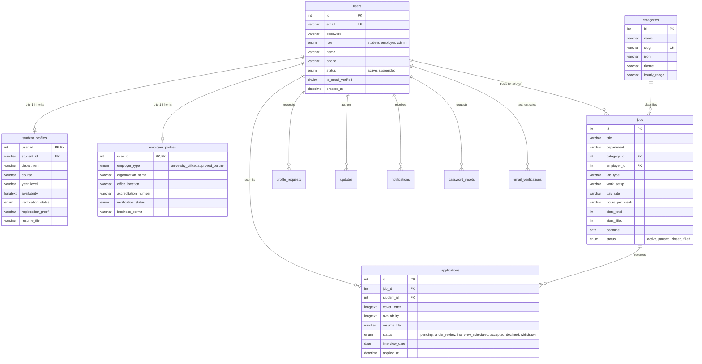

# 🗄️ `database/schema.sql` — 3NF Relational Schema & Table Architecture

> [!abstract] 📌 Executive Summary
> `database/schema.sql` defines the **production MySQL / MariaDB relational database architecture** (`campus_job_portal`). Engineered to Third Normal Form (3NF) standards, it implements the **Class Table Inheritance (CTI)** pattern for user roles, utilizes a pure junction table with unique composite constraints for job applications, enforces referential integrity across 12 interrelated tables via `ON DELETE CASCADE` and `ON DELETE SET NULL`, and indexes all high-frequency query columns.

---

## 🏛️ Entity Relationship Diagram (ERD)



---

## 🔍 Structural Analysis of the 12 Relational Tables

### 1. `users` (Core Identity & Authentication Supertype)
- **Primary Key**: `id` INT AUTO_INCREMENT.
- **Unique Constraint**: `email` VARCHAR(191) UNIQUE (enforces institutional single-account rule).
- **Role Partitioning**: `role ENUM('student', 'employer', 'admin')`.
- **Security Indexes**: `idx_users_role`, `idx_users_status`.

### 2. `student_profiles` (Student Subtype Table)
- **Primary / Foreign Key**: `user_id` INT PRIMARY KEY referencing `users(id)` with `ON DELETE CASCADE`.
- **Class Table Inheritance**: Prevents NULL bloat in the main `users` table by isolating student-specific fields (`student_id`, `department`, `course`, `year_level`, `sex`, `birthdate`, `age`, `availability`, `verification_status`, `registration_proof`, `resume_file`).
- **Academic Uniqueness**: `student_id` VARCHAR(50) NOT NULL UNIQUE.

### 3. `employer_profiles` (Employer Subtype Table)
- **Primary / Foreign Key**: `user_id` INT PRIMARY KEY referencing `users(id)` with `ON DELETE CASCADE`.
- **Accreditation Fields**: `employer_type ENUM('university_office', 'approved_partner')`, `organization_name`, `office_location`, `accreditation_number`, `business_permit`.

### 4. `categories` (Job Taxonomy)
- **Primary Key**: `id` INT AUTO_INCREMENT.
- **Unique Slug**: `slug VARCHAR(191) NOT NULL UNIQUE`.
- **UI Tokens**: `icon`, `theme`, `badge_tag`, `badge_icon`, `hourly_range`, `image`.

### 5. `jobs` (Requisition Header)
- **Primary Key**: `id` INT AUTO_INCREMENT.
- **Relational Links**:
  - `category_id` references `categories(id)` (`ON DELETE SET NULL`).
  - `employer_id` references `users(id)` (`ON DELETE SET NULL`).
- **Capacity Management**: `slots_total INT DEFAULT 1`, `slots_filled INT DEFAULT 0`.
- **Lifecycle Status**: `status ENUM('active', 'paused', 'closed', 'filled')`.

### 6. `applications` (Pure Junction & Hiring Workflow State)
- **Primary Key**: `id` INT AUTO_INCREMENT.
- **Relational Links**: `job_id` references `jobs(id)`, `student_id` references `users(id)` (`ON DELETE CASCADE`).
- **Single-Submission Constraint**: `UNIQUE KEY unique_student_job (job_id, student_id)` algorithmically blocks duplicate concurrent applications to the same requisition.
- **Workflow State**: `status ENUM('pending', 'under_review', 'interview_scheduled', 'accepted', 'declined')`.

### 7. `profile_requests` (Student Academic Correction Queue)
- **Foreign Key**: `user_id` references `users(id)` (`ON DELETE CASCADE`).
- **Auditing**: Captures `current_profile` and `requested_profile` as JSON snapshots, alongside uploaded `proof_file` (COR/grade slip) and `admin_notes`.

### 8. `updates` (Career News & Announcements)
- **Unique Constraint**: `slug VARCHAR(191) NOT NULL UNIQUE`.
- **Attribution Link**: `author_id` references `users(id)` (`ON DELETE SET NULL`).

### 9. `notifications` (In-App Alert Delivery Log)
- **Composite Index**: `idx_notifications_user_read (user_id, is_read)` for sub-millisecond polling retrieval of unread notifications.

### 10. `password_resets` (Single-Use Token Ledger)
- **Token Hashing**: `token_hash VARCHAR(255) NOT NULL UNIQUE`, `expires_at DATETIME`, `used_at DATETIME`.

### 11. `devblogs` (Engineering Sprint Chronicle)
- Captures group capstone development logs (`sprint_number`, `sprint_title`, `daily_logs`).

### 12. `email_verifications` (Institutional 6-Digit OTP Verification)
- Stores cryptographic hash of the 6-digit OTP code (`code_hash`), expiration timestamp (15-minute window), and brute-force attempt counters (`attempts`).

---

## 🛡️ Defense Talking Points & Security Disclosures

> [!tip] 🎓 Panelist Q&A Defense Sheet
> 
> **Q: Why did you choose Class Table Inheritance (CTI) instead of a Single Table Inheritance (putting all student and employer columns in the `users` table)?**
> **A:** Single Table Inheritance results in a sparse table where student records have dozens of NULL values for employer fields (`business_permit`, `organization_name`), and employer records have NULL values for student fields (`gwa`, `course`, `year_level`). CTI separates attributes cleanly: the shared authentication credentials reside in `users`, while specific attributes reside in 1-to-1 extension tables (`student_profiles` and `employer_profiles`), satisfying 3NF normalization.
> 
> **Q: What prevents a student from submitting 10 applications for the same job posting?**
> **A:** Line 166 enforces a composite database constraint:
> ```sql
> UNIQUE KEY `unique_student_job` (`job_id`, `student_id`)
> ```
> Even if a student double-clicks or bypasses front-end JavaScript checks, the relational database engine rejects duplicate submissions at the storage layer with MySQL Error 1062 (Duplicate entry).
