# 🧬 `database/seed_data.sql` — Baseline Fixtures & Evaluation Seed Data

> [!abstract] 📌 Executive Summary
> `database/seed_data.sql` supplies the **standard evaluation baseline fixtures** for the KLD Campus Job Posting System. Engineered for capstone defense presentations and automated testing, it provisions realistic sample records across all 12 relational tables: 6 standardized job categories, 10 multi-role accounts (students, campus office deans, accredited corporate partners, and system admins), 14 diverse job requisitions, candidate dossiers, and pending accreditation tickets. It uses `ON DUPLICATE KEY UPDATE` to guarantee **idempotent re-execution**.

---

## 🏛️ Seeded Ecosystem Hierarchy

```mermaid
flowchart TD
    subgraph SeedAccounts ["10 Seed Accounts (`users`)"]
        AdminUser["Admin: admin@kld.edu.ph"]
        StudentUsers["Students: Juan Dela Cruz, Maria Santos, Alwinson Bustamante"]
        OfficeUsers["Campus Offices: Registrar, MIS Center"]
        PartnerUsers["Accredited Partners: TechVanguard, Dasma Creative, Campus Cafe, Apex Robotics"]
    end

    subgraph SeedTaxonomy ["6 Job Family Categories"]
        CatIT["IT & Technical Support (₱85/hr)"]
        CatLib["Library Services (₱80/hr)"]
        CatAdmin["Administrative Clerk (₱80/hr)"]
        CatLab["Science & Computer Lab Assistant (₱85/hr)"]
        CatTutor["Peer Tutor (₱100/hr)"]
        CatSports["Sports & Athletics Aide (₱85/hr)"]
    end

    subgraph SeedRequisitions ["14 Job Requisitions (`jobs`)"]
        J1["Computer Lab Assistant (MIS)"]
        J2["Digital Cataloger (Library)"]
        J3["Student Records Clerk (Registrar)"]
        J4["Junior Web Assistant (TechVanguard)"]
        J5["Media Assistant (Creative Studio)"]
    end

    subgraph SeedApplications ["Candidate Dossiers & States"]
        A_Pending["Pending Review Dossiers"]
        A_Interview["Interview Scheduled (Calendar & Venue)"]
        A_Hired["Accepted / Hired (Slots Filled)"]
    end

    SeedAccounts --> SeedTaxonomy
    SeedTaxonomy --> SeedRequisitions
    SeedRequisitions --> SeedApplications
    
    classDef acc fill:#eff6ff,stroke:#2563eb,stroke-width:1px,color:#1e3a8a;
    classDef cat fill:#fef3c7,stroke:#d97706,stroke-width:1px,color:#92400e;
    classDef job fill:#dcfce7,stroke:#16a34a,stroke-width:1px,color:#166534;
    classDef app fill:#f1f5f9,stroke:#64748b,stroke-width:1px,color:#0f172a;
    
    class AdminUser,StudentUsers,OfficeUsers,PartnerUsers acc;
    class CatIT,CatLib,CatAdmin,CatLab,CatTutor,CatSports cat;
    class J1,J2,J3,J4,J5 job;
    class A_Pending,A_Interview,A_Hired app;
```



---

## 🔍 Detailed Inventory of Seeded Personas & Fixtures

### 1. Pre-Configured Evaluation Personas

| Role | Name | Email | Default Password | Institutional Context |
| :--- | :--- | :--- | :--- | :--- |
| **Student** | Juan Dela Cruz | `student@kld.edu.ph` | `Password123!` | 2nd Year BSIS, 20 hrs/week availability, multiple pending applications. |
| **Student** | Maria Santos | `maria.santos@kld.edu.ph` | `Password123!` | 3rd Year BSCS, 12 units, interview scheduled for MIS assistantship. |
| **Employer** | Prof. Roberto Hernandez | `registrar@kld.edu.ph` | `Password123!` | Head Registrar; manages 3 Administrative Clerk requisitions. |
| **Employer** | Engr. Clara Villanueva | `itdept@kld.edu.ph` | `Password123!` | MIS Director; manages Computer Lab and Workstation Support openings. |
| **Partner** | Atty. Katrina Alcantara | `techvanguard@partner.kld.edu.ph` | `Password123!` | Verified IT partner employer (`MOA-2026-IT004`). |
| **Partner** | Engr. Dennis Ramirez | `apexrobotics@partner.kld.edu.ph` | `Password123!` | **Pending Accreditation** (`pending_approval`) for testing admin approval queues. |
| **Admin** | KLD Campus System Admin | `admin@kld.edu.ph` | `Password123!` | Super Administrator; oversees global reports and verification triage. |

---

### 2. Category Taxonomy Fixtures
- Pre-seeds 6 standardized categories with curated icons (`bi-laptop`, `bi-book`, `bi-folder2-open`, `bi-radioactive`, `bi-mortarboard`, `bi-trophy`), hourly ranges, badge tags, and local cover photography references.

---

### 3. Requisition & Quota Scenarios
- Vacancies span across **On-Campus**, **Hybrid**, and **Remote** work setups.
- All seeded positions strictly respect the **20-hour weekly cap** (`10 - 20 hrs/week`, `15 - 20 hrs/week`).
- Includes realistic slot contention scenarios:
  - Open positions with 0 hires.
  - Partially filled positions (e.g. 1 of 2 slots filled).
  - Fully filled positions (e.g. 2 of 2 slots filled, status set to `filled`).

---

### 4. Idempotent Execution Design
```sql
INSERT INTO `users` (`id`, `email`, ...) VALUES (...)
ON DUPLICATE KEY UPDATE `email`=VALUES(`email`);
```
- Every insertion clause is bracketed by `ON DUPLICATE KEY UPDATE`. Running this script repeatedly against a live database updates existing records to the canonical baseline rather than failing with duplicate key constraint violations.

---

## 🛡️ Defense Talking Points & Security Disclosures

> [!tip] 🎓 Panelist Q&A Defense Sheet
> 
> **Q: Why does the seed dataset include an unverified partner account (`Apex Robotics`)?**
> **A:** This was deliberately engineered to demonstrate the **Partner Accreditation Workflow** during defense presentations. When the panel logs in as Administrator, Apex Robotics appears immediately in the *Pending Verification Queue* on `admin/users.php`, allowing examiners to test permit inspection, approval, and rejection live.
> 
> **Q: Are passwords stored in plaintext in `seed_data.sql`?**
> **A:** For local development and demonstration purposes, seeds provide easily recognizable test strings (`Password123!`). In production environments or when users register live through `register.php`, passwords are automatically hashed with salted **Bcrypt (`PASSWORD_DEFAULT`)**. Furthermore, `user-service.php` transparently upgrades plain demo seeds to Bcrypt hashes upon the user's first login.
