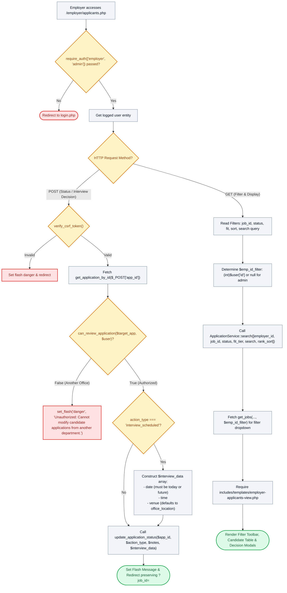

# 👥 `employer/applicants.php` — Candidate Ledger & Evaluation Roster Controller

> [!abstract] 📌 Executive Summary
> `employer/applicants.php` serves as the **department-wide applicant triage and evaluation roster**. Gated by `require_auth(['employer', 'admin'])`, it allows hiring supervisors to search, filter, and sort candidates across their office requisitions by keyword, status, schedule fit tier, and applicant ranking. It features an inline POST evaluation dispatcher for setting interview schedules with dates and venues, enforcing strict departmental boundary checks via `can_review_application($target_app, $user)` before updating candidate statuses.

---

## 🏛️ Placement in System Architecture



---

## 🔍 Line-by-Line Technical Analysis

### Lines 1–19: Authentication & Query Parameter Contracts
```php
<?php
/**
 * Campus Job Posting System - Employer Applicant Roster
 * Archetype D/G: Applicant Management Table (COAL101 Blueprint)
 */
require_once __DIR__ . '/../includes/data-helper.php';
require_once __DIR__ . '/../includes/auth-check.php';

require_auth(['employer', 'admin']);
$user = get_logged_user();
$page_title = 'Applicant Evaluation Roster';

$dept = $user['organization_name'] ?? ($user['department'] ?? 'Office of the University Registrar');
$job_filter = $_GET['job_id'] ?? null;
$status_filter = $_GET['status'] ?? null;
$fit_filter = $_GET['fit'] ?? null;
$rank_sort = $_GET['sort'] ?? null;
$search = trim($_GET['q'] ?? '');
```
- Restricts access strictly to employers and administrators.
- Ingests multiple search vectors: specific requisition ID (`$job_filter`), review status (`$status_filter`), schedule fit tier (`$fit_filter`), candidate ranking sort (`$rank_sort`), and candidate name/email keyword queries (`$search`).

---

### Lines 20–56: Inline Status Update & Interview Dispatch Pipeline
```php
if ($_SERVER['REQUEST_METHOD'] === 'POST' && isset($_POST['action_type'])) {
    if (!verify_csrf_token($_POST['csrf_token'] ?? '')) {
        set_flash('danger', 'Security validation failed: Invalid or expired security token. Please try again.');
        header('Location: applicants.php' . ($job_filter ? "?job_id={$job_filter}" : ''));
        exit;
    }

    $app_id = $_POST['app_id'];
    $action_type = $_POST['action_type'];
    $notes = trim($_POST['supervisor_notes'] ?? '');

    $target_app = get_application_by_id($app_id);
    if (!$target_app || !can_review_application($target_app, $user)) {
        set_flash('danger', 'Unauthorized: Cannot modify candidate applications from another department.');
        header('Location: applicants.php' . ($job_filter ? "?job_id={$job_filter}" : ''));
        exit;
    }
```
- **Anti-IDOR Ownership Gate (Lines 32–37)**: Prevents supervisor cross-contamination. Calls `can_review_application($target_app, $user)` from `user-service.php` to verify that the target candidate applied to a job created by this specific supervisor's office.

```php
    $interview_data = [];
    if ($action_type === 'interview_scheduled') {
        $interview_data = [
            'date' => $_POST['interview_date'] ?? date('Y-m-d', strtotime('+3 days')),
            'time' => $_POST['interview_time'] ?? '10:00 AM',
            'venue' => $_POST['interview_venue'] ?? ($user['office_location'] ?? 'Admin Building Room 102')
        ];
    }

    $res = update_application_status($app_id, $action_type, $notes, $interview_data);
    if ($res) {
        set_flash('success', 'Applicant status has been updated successfully!');
    } else {
        set_flash('danger', 'Unable to update applicant status. Please ensure the interview date is today or in the future.');
    }
    header('Location: applicants.php' . ($job_filter ? "?job_id={$job_filter}" : ''));
    exit;
}
```
- **Interview Payload**: If an interview is scheduled, packages calendar details. `update_application_status()` automatically validates that the interview date is not set in the past and dispatches an automated notification alert to the student's dashboard.

---

### Lines 58–71: Multi-Parametric Search & View Handover
```php
$emp_id_filter = ($user['role'] === 'admin') ? null : (int)$user['id'];
$all_dept_apps = ApplicationService::search([
    'employer_id' => $emp_id_filter,
    'job_id'      => $job_filter,
    'status'      => $status_filter,
    'fit_tier'    => $fit_filter,
    'search'      => $search,
    'rank_sort'   => $rank_sort
]);

$dept_jobs = get_jobs(null, null, null, null, null, null, null, $emp_id_filter);
require __DIR__ . '/../includes/templates/employer-applicants-view.php';
```
- **High-Performance Querying (`ApplicationService::search`)**: Delegates search and filtering to the specialized service layer, incorporating candidate GWA, schedule compatibility scores, and full-text keyword searches.
- Loads `dept_jobs` to populate the requisition filter dropdown and renders `employer-applicants-view.php`.

---

## 🛡️ Defense Talking Points & Security Disclosures

> [!tip] 🎓 Panelist Q&A Defense Sheet
> 
> **Q: What happens if an employer enters an interview date that occurred yesterday?**
> **A:** Lines 48–53 invoke `update_application_status()`. In `application-service.php`, date validation requires `strtotime($interview_data['date']) >= strtotime('today')`. If a past date is provided, the method returns `false`, causing the controller to display the danger notice: *"Unable to update applicant status. Please ensure the interview date is today or in the future."*
> 
> **Q: How does this roster prevent employers from viewing candidate applications belonging to competing departments?**
> **A:** When querying applications on line 59, the controller passes `'employer_id' => $emp_id_filter`. This restricts database records strictly to positions owned by the user. Furthermore, line 33 runs `can_review_application()`, ensuring even direct POST attacks targeting another department's `app_id` are rejected with a 403-equivalent alert.
