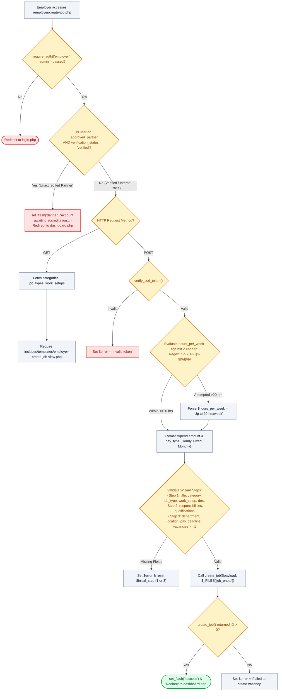

# 📝 `employer/create-job.php` — Requisition Wizard & 20-Hour Cap Enforcer

> [!abstract] 📌 Executive Summary
> `employer/create-job.php` governs the **multi-step job requisition composer**. Accessible exclusively to verified departmental supervisors and administrators (`require_auth(['employer', 'admin'])`), it enforces two critical institutional constraints:
> 1. **Accreditation Gate**: Unverified external partner employers cannot publish requisitions until officially accredited by SASO/Admin.
> 2. **Statutory 20-Hour Labor Ceiling**: Algorithmically prevents supervisors from creating student positions exceeding 20 hours per week.
> It processes 3-step wizard validation (Core Information, Duties & Qualifications, Terms & Stipend), formats currency rates, handles promotional flyer uploads, and calls `create_job()`.

---

## 🏛️ Placement in System Architecture



---

## 🔍 Line-by-Line Technical Analysis

### Lines 1–19: Authentication & Partner Accreditation Interception
```php
<?php
/**
 * Campus Job Posting System - Create Job Requisition Form
 * Archetype A/C: Multi-Stage Split Card Requisition Wizard (COAL101 Blueprint)
 */
require_once __DIR__ . '/../includes/data-helper.php';
require_once __DIR__ . '/../includes/auth-check.php';

require_auth(['employer', 'admin']);
$user = get_logged_user();

$is_partner = ($user['employer_type'] ?? '') === 'approved_partner';
$ver_status = $user['verification_status'] ?? 'verified';
if ($user['role'] === 'employer' && $is_partner && $ver_status !== 'verified') {
    set_flash('danger', 'Your partner organization account is currently awaiting administrative accreditation. Vacancies cannot be published until verified.');
    header('Location: dashboard.php');
    exit;
}
```
- **Accreditation Guard (Lines 14–18)**: External companies that register as corporate partners cannot immediately broadcast vacancies to students. If their `verification_status` is `pending` or `rejected`, they are blocked from posting and redirected back to the dashboard.

---

### Lines 40–78: Category Resolution & Stipend Normalization
```php
// Resolve category_id from category name
$category_id = 3;
foreach ($categories as $cat) {
    if (strcasecmp($cat['name'], $category) === 0) {
        $category_id = (int)$cat['id'];
        break;
    }
}

// Separated stipend rate & compensation
$pay_amount = trim($_POST['pay_amount'] ?? '');
$pay_period = trim($_POST['pay_period'] ?? '/ hour');

if (is_numeric($pay_amount) && (float)$pay_amount > 0) {
    $formatted_amt = number_format((float)$pay_amount, 2);
    if ($pay_period === 'fixed stipend') {
        $pay_rate = '₱' . $formatted_amt . ' fixed stipend';
        $pay_type = 'Fixed Stipend';
    } else {
        $pay_rate = '₱' . $formatted_amt . ' ' . $pay_period;
        // Sets $pay_type to 'Hourly', 'Monthly', 'Daily', 'Per Semester', etc.
    }
}
```
- Maps the textual category name back to its primary key in the categories taxonomy.
- Standardizes compensation strings (e.g. `₱80.00 / hour` or `₱1,500.00 fixed stipend`) and infers the structured `$pay_type` for SQL indexing.

---

### Lines 80–85: Programmatic Enforcement of the 20-Hour Labor Cap
```php
$hours_per_week = trim($_POST['hours_per_week'] ?? '10 - 20 hrs/week');
$valid_hours = ['10 - 20 hrs/week', 'Up to 15 hrs/week', 'Up to 20 hrs/week', 'Flexible Schedule (Max 20 hrs/week)', 'Flexible Schedule'];
if (!in_array($hours_per_week, $valid_hours) || preg_match('/\b(2[1-9]|[3-9]\d)\b/', $hours_per_week)) {
    $hours_per_week = 'Up to 20 hrs/week';
}
```
- **Anti-Exploitation Policy Enforcement**: Under institutional rules, students may not be scheduled beyond 20 hours per week during academic semesters.
- **Regex Guard (`preg_match('/\b(2[1-9]|[3-9]\d)\b/', ...)`)**: Inspects any custom string input for numbers between 21 and 99. If a supervisor attempts to input "25 hrs/week" or "30 hours", the system automatically clamps the value to `'Up to 20 hrs/week'`.

---

### Lines 89–103: Dynamic Multi-Line Duties & Qualifications Parser
```php
// Dynamic lines handling for duties & qualifications
$raw_resp = $_POST['responsibilities'] ?? [];
$responsibilities = is_array($raw_resp)
    ? array_values(array_filter(array_map('trim', $raw_resp), fn($v) => $v !== ''))
    : array_values(array_filter(array_map('trim', explode("\n", (string)$raw_resp)), fn($v) => $v !== ''));

$raw_qual = $_POST['qualifications'] ?? [];
$qualifications = is_array($raw_qual)
    ? array_values(array_filter(array_map('trim', $raw_qual), fn($v) => $v !== ''))
    : array_values(array_filter(array_map('trim', explode("\n", (string)$raw_qual)), fn($v) => $v !== ''));
```
- Accepts either dynamic array inputs generated by client-side "+ Add Duty" JavaScript buttons or a textarea string with newline splits (`explode("\n", ...)`), cleaning empty lines and trimming whitespace.

---

### Lines 105–152: Step Validation, Vacancy Insertion & Redirection
```php
if (empty($title) || empty($category) || empty($job_type) || empty($work_setup) || empty($description)) {
    $error = 'Please complete all required fields in Step 1 (Vacancy Information).';
    $initial_step = 1;
} elseif (empty($department) || empty($location) || empty($pay_amount) || empty($deadline)) {
    $error = 'Please complete all required terms & quota fields in Step 3.';
    $initial_step = 3;
} elseif (!is_numeric($pay_amount) || (float)$pay_amount <= 0) {
    $error = 'Please provide a valid positive stipend rate.';
    $initial_step = 3;
} elseif ($vacancies < 1) {
    $error = 'Vacancy quota must be at least 1 position.';
    $initial_step = 3;
} else {
    $photo_file = $_FILES['job_photo'] ?? null;
    $new_id = create_job([...], $photo_file);

    if ($new_id > 0) {
        set_flash('success', "New vacancy '{$title}' published successfully!");
        header('Location: dashboard.php');
        exit;
    }
}
```
- Sets `$initial_step` so that if validation fails, the multi-step wizard reopens automatically on the exact tab that triggered the error.
- Invokes `create_job()` in `job-service.php` to persist the requisition and upload the promotional flyer.

---

## 🛡️ Defense Talking Points & Security Disclosures

> [!tip] 🎓 Panelist Q&A Defense Sheet
> 
> **Q: How does the backend prevent an employer from posting a job that demands 30 or 40 hours of work per week?**
> **A:** As demonstrated on line 82:
> ```php
> if (!in_array($hours_per_week, $valid_hours) || preg_match('/\b(2[1-9]|[3-9]\d)\b/', $hours_per_week)) {
>     $hours_per_week = 'Up to 20 hrs/week';
> }
> ```
> The system checks submitted values against a whitelist and uses regular expressions to detect any number greater than 20 (`\b(2[1-9]|[3-9]\d)\b`). Any attempted submission exceeding 20 is overridden and sanitized before insertion.
> 
> **Q: Can an unverified external employer publish jobs on the platform?**
> **A:** No. Lines 12–18 check `($is_partner && $ver_status !== 'verified')`. If an external organization has not been validated by SASO and the Admin through business permit inspection, posting is blocked, and the employer is redirected to the dashboard.
