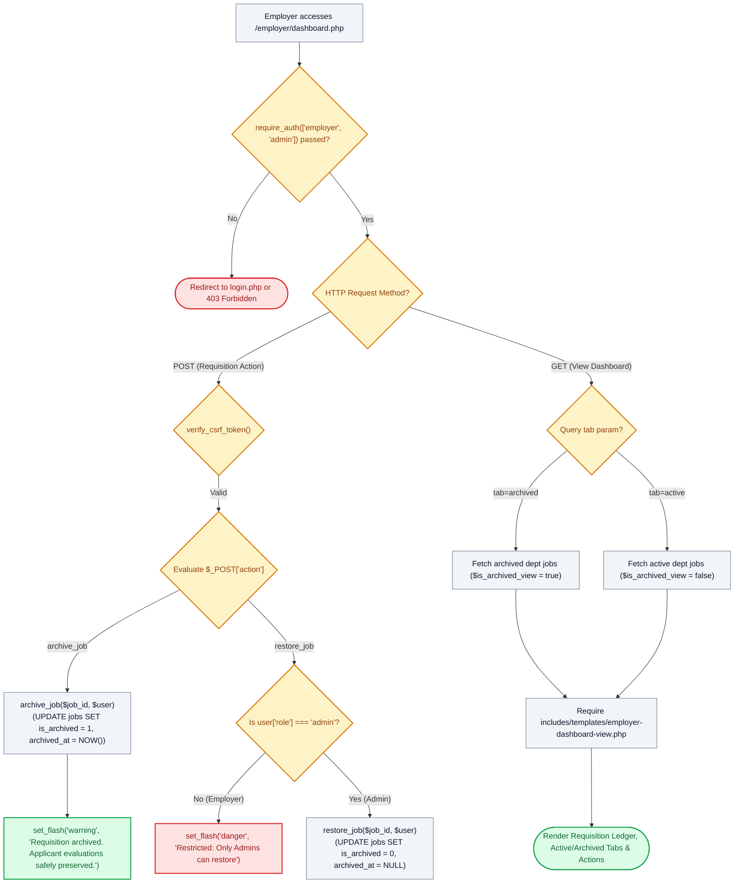

# 🏢 `employer/dashboard.php` — Employer Workspace, Requisition Archiving & Multi-Tab Controller

> [!abstract] 📌 Executive Summary
> `employer/dashboard.php` serves as the **operational workspace and requisition management console** for campus departments, university institutes, and accredited partner employers. Gated by `require_auth(['employer', 'admin'])`, it manages job requisitions with **non-destructive archiving**:
> 1. **Dual Requisition Tabs**: Toggles between **Active** and **Archived** requisitions (`?tab=archived`).
> 2. **Candidate Evaluation Preservation**: Moving a posting to Archive via `archive_job()` immediately halts new candidate applications while **preserving 100% of candidate applications, evaluation scores, and interview records**.
> 3. **Admin-Only Restore Gate**: Employers can archive their own requisitions, but **only university administrators are authorized to restore archived requisitions** back to active status, enforcing institutional hiring quotas.

---

## 🏛️ Placement in System Architecture



---

## 🔍 Line-by-Line Technical Analysis

### Lines 22–50: Requisition Archiving & Admin-Only Restore Mutations
```php
if ($action === 'archive_job') {
    if ($job_id > 0 && archive_job($job_id, $user)) {
        set_flash('warning', "Job requisition #{$job_id} has been moved to Archive. All applicant records and evaluations have been safely preserved.");
    } else {
        set_flash('danger', 'Failed to archive requisition or unauthorized access.');
    }
    header('Location: dashboard.php');
    exit;
} elseif ($action === 'restore_job') {
    // Enforce: Admin ONLY has restore privileges
    if (($user['role'] ?? '') !== 'admin') {
        set_flash('danger', 'Access Restricted: Only University Administrators are authorized to restore archived requisitions.');
        header('Location: dashboard.php');
        exit;
    }

    if ($job_id > 0 && restore_job($job_id, $user)) {
        set_flash('success', "Job requisition #{$job_id} has been restored to active status!");
    } else {
        set_flash('danger', 'Failed to restore requisition.');
    }
    header('Location: dashboard.php?tab=archived');
    exit;
}
```
- **Zero Candidate Loss**: Archiving preserves candidate applications and supervisor evaluation notes.
- **Quota Protection**: Employers cannot reopen closed postings without administrative review.

---

## 🛡️ Defense Talking Points & Security Disclosures

> [!tip] 🎓 Panelist Q&A Defense Sheet
> 
> **Q: Why are employers allowed to archive job postings but prevented from restoring them?**
> **A:** Campus departments are authorized to close or archive their job requisitions when hiring rounds finish. However, restoring an archived posting can impact institutional assistantship budgets and quota allocations. Restricting restoration to University Administrators ensures university-wide labor cap oversight.
> 
> **Q: What happens to student applications when a requisition is moved to Archive?**
> **A:** All applicant dossiers, interview notes, and status records in `applications` remain completely untouched in MySQL. Students can still see their application status in `my-applications.php`.
