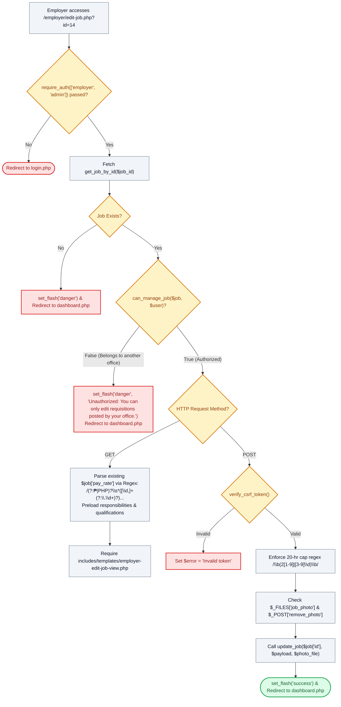

# ✏️ `employer/edit-job.php` — Requisition Modifier & Quota Manager Controller

> [!abstract] 📌 Executive Summary
> `employer/edit-job.php` provides the **requisition editing and lifecycle administration console**. Accessible to department supervisors and admins (`require_auth(['employer', 'admin'])`), it enforces strict departmental ownership via `can_manage_job($job, $user)` to prevent horizontal unauthorized modifications. It features an advanced regular-expression stipend parser for pre-populating currency inputs, allows uploading or purging promotional flyers (`remove_photo`), enforces the statutory 20-hour labor ceiling, and persists updates via `update_job()`.

---

## 🏛️ Placement in System Architecture



---

## 🔍 Line-by-Line Technical Analysis

### Lines 1–25: Authentication & Departmental Ownership Verification
```php
<?php
/**
 * Campus Job Posting System - Edit Job Requisition Form
 * Archetype C: Detail & Sidebar Action Form (COAL101 Blueprint)
 */
require_once __DIR__ . '/../includes/data-helper.php';
require_once __DIR__ . '/../includes/auth-check.php';

require_auth(['employer', 'admin']);
$user = get_logged_user();
$job_id = $_GET['id'] ?? null;
$job = get_job_by_id($job_id);

if (!$job) {
    set_flash('danger', 'The specified job requisition could not be found.');
    header('Location: dashboard.php');
    exit;
}

if (!can_manage_job($job, $user)) {
    set_flash('danger', 'Unauthorized: You can only edit requisitions posted by your office.');
    header('Location: dashboard.php');
    exit;
}
```
- **Ownership Gate (`can_manage_job`)**: Verifies that:
  - If the user is an **Admin**, full edit authority is permitted.
  - If the user is an **Employer**, `(int)$job['employer_id'] === (int)$user['id']` must match.
  - If an employer attempts to tamper with the URL parameter (e.g., changing `?id=12` to `?id=45`), the mismatch triggers an immediate redirect back to the dashboard with an error notice.

---

### Lines 72–76: 20-Hour Labor Cap Preservation
```php
$hours_per_week = trim($_POST['hours_per_week'] ?? $job['hours_per_week']);
$valid_hours = ['10 - 20 hrs/week', 'Up to 15 hrs/week', 'Up to 20 hrs/week', 'Flexible Schedule (Max 20 hrs/week)', 'Flexible Schedule'];
if (!in_array($hours_per_week, $valid_hours) || preg_match('/\b(2[1-9]|[3-9]\d)\b/', $hours_per_week)) {
    $hours_per_week = 'Up to 20 hrs/week';
}
```
- Ensures that subsequent edits cannot retroactively increase weekly workload expectations beyond the university's 20-hour ceiling.

---

### Lines 107–133: Photo Updates, Removal & Vacancy Persistence
```php
$photo_file = $_FILES['job_photo'] ?? null;
$remove_photo = !empty($_POST['remove_photo']);

update_job($job['id'], [
    'title' => $title,
    'category' => $category,
    'category_id' => $category_id,
    'job_type' => $job_type,
    'work_setup' => $work_setup,
    'location' => $location,
    'pay_rate' => $pay_rate,
    'pay_type' => $pay_type,
    'hours_per_week' => $hours_per_week,
    'vacancies' => $vacancies,
    'deadline' => $deadline,
    'status' => $status,
    'description' => $description,
    'remove_photo' => $remove_photo,
    'responsibilities' => $responsibilities,
    'qualifications' => $qualifications
], $photo_file);

set_flash('success', "Vacancy '{$title}' updated successfully!");
header('Location: dashboard.php');
exit;
```
- Handles flyer replacement or deletion via the `$remove_photo` flag.
- Updates status (e.g. changing between `active` and `closed`).
- Invokes `update_job()` in `job-service.php` and returns to `dashboard.php`.

---

### Lines 136–167: Regex Stipend Parser & Preloading
```php
// Parse existing stipend amount and period
$parsed_amount = '';
$parsed_period = '/ hour';
if (!empty($job['pay_rate'])) {
    if (preg_match('/(?:₱|PHP)?\s*([\d,]+(?:\.\d+)?)\s*(?:\/|\bper\b)?\s*(.+)?/iu', $job['pay_rate'], $pm)) {
        $parsed_amount = str_replace(',', '', trim($pm[1]));
        $raw_period = trim($pm[2] ?? '');
        // Maps 'hour', 'day', 'week', 'month', 'sem', or 'fixed'
    }
}

$resp_items = is_array($job['responsibilities'] ?? null) ? $job['responsibilities'] : (!empty($job['responsibilities']) ? explode("\n", $job['responsibilities']) : []);
$qual_items = is_array($job['qualifications'] ?? null) ? $job['qualifications'] : (!empty($job['qualifications']) ? explode("\n", $job['qualifications']) : []);

$page_title = 'Edit ' . $job['title'];
require __DIR__ . '/../includes/templates/employer-edit-job-view.php';
```
- **Regex Deconstruction**: Safely extracts the numeric digits and billing unit from composite strings like `"₱85.50 / hour"` or `"PHP 2,000 / month"` so HTML input fields are pre-populated cleanly for editing.
- Pre-splits responsibilities and qualifications into array items before invoking `employer-edit-job-view.php`.

---

## 🛡️ Defense Talking Points & Security Disclosures

> [!tip] 🎓 Panelist Q&A Defense Sheet
> 
> **Q: What stops Supervisor A from modifying the vacancy requirements or closing the job postings of Supervisor B?**
> **A:** Lines 20–24 invoke `can_manage_job($job, $user)` from `user-service.php`:
> ```php
> if (!can_manage_job($job, $user)) {
>     set_flash('danger', 'Unauthorized: You can only edit requisitions posted by your office.');
>     header('Location: dashboard.php');
>     exit;
> }
> ```
> This is a strict **Anti-IDOR Authorization Check**. Unless the user is a Super Admin or the recorded `employer_id` matches the session user's ID, execution is aborted immediately.
> 
> **Q: What happens if an employer changes the number of vacancies from 5 down to 2, but 3 students are already hired?**
> **A:** In `job-service.php`, `sync_job_slot_capacity()` executes row-locked checks (`SELECT ... FOR UPDATE`). It verifies that `slots_filled` is never exceeded by manual adjustments, and if the quota is reached, it automatically flags the job status as filled.
