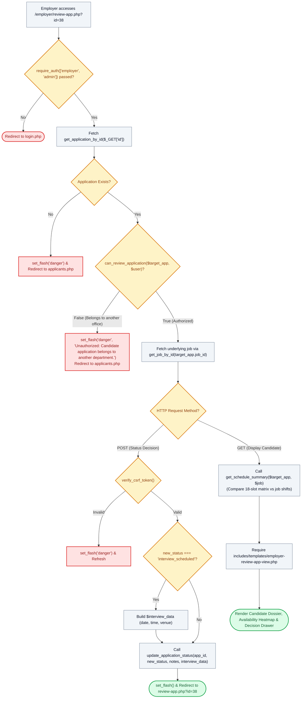

# 🧐 `employer/review-app.php` — Candidate Deep-Dive Evaluation & Decision Drawer Controller

> [!abstract] 📌 Executive Summary
> `employer/review-app.php` serves as the **deep-dive candidate evaluation workspace**. Accessible to departmental supervisors and administrators (`require_auth(['employer', 'admin'])`), it displays the student's complete application dossier, cover letter, and resume links. Crucially, it integrates the **Weekly Schedule Availability Matrix Comparison** (`get_schedule_summary`), mapping candidate free periods directly against required departmental shift blocks. It handles 3-way hiring decisions (*Under Review*, *Interview Scheduled*, *Accepted*, *Declined*) protected by CSRF tokens and strict ownership verification via `can_review_application()`.

---

## 🏛️ Placement in System Architecture



---

## 🔍 Line-by-Line Technical Analysis

### Lines 1–25: Authentication & Departmental IDOR Prevention
```php
<?php
/**
 * Campus Job Posting System - Candidate Evaluation & Decision Drawer
 * Archetype C/D: Candidate Evaluation & Availability Matrix (COAL101 Blueprint)
 */
require_once __DIR__ . '/../includes/data-helper.php';
require_once __DIR__ . '/../includes/auth-check.php';

require_auth(['employer', 'admin']);
$user = get_logged_user();

$app_id = $_GET['id'] ?? null;
$target_app = $app_id ? get_application_by_id($app_id) : null;

if (!$target_app) {
    set_flash('danger', 'The specified student application could not be found.');
    header('Location: applicants.php');
    exit;
}

if (!can_review_application($target_app, $user)) {
    set_flash('danger', 'Unauthorized: Candidate application belongs to another department.');
    header('Location: applicants.php');
    exit;
}
```
- Restricts view strictly to authenticated departmental supervisors and administrators.
- **Anti-IDOR Security Shield (Lines 21–25)**: Evaluates `can_review_application($target_app, $user)`. If a supervisor from the *Library* attempts to inspect an application submitted to the *Dean's Office*, access is rejected, and they are redirected back to their own applicant roster.

---

### Lines 27–57: Status Mutation & Interview Scheduling Handler
```php
$job = get_job_by_id($target_app['job_id'] ?? 0);

// Handle status update POST
if ($_SERVER['REQUEST_METHOD'] === 'POST') {
    if (!verify_csrf_token($_POST['csrf_token'] ?? '')) {
        set_flash('danger', 'Security validation failed: Invalid or expired security token. Please try again.');
        header("Location: review-app.php?id={$target_app['id']}");
        exit;
    }

    $new_status = $_POST['status'] ?? 'under_review';
    $notes = trim($_POST['supervisor_notes'] ?? '');

    $interview_data = [];
    if ($new_status === 'interview_scheduled') {
        $interview_data = [
            'date' => $_POST['interview_date'] ?? date('Y-m-d', strtotime('+3 days')),
            'time' => $_POST['interview_time'] ?? '10:00 AM',
            'venue' => $_POST['interview_venue'] ?? ($user['office_location'] ?? 'Admin Building Room 102')
        ];
    }

    $res = update_application_status($target_app['id'], $new_status, $notes, $interview_data);
    if ($res) {
        set_flash('success', "Candidate status for {$target_app['student_name']} updated to " . ucfirst(str_replace('_', ' ', $new_status)) . ".");
    } else {
        set_flash('danger', "Unable to update candidate status. Please ensure the interview schedule date is today or in the future.");
    }
    header("Location: review-app.php?id={$target_app['id']}");
    exit;
}
```
- **CSRF Token Validation**: Defends against cross-site request forgery attacks.
- **Interview Logistics**: If `interview_scheduled` is selected, parses the calendar date, time, and campus venue (defaulting to the supervisor's physical office workstation).
- **Audit Logging & Notifications**: Calls `update_application_status()`, which appends internal supervisor notes to the candidate history log, automatically dispatches an in-app notification to the student, and triggers an email alert if configured.

---

### Lines 59–67: Schedule Compatibility Heatmap & View Handover
```php
$page_title = 'Evaluate: ' . $target_app['student_name'];

// Candidate shift availability summary
$schedule_summary = get_schedule_summary($target_app, $job);

// Last line: view template
require __DIR__ . '/../includes/templates/employer-review-app-view.php';
```
- **`get_schedule_summary($target_app, $job)`**: Sourced from `includes/services/system-checks.php`, this algorithm cross-references the student's 18-slot availability array against the requisition's required shifts. It produces matching counts, percentage fit scores, and conflict warnings for the visual heatmap.
- Invokes `employer-review-app-view.php`.

---

## 🛡️ Defense Talking Points & Security Disclosures

> [!tip] 🎓 Panelist Q&A Defense Sheet
> 
> **Q: How does the evaluation drawer prevent a supervisor from accepting a candidate when the job quota is already filled?**
> **A:** Inside `update_application_status()` in `application-service.php`, when transitioning an application to `'accepted'`, the service calls `sync_job_slot_capacity()`. This method executes a transactional database lock (`SELECT slots_total, slots_filled FROM jobs WHERE id = ? FOR UPDATE`). If `slots_filled >= slots_total`, the acceptance transition is rejected, and an exception is returned to prevent over-hiring.
> 
> **Q: How does the system visualize whether a student is available for morning or afternoon office shifts?**
> **A:** Line 62 calls `get_schedule_summary()`. The template renders an interactive 6-day $\times$ 3-period weekly matrix (Morning, Afternoon, Evening). Timeslots selected by the student are highlighted in vibrant green, while conflicting or unavailable slots are dimmed, enabling the supervisor to make an informed hiring decision in seconds.
