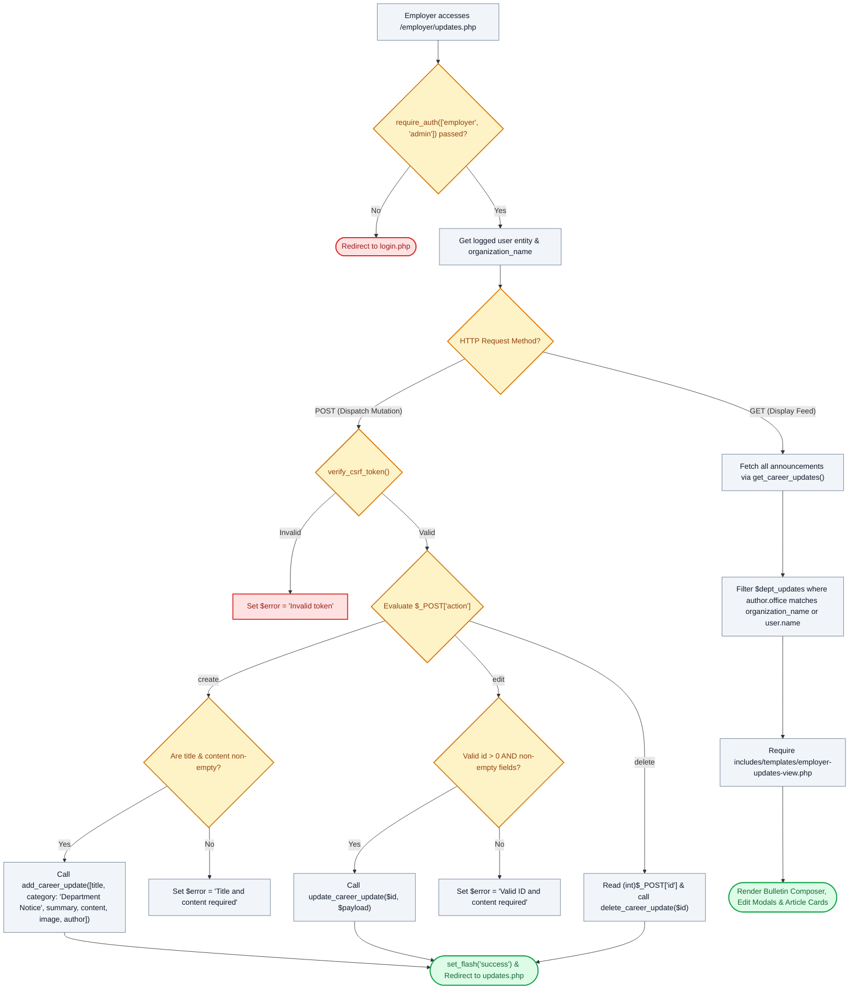

# 📢 `employer/updates.php` — Department Bulletins & Dispatch Manager Controller

> [!abstract] 📌 Executive Summary
> `employer/updates.php` provides the **departmental editorial and bulletin management console**. Gated by `require_auth(['employer', 'admin'])`, it empowers campus office supervisors to author, edit, and purge department-specific recruitment dispatches and advisories. All state-mutating actions (`create`, `edit`, `delete`) are secured by session CSRF validation. The controller automatically filters the institutional announcement feed to prioritize and highlight dispatches authored by the active office.

---

## 🏛️ Placement in System Architecture



---

## 🔍 Line-by-Line Technical Analysis

### Lines 1–16: Access Control & Entity Context
```php
<?php
/**
 * Campus Job Posting System - Employer / Campus Department Dispatches
 * Archetype B: Department Announcements Hub (COAL101 Blueprint)
 */
require_once __DIR__ . '/../includes/data-helper.php';
require_once __DIR__ . '/../includes/auth-check.php';

require_auth(['employer', 'admin']);
$user = get_logged_user();
$page_title = 'Department Dispatches & Bulletins';

$org_name = $user['organization_name'] ?? ($user['department'] ?? 'Campus Department');
$error = null;
$action = $_POST['action'] ?? null;
```
- Restricts view strictly to authenticated departmental supervisors and administrators.
- Resolves the official institutional office name (`$org_name`) to associate authored articles with the correct department badge.

---

### Lines 18–46: Action `create` — Publishing New Dispatches
```php
if ($_SERVER['REQUEST_METHOD'] === 'POST') {
    if (!verify_csrf_token($_POST['csrf_token'] ?? '')) {
        $error = 'Security validation failed: Invalid or expired security token. Please try again.';
    } elseif ($action === 'create') {
        $title = trim($_POST['title'] ?? '');
        $summary = trim($_POST['summary'] ?? '');
        $content = trim($_POST['content'] ?? '');
        $image = trim($_POST['image'] ?? '');
        $author_name = trim($_POST['author_name'] ?? $user['name']);
        $author_role = trim($_POST['author_role'] ?? 'Department Supervisor');
        $author_office = trim($_POST['author_office'] ?? $org_name);

        if (empty($title) || empty($content)) {
            $error = 'Headline title and article content are required.';
        } else {
            add_career_update([
                'title' => $title,
                'category' => 'Department Notice',
                'summary' => $summary,
                'content' => $content,
                'image' => $image,
                'author_name' => $author_name,
                'author_role' => $author_role,
                'author_office' => $author_office
            ]);
            set_flash('success', "Your department dispatch '{$title}' was published live immediately.");
            header('Location: updates.php');
            exit;
        }
```
- Validates the session CSRF token.
- Packages metadata: forces category to `'Department Notice'` and tags the authoring division.
- Invokes `add_career_update()` in `includes/services/system-service.php`, publishing the advisory live across the campus portal.

---

### Lines 47–81: Actions `edit` and `delete`
```php
    } elseif ($action === 'edit') {
        $id = (int)($_POST['id'] ?? 0);
        // Validates input and invokes update_career_update($id, $payload)
    } elseif ($action === 'delete') {
        $id = (int)($_POST['id'] ?? 0);
        if ($id > 0) {
            delete_career_update($id);
            set_flash('success', "Dispatch #{$id} has been removed.");
            header('Location: updates.php');
            exit;
        }
    }
```
- Safely casts identifiers to integers (`(int)$_POST['id']`) to prevent SQL or syntax injections.
- Updates or deletes the bulletin from datastore storage.

---

### Lines 84–93: Department Scoping & View Handover
```php
$all_updates = get_career_updates();
// If employer, highlight their department's updates first
$dept_updates = array_filter($all_updates, function($u) use ($org_name, $user) {
    return ($user['role'] === 'admin') || 
           stripos($u['author']['office'] ?? '', $org_name) !== false || 
           stripos($u['author']['name'] ?? '', $user['name']) !== false;
});

require __DIR__ . '/../includes/templates/employer-updates-view.php';
```
- Retrieves institutional announcements.
- **Department Highlight Filter**: Filters the array so that an employer only sees dispatches authored by their specific office or name (while admins retain global oversight).
- Renders `employer-updates-view.php`.

---

## 🛡️ Defense Talking Points & Security Disclosures

> [!tip] 🎓 Panelist Q&A Defense Sheet
> 
> **Q: How does this bulletin feature support campus hiring operations?**
> **A:** When a department experiences unexpected vacancies (e.g. urgent need for 3 computer lab assistants before midterms) or modifies its interview dates, the supervisor can publish an official *Department Notice*. The notice appears on both the public `updates.php` portal and student dashboards, streamlining campus communications.
> 
> **Q: Can an employer edit or delete an announcement published by the College President or the Registrar?**
> **A:** Lines 86–90 filter `$dept_updates` by the supervisor's `organization_name`. The view template only renders edit/delete action triggers for articles matching the logged-in supervisor's department, preventing supervisors from modifying or deleting announcements issued by other divisions.
