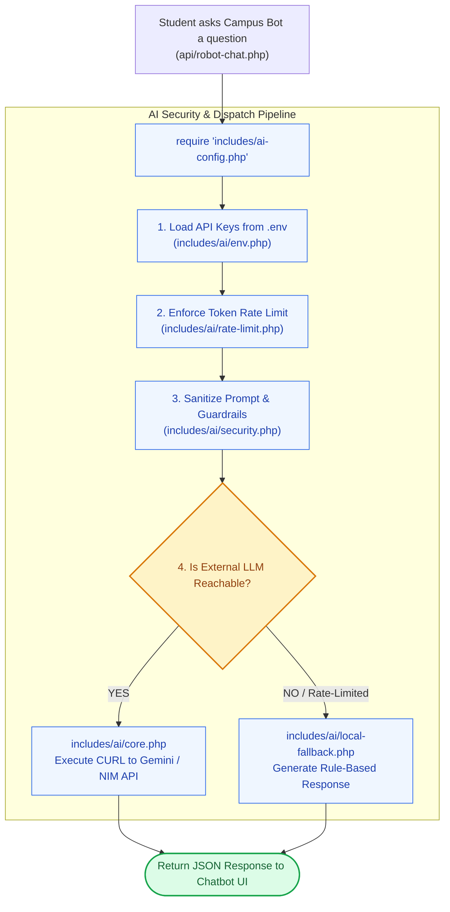

# 🤖 `includes/ai-config.php` — AI Security Gateway & Subsystem Aggregator

> [!abstract] 📌 Executive Summary
> `includes/ai-config.php` serves as the **security gateway and loader** for the platform's AI chatbot assistant (`api/robot-chat.php`). It loads the AI modules located in `includes/ai/`:
> 1. **Environment Loader (`env.php`)**: Reads `.env` keys.
> 2. **Prompt Injection Defense (`security.php`)**: Sanitizes student prompts and enforces system guardrails.
> 3. **Rate Limiting Engine (`rate-limit.php`)**: Throttles chat requests to protect API token quotas.
> 4. **Model Catalog (`models.php`)**: Lists supported models (Gemini / NVIDIA NIM).
> 5. **Core API Client (`core.php`)**: Dispatches HTTP REST requests to external LLM endpoints.
> 6. **Local Heuristic Fallback (`local-fallback.php`)**: Provides rule-based offline answers if the external API is unreachable or rate-limited.

---

## 🏛️ Placement in System Architecture



---

## 🔍 Detailed Component Breakdown

### 1. Architectural Guard Constant (Lines 8–10)
```php
if (!defined('NVIDIA_CONFIG_LOADED')) {
    define('NVIDIA_CONFIG_LOADED', true);
}
```
* Prevents multiple execution passes when loaded from diverse API endpoints.

---

### 2. Ordered Subsystem Loading (Lines 12–17)
```php
require_once __DIR__ . '/ai/env.php';
require_once __DIR__ . '/ai/security.php';
require_once __DIR__ . '/ai/rate-limit.php';
require_once __DIR__ . '/ai/models.php';
require_once __DIR__ . '/ai/core.php';
require_once __DIR__ . '/ai/local-fallback.php';
```
* **Order of Execution**:
  1. `env.php` bootstraps API keys and environment variables.
  2. `security.php` sets up prompt sanitizers and jailbreak detection.
  3. `rate-limit.php` establishes IP-based token sliding windows.
  4. `models.php` exposes model capabilities.
  5. `core.php` mounts the primary cURL HTTP client.
  6. `local-fallback.php` ensures the chatbot never returns blank or broken states.

---

## 🛡️ Security & Panel Defense Talking Points

> [!tip] 🎤 High-Yield Defense Q&A for this File
> 
> **Q: What happens if the AI API quota is exhausted during a live presentation?**
> * **Answer:** *"The AI subsystem features a dedicated **Local Heuristic Fallback** (`includes/ai/local-fallback.php`). If the Gemini API is unreachable, quota-throttled, or offline, the system intercepts the error and answers the student's question using local keyword heuristics, ensuring the chatbot never displays an error screen."*
> 
> **Q: How do you prevent prompt injection or abuse in the chatbot?**
> * **Answer:** *"In `includes/ai/security.php`, all student prompts are scrubbed of delimiter attacks, capped in length, and bound to a strict institutional system prompt instructing the AI to only assist with KLD campus jobs and academic guidelines."*
