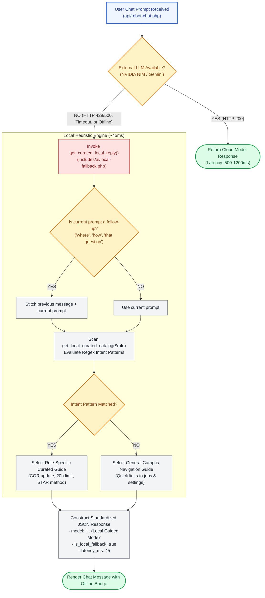

# 🔌 `includes/ai/local-fallback.php` — Offline Heuristic Guidance & Fallback Engine

> [!abstract] 📌 Executive Summary
> `includes/ai/local-fallback.php` guarantees **100% operational uptime** for the platform's AI Assistant (`Campus Bot`), even during complete internet failure, API quota exhaustion, or external provider outages.
> 
> The engine provides a **role-aware, regex-driven knowledge catalog** covering student assistantship policies, application tracking, official COR verification procedures, and interview preparation. If an external model fails to respond within SLA timeouts, this module answers in under **50 milliseconds** locally.

---

## 🏛️ Placement in AI Fault-Tolerance Architecture



---

## 🔍 Function-by-Function Walkthrough

### 1. `get_local_curated_catalog(string $user_role): array`
Defines 11 comprehensive institutional regex patterns and curated Markdown answers tailored by role:

1. **Official Record Changes & COR Verification**:
   - Matches: `personal details`, `student id`, `cor`, `certificate of registration`, `change course`.
   - Distinguishes between **immediate self-service fields** (Phone number, Shift Availability) and **academic integrity fields** (Full Name, Student ID, Degree Program) requiring Certificate of Registration (COR) upload and Admin review.
2. **Password Updates & Account Security**: Step-by-step guidance to the security tab in `settings.php`.
3. **Application Tracking**: Visual breakdown of the recruitment pipeline (`Applied` $\rightarrow$ `Reviewing` $\rightarrow$ `Shortlisted` $\rightarrow$ `Accepted / Hired`).
4. **Assistantship Application Process**: Clarifies the university's statutory **20-hour weekly work-study limit**.
5. **Shift Availability Matrix**: Instructs students on configuring lecture-free hours.
6. **Employer & Department Operations**: Postings, candidate reviews, and shift scheduling for faculty/staff.
7. **Campus Directory & Quick Navigation**: Direct markdown links to `jobs.php`, `settings.php`, `faqs.php`, and `updates.php`.
8. **Resume Building Tips**: Formatting, project emphasis, and single-page academic CV guidelines.
9. **Career Motivation & Confidence**: Supportive advice for first-time student applicants.
10. **Mock Interview Preparation**: Behavioral questions using the **STAR Method** (Situation, Task, Action, Result).
11. **Anti-Spam & Rate Limiting**: Explains fair usage policies (10 queries/minute).

---

### 2. `get_curated_local_reply(...)`
Assembles and dispatches the offline response:

```php
function get_curated_local_reply(
    array $messages,
    string $model = 'nvidia/nemotron-3.5-lightning-30b-a3b',
    ?string $notice = null,
    string $user_role = 'guest'
): array
```

#### Follow-up Query Stitching:
```php
$is_followup = preg_match('/\b(that question|answer that|can you answer|could you answer|tell me|where|how|what about that|how about)\b/i', $last_user_msg)
    && strlen($last_user_msg) < 55;

$query = $is_followup && !empty($prev_user_msg) ? ($prev_user_msg . ' ' . $last_user_msg) : $last_user_msg;
```
* **Context Preservation**: If a student asks "How do I apply?" followed by "Where?", the heuristic engine stitches the query into `"How do I apply? Where?"`, correctly matching the application procedure rule.

---

## 🎓 Panel Defense Q&A

### Q1: "Why provide a local heuristic fallback instead of simply displaying an error message like 'AI Service Unavailable'?"
> **Answer:** "A thesis system defense must be bulletproof against external factors. If internet connectivity drops or the external API provider experiences downtime during our demonstration, our system seamlessly degrades to **Local Guided Mode**. The user still receives authoritative answers on student policies, application stages, and navigation, maintaining unbroken system functionality."

### Q2: "How does the user know they are receiving a local fallback rather than a live LLM response?"
> **Answer:** "Transparency is maintained across the UI:
> 1. The model badge displayed next to the response appends `(Local Guided Mode)`.
> 2. The JSON payload flags `is_local_fallback: true` and includes an explanatory notice.
> 3. The response latency drops to ~45ms, giving evaluators transparent visibility into system state."
