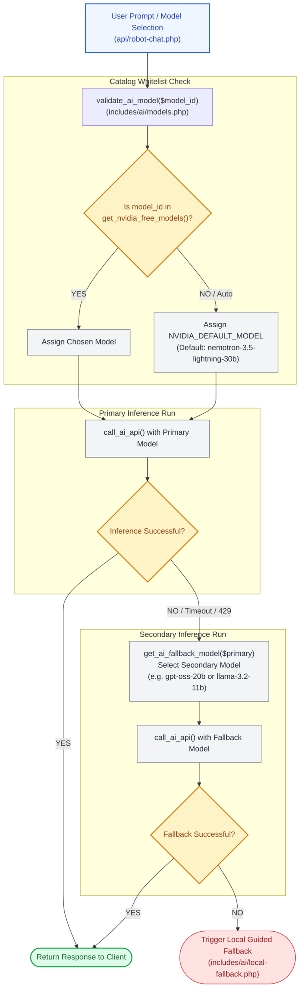

# 🧠 `includes/ai/models.php` — AI Model Catalog & Whitelist Governance

> [!abstract] 📌 Executive Summary
> `includes/ai/models.php` establishes the **model catalog, metadata definitions, and fallback hierarchy** for the platform's AI Assistant (`Campus Bot`).
> 
> Rather than permitting arbitrary external model names, the system enforces a strict **whitelist of 8 curated Large Language Models (LLMs)** hosted on high-throughput NVIDIA NIM inference clusters. It coordinates automatic model failover if the primary inference model experiences network timeouts or quota exhaustion.

---

## 🏛️ Model Selection & Failover Architecture



---

## 📋 The 8 Curated Supported Models

All models are registered with parameter ceilings and temperature calibrations in `get_nvidia_free_models()`:

| Model ID | Provider | Role / Badge | Max Tokens | Default Temp | Priority | Recommended |
| :--- | :--- | :--- | :--- | :--- | :--- | :--- |
| `nvidia/nemotron-3.5-lightning-30b-a3b` | NVIDIA | Domain Fast MoE | 1024 | 0.5 | 1 | **Yes (Default)** |
| `meta/llama-3.2-11b-vision-instruct` | Meta | Fast & Friendly | 1024 | 0.6 | 2 | **Yes** |
| `deepseek-ai/deepseek-v4-flash-0731` | DeepSeek AI | Lightning MoE | 1024 | 0.5 | 3 | **Yes** |
| `google/gemma-4-31b-it` | Google | Deep Reasoning | 1024 | 0.6 | 4 | No |
| `mistralai/mistral-nemotron` | Mistral / NVIDIA | Precise Instruction | 1024 | 0.6 | 5 | No |
| `openai/gpt-oss-20b` | OpenAI | Compact MoE | 1024 | 0.5 | 6 | No (Fallback 1) |
| `meta/llama-3.2-90b-vision-instruct` | Meta | 90B Powerhouse | 1024 | 0.6 | 7 | No |
| `moonshotai/kimi-k3` | Moonshot AI | Agentic MoE | 1024 | 0.6 | 8 | No |

---

## 🔍 Function-by-Function Walkthrough

### 1. `get_nvidia_free_models(): array`
Returns the complete model metadata array including UI badges, provider names, token bounds, and default temperatures.

### 2. `validate_ai_model(?string $model_id): string`
Protects backend inference pipelines from parameter tampering:
```php
function validate_ai_model(?string $model_id): string {
    $catalog = get_nvidia_free_models();
    $default = (string)get_ai_env('NVIDIA_DEFAULT_MODEL', 'nvidia/nemotron-3.5-lightning-30b-a3b');

    if (empty($model_id) || $model_id === 'auto') {
        return $default;
    }

    if (isset($catalog[$model_id])) {
        return $model_id;
    }

    return $default;
}
```
* **Strict Whitelist**: If a client submits a model outside `get_nvidia_free_models()` (e.g. attempting to call an unapproved or expensive model), it silently falls back to the configured institutional default.

### 3. `get_ai_fallback_model(?string $exclude_model = null): string`
Calculates an alternative model when primary inference fails:
* Reads `NVIDIA_FALLBACK_MODEL` from `.env`.
* If the configured fallback is identical to the failing model (`$exclude_model`), it cycles through an ordered priority list: `openai/gpt-oss-20b` $\rightarrow$ `meta/llama-3.2-11b-vision-instruct` $\rightarrow$ `nvidia/nemotron-3.5-lightning-30b-a3b`.

### 4. `get_model_display_name(?string $model_id): string`
Generates human-readable badges for the UI header, automatically appending `(Local Guided Mode)` when heuristic offline fallbacks are triggered.

---

## 🎓 Panel Defense Q&A

### Q1: "Why did your team configure Nemotron 3.5 Lightning (30B) as the primary default model?"
> **Answer:** "Nemotron 3.5 Lightning is a Mixture-of-Experts (MoE) architecture specifically optimized by NVIDIA for conversational accuracy and low latency. With a 0.5 temperature setting, it delivers factual, deterministic answers regarding student assistantship policies and office locations while completing generation in under 600ms."

### Q2: "What happens if NVIDIA NIM suffers a cloud outage during an interview or evaluation?"
> **Answer:** "Our architecture has two layers of resilience:
> 1. **Model Failover**: The system attempts inference on an alternate provider model (e.g. Meta Llama or DeepSeek).
> 2. **Local Guided Offline Fallback**: If internet connectivity is completely lost, `includes/ai/local-fallback.php` takes over instantly, answering portal navigation, application tracking, and policy questions with zero external network connectivity."
