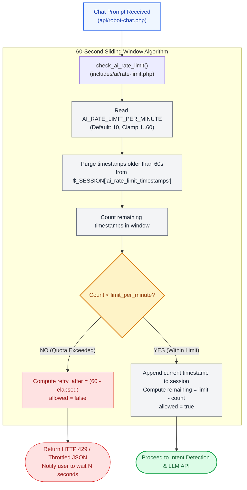

# ⏱️ `includes/ai/rate-limit.php` — Sliding Window AI Rate Limiting & Throttling

> [!abstract] 📌 Executive Summary
> `includes/ai/rate-limit.php` prevents API token exhaustion and spam flooding of the chatbot assistant. It implements a **60-second in-session sliding window rate limiter**.
> 
> By default, the system caps requests to **10 prompts per minute** (configurable dynamically via `.env` or the Admin AI Settings console). When a user exceeds the threshold, requests are rejected with an exact `retry_after` countdown in seconds.

---

## 🏛️ Placement in AI Throttling Lifecycle



---

## 🔍 Function-by-Function Walkthrough

### 1. `get_ai_rate_limit_status(?int $limit_per_minute = null): array`
Inspects rate-limit health **without** recording an increment (idempotent inspection):

```php
function get_ai_rate_limit_status(?int $limit_per_minute = null): array {
    if ($limit_per_minute === null) {
        $limit_per_minute = (int)get_ai_env('AI_RATE_LIMIT_PER_MINUTE', 10);
    }
    $limit_per_minute = max(1, min(60, $limit_per_minute));

    if (session_status() === PHP_SESSION_NONE && !headers_sent()) {
        session_start();
    }

    $now = time();
    $window = 60; // 60 seconds

    if (!isset($_SESSION['ai_rate_limit_timestamps']) || !is_array($_SESSION['ai_rate_limit_timestamps'])) {
        $_SESSION['ai_rate_limit_timestamps'] = [];
    }

    // Clean timestamps older than window
    $_SESSION['ai_rate_limit_timestamps'] = array_filter(
        $_SESSION['ai_rate_limit_timestamps'],
        fn($ts) => ($now - $ts) < $window
    );

    $count = count($_SESSION['ai_rate_limit_timestamps']);
    $oldest = reset($_SESSION['ai_rate_limit_timestamps']) ?: $now;
    $retry_after = ($count >= $limit_per_minute) ? max(1, $window - ($now - $oldest)) : 0;
    $remaining = max(0, $limit_per_minute - $count);

    return [
        'allowed' => $count < $limit_per_minute,
        'retry_after' => $retry_after,
        'remaining' => $remaining,
        'limit_max' => $limit_per_minute
    ];
}
```

* **Sliding Window Maintenance**: Stale timestamps ($now - ts \ge 60$) are discarded on every evaluation using `array_filter`.
* **Dynamic Retry Calculation**: When blocked, `retry_after` determines the precise seconds remaining until the oldest timestamp exits the 60-second window.

---

### 2. `check_ai_rate_limit(?int $limit_per_minute = null): array`
Enforces the rate limit and registers an invocation hit:

```php
function check_ai_rate_limit(?int $limit_per_minute = null): array {
    $status = get_ai_rate_limit_status($limit_per_minute);

    if (!$status['allowed']) {
        return $status;
    }

    $now = time();
    $_SESSION['ai_rate_limit_timestamps'][] = $now;

    return [
        'allowed' => true,
        'retry_after' => 0,
        'remaining' => max(0, $status['remaining'] - 1),
        'limit_max' => $status['limit_max']
    ];
}
```

* **Atomic Session Push**: Appends `$now` only when `allowed === true`, preventing blocked spam requests from extending the lockout penalty.

---

## 🎓 Panel Defense Q&A

### Q1: "Why use a sliding window instead of a fixed 1-minute bucket (e.g. tracking requests in minute 01, 02, etc.)?"
> **Answer:** "A fixed bucket algorithm suffers from the **Boundary Burst Vulnerability**, where a user sends 10 requests at 11:59:59 and another 10 requests at 12:00:01, yielding 20 requests in 2 seconds. Our sliding window stores exact request timestamps in `$_SESSION['ai_rate_limit_timestamps']`, ensuring that at any 60-second interval, no more than 10 requests can ever execute."

### Q2: "Can an attacker bypass this rate limiter by clearing their browser session cookies?"
> **Answer:** "Clearing cookies creates a new session ID, but in our production setup:
> 1. The chatbot API (`api/robot-chat.php`) requires an authenticated user session (`SessionGuard::requireLogin()`).
> 2. Unauthenticated anonymous visitors are blocked before this rate limiter is ever invoked.
> 3. An attacker would need to register and verify new institutional accounts to obtain new sessions, which is throttled by our registration verification controls."
