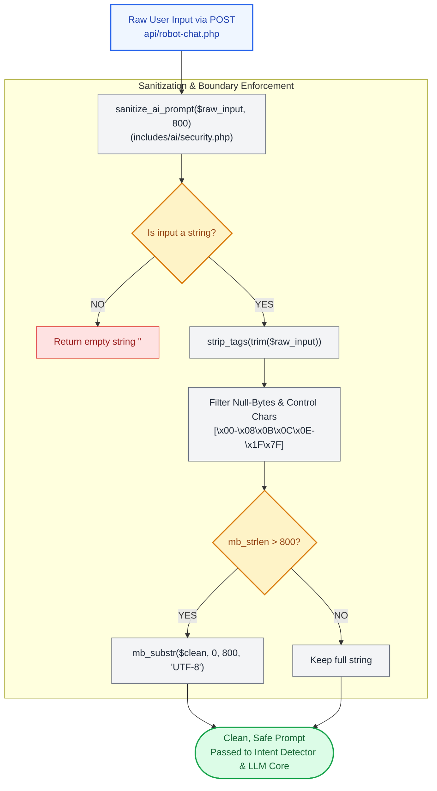

# 🛡️ `includes/ai/security.php` — AI Input Sanitization & Control Character Filtering

> [!abstract] 📌 Executive Summary
> `includes/ai/security.php` provides the first line of defense for the platform's AI Assistant chatbot (`Campus Bot`). It extracts, sanitizes, and normalizes raw text input before any prompt reaches internal intent classifiers or external Large Language Model (LLM) APIs.
> 
> The module enforces a strict **800-character ceiling**, eliminates null-byte attacks (`\x00`), strips HTML tags to neutralize injection vectors, and purges non-printable control characters that could corrupt upstream JSON HTTP payloads.

---

## 🏛️ Placement in AI Execution Pipeline



---

## 🔍 Function-by-Function Walkthrough

### `sanitize_ai_prompt(mixed $raw_input, int $max_length = 800): string`

```php
function sanitize_ai_prompt(mixed $raw_input, int $max_length = 800): string {
    if (!is_string($raw_input)) {
        return '';
    }
    $clean = strip_tags(trim($raw_input));
    // Remove null bytes and non-printable control characters (except newline, tab)
    $clean = preg_replace('/[\x00-\x08\x0B\x0C\x0E-\x1F\x7F]/', '', $clean) ?? '';
    if (function_exists('mb_strlen')) {
        if (mb_strlen($clean, 'UTF-8') > $max_length) {
            $clean = mb_substr($clean, 0, $max_length, 'UTF-8');
        }
    } else {
        if (strlen($clean) > $max_length) {
            $clean = substr($clean, 0, $max_length);
        }
    }
    return $clean;
}
```

#### Detailed Line Breakdown:
1. **Type Assertion (`is_string($raw_input)`)**: Guarantees non-string payloads (e.g. arrays or objects sent via malformed JSON bodies) are rejected immediately as empty strings rather than causing PHP type errors.
2. **HTML Tag Stripping (`strip_tags(trim($raw_input))`)**: Eliminates `<script>`, `<iframe>`, or HTML formatting tags, ensuring prompts are evaluated purely as plain text.
3. **Control Character Regex (`/[\x00-\x08\x0B\x0C\x0E-\x1F\x7F]/`)**:
   - `\x00`: Null-byte string termination attack mitigation.
   - `\x01-\x08`: SOH, STX, ETX, EOT, ENQ, ACK, BEL, BS.
   - `\x0B\x0C`: Vertical tab and form-feed bytes.
   - `\x0E-\x1F`: Shift Out, Shift In, DLE, DC1-4, NAK, SYN, ETB, CAN, EM, SUB, ESC, FS, GS, RS, US.
   - `\x7F`: Delete byte (DEL).
   - *Intentionally preserved*: `\x09` (Horizontal Tab) and `\x0A` (Newline `\n`) to preserve readable multi-line questions.
4. **Length Clamping (`mb_substr(..., 800)`)**: Prevents denial-of-service (DoS) via token exhaustion or massive context window stuffing attacks by enforcing an 800-character upper limit.

---

## 🎓 Panel Defense Q&A

### Q1: "Why filter out control characters before sending prompts to the LLM?"
> **Answer:** "Unfiltered control characters (such as null-bytes or terminal control escapes) can break upstream JSON serializers (`json_encode`), corrupt HTTP REST payload formatting sent to NVIDIA NIM or Google Gemini, or trigger undefined behavior in the tokenizer. Filtering ensures payload predictability and prevents protocol injection."

### Q2: "Why cap user prompts at 800 characters?"
> **Answer:** "800 characters corresponds to approximately 160–200 words, which is more than sufficient for campus assistantship inquiries and portal navigation questions. Enforcing this boundary directly protects our external API token budget and prevents attackers from submitting massive prompts that consume inference credits or attempt jailbreaks via complex instruction flooding."
