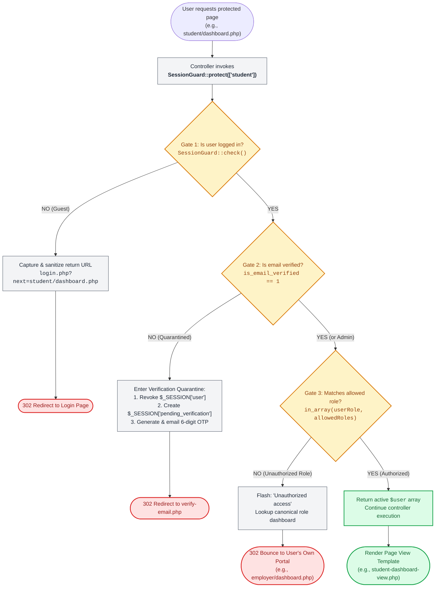

# 🛡️ `includes/auth-check.php` — SessionGuard & Access Engine

> [!abstract] 📌 Executive Summary
> `includes/auth-check.php` defines the **SessionGuard** domain authority. It serves as the primary security middleware for the entire platform, handling:
> 1. **Authentication Enforcement**: Gating pages so unauthorized guests cannot access protected routes.
> 2. **Role-Based Authorization (RBAC)**: Enforcing that `student`, `employer`, and `admin` accounts cannot access each other's portals.
> 3. **Verification Quarantine State Machine**: Quarantining unverified student or employer accounts and enforcing 6-digit institutional email OTP verification before granting full session privileges.
> 4. **Return-To Deep Linking with Open-Redirect Protection**: Sanitizing return targets to keep users on their original destination after authenticating while preventing phishing attacks.
> 5. **Testing/CLI Interceptors**: Providing hooks for automated E2E tests without breaking HTTP header streams.

---

## 🏛️ Placement in System Architecture



> [!info] 🧭 The 3-Gate Security Pipeline Explained
> 1. **Gate 1 (Authentication Check)**: If the visitor has no active session, they are redirected to `login.php`. Their destination is safely captured in `?next=` so they land on their requested page after logging in.
> 2. **Gate 2 (Verification Quarantine)**: If the user is logged in but hasn't confirmed their institutional email (`is_email_verified == 0`), their session is quarantined, a 6-digit OTP is sent, and they are routed to `verify-email.php`.
> 3. **Gate 3 (Role Authorization)**: If an authenticated user attempts to access an unauthorized portal (e.g., an employer accessing `/student/dashboard.php`), they are blocked with a flash alert and safely bounced to their own role's home page.
> 4. **Success**: Only when all 3 gates pass does `SessionGuard` return the `$user` array and allow the page template to render.

---

## 🔍 Detailed Function-by-Function Breakdown

### 1. `declare(strict_types=1);` & Initialization (Lines 1–10)
```php
declare(strict_types=1);
require_once __DIR__ . '/data-helper.php';
```
* **Purpose**: Enforces strict PHP type checking across all arguments and return types to prevent unexpected type coercion bugs.
* **Dependencies**: Loads `includes/data-helper.php` for session inspection functions (`get_logged_user()`, `is_logged_in()`).

---

### 2. Test Interceptor Hook (Lines 12–20)
```php
private static $redirectHandler = null;

public static function setRedirectHandler(?callable $handler): void {
    self::$redirectHandler = $handler;
}
```
* **Parameters**: `?callable $handler` — A callback function with signature `fn(string $url, int $statusCode, string $reason): void`.
* **Purpose**: In automated CLI testing (e.g., PHPUnit or test scripts), calling `header("Location: ...")` causes headers to be sent or aborts execution with `exit`. This setter allows test suites to intercept redirects and assert security behaviors without process termination.

---

### 3. Session User & State Checks (Lines 22–46)

#### `public static function user(): ?array` (Lines 25–27)
* **Returns**: Array of current user session data, or `null` if unauthenticated.
* **Mechanism**: Calls `get_logged_user()`, which safely inspects `$_SESSION['user']`.

#### `public static function check(): bool` (Lines 32–34)
* **Returns**: `true` if an active user session exists, `false` otherwise.

#### `public static function hasRole(string ...$roles): bool` (Lines 39–45)
* **Parameters**: Variadic string list of permitted roles (e.g. `'student'`, `'admin'`).
* **Logic**: Fetches `self::user()`, checks if `$u['role']` exists, and strictly evaluates `in_array($u['role'], $roles, true)`.

---

### 4. Canonical Role Dashboard Mapping (Lines 48–57)
```php
public static function getRoleDashboardUrl(?string $role): string {
    return match ($role) {
        'student'  => 'student/dashboard.php',
        'employer' => 'employer/dashboard.php',
        'admin'    => 'admin/reports.php',
        default    => 'index.php'
    };
}
```
* **Purpose**: Centralizes the canonical home routes for each role.
* **Defense Talking Point**: Notice that `admin` routes to `admin/reports.php` (the institutional executive dashboard) rather than a blank index page.

---

### 5. Path Nesting Resolver (Lines 59–67)
```php
public static function getDirectoryPrefix(): string {
    $script = $_SERVER['SCRIPT_NAME'] ?? '';
    return (strpos($script, '/admin/') !== false ||
            strpos($script, '/employer/') !== false ||
            strpos($script, '/student/') !== false) ? '../' : '';
}
```
* **Purpose**: Solves relative path resolution when redirecting. If the current executing script is nested inside a subfolder (`/student/`, `/employer/`, or `/admin/`), redirects must be prefixed with `../` to access root assets.

---

### 6. Anti-Open-Redirect Sanitizer (Lines 69–85)
```php
public static function sanitizeReturnTo(?string $target): ?string {
    if ($target === null || $target === '') {
        return null;
    }
    $target = trim($target);
    // Block protocol-relative and absolute external URLs
    if (preg_match('#^(https?:|//)#i', $target)) {
        return null;
    }
    $target = ltrim($target, '/');
    // Whitelist approved internal routing roots
    if (preg_match('#^(student|employer|admin|index\.php|jobs\.php|faqs\.php|about-us\.php|updates\.php|update-detail\.php)\b#i', $target)) {
        return $target;
    }
    return null;
}
```
* **Security Criticality**: **Prevents Open Redirect Vulnerabilities (CWE-601)**.
* **Mechanism**:
  1. Blocks any target beginning with `http:`, `https:`, or `//` (preventing an attacker from redirecting users to an external phishing site via `login.php?next=https://evil.com`).
  2. Enforces a strict whitelist regex matching only valid internal application routes.

---

### 7. Redirect Dispatcher (Lines 87–102)
```php
public static function redirect(string $url, string $reason = 'redirect'): void
```
* **Logic**:
  1. Checks if a test handler is configured; if so, delegates and returns.
  2. If HTTP headers are not yet sent (`!headers_sent()`), executes `header('Location: ' . $url)` and `exit`.
  3. If headers were already output by a prior error or debug print, executes a client-side JavaScript fallback:
     `<script>window.location.href = ...;</script>` with `JSON_HEX_TAG | JSON_HEX_AMP` escaping to prevent XSS.

---

### 8. Primary Route Guard: `SessionGuard::protect()` (Lines 114–170)
```php
public static function protect(
    array $allowedRoles = [],
    ?string $returnTo = null,
    ?string $loginMessage = 'Please sign in to access this page.'
): array
```
This is the core middleware method called at the top of every protected controller.

* **Step 1: Check Authentication (Lines 125–149)**
  * If user is not logged in:
    * Sets a flash warning message: `Please sign in to access this page.`
    * Automatically computes the current script's URL and query parameters as the `$returnTo` target.
    * Sanitizes the target through `sanitizeReturnTo()`.
    * Redirects to `login.php?next=<sanitized_path>`.
* **Step 2: Check Verification Quarantine (Lines 153–157)**
  * If `$user['is_email_verified'] === 0` and role is not `admin`:
    * Automatically intercepts the request and calls `quarantineForVerification($user)`.
* **Step 3: Role Authorization Check (Lines 160–167)**
  * If `$allowedRoles` is passed (e.g. `['employer']`) and the user's role does not match:
    * Sets an alert flash: `Unauthorized access for your account role.`
    * Redirects the user back to their own role's dashboard via `redirectByRole()`.
* **Step 4: Grant Access (Line 169)**
  * Returns the validated `$user` array to the controller.

---

### 9. Verification Quarantine State Machine (Lines 172–214)

#### `quarantineForVerification(array $user, ?string $roleMessage = null): void` (Lines 176–199)
* **Purpose**: Puts an account into a restricted verification holding pen.
* **Mechanism**:
  1. Stores only non-sensitive identifying data in `$_SESSION['pending_verification']` (`user_id`, `email`, `name`, `role`).
  2. Completely unsets `$_SESSION['user']`, revoking all authenticated privileges.
  3. Generates a secure 6-digit confirmation code via `create_email_verification_code()`.
  4. Dispatches the code to the user's institutional email address using `send_verification_code_email()`.
  5. Redirects to `verify-email.php`.

#### `graduateVerification(int $userId): ?array` (Lines 204–214)
* **Purpose**: Promotes a quarantined user to a fully authenticated session once the correct 6-digit code is confirmed.
* **Mechanism**:
  1. Fetches updated user record via `get_user_by_id($userId)`.
  2. Strips password hash (`unset($user['password'])`).
  3. Promotes user data to `$_SESSION['user']`.
  4. Destroys `$_SESSION['pending_verification']`.

---

### 10. Session Invalidation / Logout (Lines 216–224)
```php
public static function logout(): void {
    unset($_SESSION['user'], $_SESSION['pending_verification']);
    if (session_status() === PHP_SESSION_ACTIVE && !headers_sent()) {
        session_regenerate_id(true);
    }
}
```
* **Security Criticality**: **Prevents Session Fixation Attacks**.
* Calling `session_regenerate_id(true)` invalidates the old session ID on the server and issues a brand-new ID.

---

### 11. Global Procedural Helper Wrappers (Lines 227–254)
For developer ergonomic convenience, the class provides global procedural shims:
* `require_auth(['student'])` ➔ Maps directly to `SessionGuard::protect(['student'])`
* `has_role('employer')` ➔ Maps to `SessionGuard::hasRole('employer')`
* `redirect_by_role()` ➔ Maps to `SessionGuard::redirectByRole()`
* `get_role_dashboard_url($role)` ➔ Maps to `SessionGuard::getRoleDashboardUrl($role)`

---

## 🛡️ Security & Panel Defense Talking Points

> [!tip] 🎤 High-Yield Defense Q&A for this File
> 
> **Q: How does your system prevent unauthorized users from typing `/admin/reports.php` in the browser URL bar?**
> * **Answer:** *"Every protected controller invokes `require_auth(['admin'])` at line 1. Under the hood, this calls `SessionGuard::protect()`. If the user has no session, they are redirected to `login.php`. If they are logged in as a student or employer, `SessionGuard` detects the role mismatch, flashes an unauthorized warning, and bounces them back to their own dashboard."*
> 
> **Q: What is the 'Verification Quarantine' state in your code?**
> * **Answer:** *"When a student registers, we do not grant them full session privileges immediately. `SessionGuard` checks `is_email_verified`. If it is `0`, `quarantineForVerification()` strips `$_SESSION['user']`, creates `$_SESSION['pending_verification']`, sends a 6-digit OTP code to their institutional email, and restricts them to `verify-email.php` until validated."*
> 
> **Q: How do you protect against Open Redirect phishing attacks?**
> * **Answer:** *"In `sanitizeReturnTo()`, we evaluate any incoming `?next=` URL with regular expressions. Any target containing `http:`, `https:`, or `//` is stripped to prevent attackers from tricking users into logging in and being sent to an external spoofed domain."*
