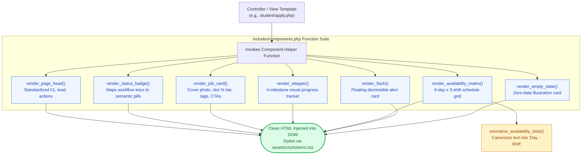

# 🎨 `includes/components.php` — Shared UI Component Engine

> [!abstract] 📌 Executive Summary
> `includes/components.php` serves as the **Single Source of Truth** for the platform's visual design system. In accordance with the tactile **Paper Sheet Design System**, it prevents code duplication across templates by encapsulating UI elements into standardized PHP render functions:
> 1. **Page Headers (`render_page_head`)**: Enforces clean typography and strictly prohibits decorative eyebrow pills.
> 2. **Dynamic Flash Alerts (`render_flash`)**: Dismissible paper cards with semantic icons.
> 3. **Status Badges (`render_status_badge`)**: Strict semantic mapping of application milestones (`Pending Review`, `Under Evaluation`, `Interview Scheduled`, `Accepted`, `Declined`).
> 4. **Standard Job Card (`render_job_card`)**: Features curated cover photos, slot progress bars, hourly rates, and action links.
> 5. **Application Stepper (`render_stepper`)**: 4-stage visual milestone pipeline for student tracking.
> 6. **Weekly Availability Matrix (`render_availability_matrix`)**: 6-day × 3-shift time grid supporting both interactive input and read-only candidate heatmap comparison.

---

## 🏛️ Placement in System Architecture



---

## 🔍 Detailed Function-by-Function Breakdown

### 1. `render_page_head()` (Lines 7–37)
```php
function render_page_head($eyebrow, $title, $lead = '', $actionsHtml = '', $eyebrowClass = '')
```
* **Parameters**:
  * `$eyebrow` (string): Small category kicker above the heading.
  * `$title` (string): Primary `<h1>` title text.
  * `$lead` (string): Optional sub-heading descriptive lead paragraph.
  * `$actionsHtml` (string): Optional action buttons aligned to the right (e.g., "Post New Job").
  * `$eyebrowClass` (string): CSS class overrides.
* **Design Rule Enforcement**: Notice lines 12–13: The eyebrow is rendered as plain muted text, **never as a rounded pill badge**. In this design system, rounded badges are strictly reserved for dynamic system data (e.g., status, counts), keeping headers clean and authoritative.

---

### 2. `render_flash()` (Lines 39–75)
```php
function render_flash()
```
* **Mechanism**:
  1. Inspects `$_SESSION['flash']`. If empty, returns immediately.
  2. Extracts `type` (`success`, `danger`, `warning`, `info`) and `message`.
  3. Immediately calls `unset($_SESSION['flash'])` so the alert is strictly single-use and will not persist across subsequent page loads.
  4. Maps the type to a custom paper style (`alert-paper--success`, `alert-paper--danger`, etc.) and Bootstrap icon (`bi-check-circle-fill`, `bi-exclamation-triangle-fill`).
  5. Renders a floating, dismissible paper card with an auto-dismiss JavaScript trigger.

---

### 3. `render_status_badge()` (Lines 77–122)
```php
function render_status_badge($status)
```
* **Purpose**: Serves as the global standard for application and vacancy state tags.
* **Normalization Logic**:
  * Trims and lowercases the input string to guarantee compatibility whether passing database enums (`under_review`) or formal UI strings (`Under Evaluation`).
* **Mapping Matrix**:
  * `pending` / `pending review` ➔ `<span class="badge-status--pending"><i class="bi bi-hourglass-split"></i> Pending Review</span>`
  * `under_review` / `under evaluation` ➔ `<span class="badge-status--review"><i class="bi bi-search"></i> Under Evaluation</span>`
  * `interview_scheduled` ➔ `<span class="badge-status--interview"><i class="bi bi-calendar-event"></i> Interview Scheduled</span>`
  * `accepted` / `hired` ➔ `<span class="badge-status--accepted"><i class="bi bi-check-circle-fill"></i> Accepted / Hired</span>`
  * `declined` / `rejected` ➔ `<span class="badge-status--declined"><i class="bi bi-x-circle-fill"></i> Declined / Position Filled</span>`
  * `active` / `open` ➔ `<span class="badge-status--accepted"><i class="bi bi-check-circle"></i> Active</span>`
  * `closed` / `filled` ➔ `<span class="badge-status--declined"><i class="bi bi-slash-circle"></i> Closed</span>`

---

### 4. `render_metric()` (Lines 124–141)
```php
function render_metric($value, $label, $icon = 'bi-bar-chart-fill')
```
* **Parameters**:
  * `$value` (string|int): Numeric or formatted statistic (e.g., `'14'`, `'₱85'`).
  * `$label` (string): Metric title (e.g., `'Active Requisitions'`).
  * `$icon` (string): Bootstrap icon class.
* **UI Pattern**: Renders a standardized high-contrast KPI card with an elevated green circular icon container (`icon-circle-success`), used across all role dashboards.

---

### 5. `render_job_card()` (Lines 143–311)
```php
function render_job_card($job, $base_url = '')
```
* **Parameters**:
  * `$job` (array): The job requisition record.
  * `$base_url` (string): Relative prefix for deep linking (`../` or empty).
* **Key Features**:
  1. **Dynamic Capacity Calculation**:
     ```php
     $slots_total = (int)($job['slots_total'] ?? $job['vacancies'] ?? 1);
     $slots_filled = (int)($job['slots_filled'] ?? 0);
     $pct = ($slots_total > 0) ? round(($slots_filled / $slots_total) * 100) : 0;
     ```
     Renders an interactive progress bar showing `X of Y slots filled (Z%)`.
  2. **Cover Picture Fallback Engine**: If no custom flyer was uploaded, it analyzes the category keyword and automatically binds a high-resolution offline category photo (`cat-tech.jpg`, `cat-library.jpg`, `cat-admin.jpg`, `cat-lab.jpg`, `cat-tutor.jpg`, `cat-sports.jpg`).
  3. **Strict Badge De-duplication**: Filters out redundant badges and parses pay rates cleanly (e.g., `₱80.00 / hour`).

---

### 6. `render_empty_state()` (Lines 313–333)
```php
function render_empty_state($icon, $title, $body, $ctaHref = '', $ctaLabel = '')
```
* **Parameters**:
  * `$icon` (string): Centered illustration icon (e.g., `'bi-inbox'`).
  * `$title` (string): Reassuring zero-data title (e.g., `'No Active Applications'`).
  * `$body` (string): Actionable explanation for the student or employer.
  * `$ctaHref` / `$ctaLabel` (string): Call-to-action button (e.g., `'Browse Open Vacancies'`).
* **Design Purpose**: Prevents jarring blank screens when database queries return 0 rows.

---

### 7. `render_stepper()` (Lines 335–392)
```php
function render_stepper($status)
```
* **Purpose**: Generates the 4-step progress stepper in the student application tracking view:
  * Step 1: `Pending Review`
  * Step 2: `Under Evaluation`
  * Step 3: `Interview Scheduled`
  * Step 4: `Accepted / Hired` OR `Declined / Filled`
* **Declined State Handling**: If rejected, Step 4 turns red with an `X` icon (`is-declined is-active`) instead of a checkmark, communicating rejection respectfully and clearly.

---

### 6. Availability Normalization & Matrix (Lines 394–528)

#### `normalize_availability_slots($slots): array` (Lines 402–468)
* **Problem Solved**: Students submit availability in various formats (raw checkbox arrays, JSON strings, or comma-separated text like `"Mon morning, tue afternoon"`).
* **Algorithm**:
  * Decodes JSON or splits delimited strings.
  * Maps day names (`monday` ➔ `Mon`).
  * Maps shift strings to canonical tokens:
    * `Morning (8AM–12NN)`
    * `Afternoon (1PM–5PM)`
    * `Evening (5PM–8PM)`
  * Returns deduplicated canonical tokens: `["Mon - Morning (8AM–12NN)", "Wed - Afternoon (1PM–5PM)"]`.

#### `render_availability_matrix($selected = [], $name = 'availability[]', $readonly = false)` (Lines 470–528)
* **Grid Architecture**: 6 Columns (`Mon`, `Tue`, `Wed`, `Thu`, `Fri`, `Sat`) by 3 Rows (`Morning`, `Afternoon`, `Evening`).
* **Modes**:
  * **Editable Mode (`$readonly = false`)**: Rendered in `student/apply.php` with clickable checkboxes for students to mark free hours.
  * **Read-Only Heatmap Mode (`$readonly = true`)**: Rendered in `employer/review-app.php`. Checkboxes are locked and selected cells are highlighted in soft green (`matrix-cell-selected`), creating an instant availability comparison heatmap for hiring supervisors.
* **Mobile Responsiveness**: Includes horizontal touch scroll wrappers and a helper hint: `Swipe horizontally to view full schedule (Mon–Sat)`.

---

## 🛡️ Security & Panel Defense Talking Points

> [!tip] 🎤 High-Yield Defense Q&A for this File
> 
> **Q: Why did you build the Weekly Availability Matrix as a custom component?**
> * **Answer:** *"Standard job portals only take a resume upload. However, campus student assistants are full-time students first. A resume does not reveal class timetables. We engineered a 6-day by 3-shift grid in `render_availability_matrix()` that operates in two modes: students interactively check their free slots when applying, and campus supervisors view it as a read-only visual heatmap during applicant review to prevent class scheduling conflicts."*
> 
> **Q: How does `render_job_card()` ensure resilience if an employer forgets to upload a flyer?**
> * **Answer:** *"Lines 191–206 implement an automatic category fallback engine. If the requisition lacks an attached photo, the component parses the department category string and binds an optimized university stock image (`cat-tech.jpg`, `cat-library.jpg`, `cat-admin.jpg`), preventing broken images or missing layout assets."*
> 
> **Q: How do you prevent Cross-Site Scripting (XSS) in your shared components?**
> * **Answer:** *"All dynamic strings (job titles, department names, pay rates, flash messages, user inputs) are rigorously escaped through `htmlspecialchars()` before being echoed to the browser DOM, neutralizing any potential script injection."*
