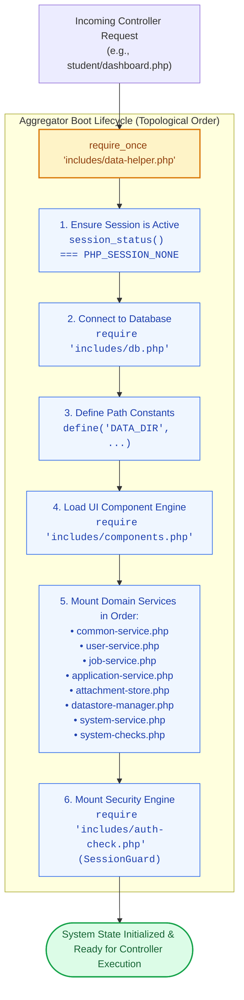

# 🚪 `includes/data-helper.php` — System Bootstrapper & Service Aggregator

> [!abstract] 📌 Executive Summary
> `includes/data-helper.php` is the **central architectural aggregator (Facade pattern)** of the entire system. Instead of individual page controllers manually starting sessions, connecting to PDO, and requiring 10 separate service libraries, every controller in the platform simply calls:
> ```php
> require_once __DIR__ . '/includes/data-helper.php';
> ```
> This file establishes session persistence, mounts the database connection, defines global root path constants, and orchestrates the domain service layer in strict dependency order.

---

## 🏛️ Placement in System Architecture



---

## 🔍 Line-by-Line Technical Breakdown

### Lines 1–9: Session Initialization Guard
```php
if (session_status() === PHP_SESSION_NONE) {
    session_start();
}
```
* **Mechanism**: Evaluates the global session state using PHP's native `session_status()`. 
* **Design Decision**: If a session has not been initiated, it calls `session_start()`. If a session is already active (such as during test suites or nested includes), it safely avoids calling `session_start()` again, preventing `E_NOTICE` warnings regarding active sessions.

---

### Lines 11–13: Persistence Engine & Path Constants
```php
require_once __DIR__ . '/db.php';
define('DATA_DIR', dirname(__DIR__) . '/data');
```
* **Line 11**: Mounts the database connection module `includes/db.php`, creating the lazy PDO connection singleton `get_db_connection()`.
* **Line 13**: Declares the canonical immutable constant `DATA_DIR`, anchoring all file-based JSON read/write operations to `C:/xampp/htdocs/Final-Campus-Job-Posting-System/data`.

---

### Line 15: Presentation Component Library
```php
require_once __DIR__ . '/components.php';
```
* Mounts the UI component rendering engine (`render_job_card()`, `render_status_badge()`, `render_availability_matrix()`), ensuring every downstream controller can immediately construct HTML views.

---

### Lines 17–26: Ordered Domain Service Injection
```php
// Domain services (order matters: common first for shared helpers)
require_once __DIR__ . '/services/common-service.php';
require_once __DIR__ . '/services/user-service.php';
require_once __DIR__ . '/services/job-service.php';
require_once __DIR__ . '/services/application-service.php';
require_once __DIR__ . '/services/attachment-store.php';
require_once __DIR__ . '/services/datastore-manager.php';
require_once __DIR__ . '/services/system-service.php';
require_once __DIR__ . '/services/system-checks.php';
require_once __DIR__ . '/auth-check.php';
```
* **Topological Ordering**: 
  1. `common-service.php` must load **first** because other services rely on its data hydration (`hydrate_user()`, `hydrate_job()`) and sanitization routines.
  2. `user-service.php` and `job-service.php` load next to establish core entity lifecycles.
  3. `application-service.php` and `attachment-store.php` load next to manage application logic and uploaded files.
  4. `datastore-manager.php` loads to handle mode toggles and lazy table migrations.
  5. `system-service.php` and `system-checks.php` load for background metrics, alerts, and availability heuristics.
  6. `auth-check.php` loads **last** so `SessionGuard` can utilize all the preceding helpers.

---

## 🛡️ Security & Panel Defense Talking Points

> [!tip] 🎤 High-Yield Defense Q&A for this File
> 
> **Q: What software design pattern is implemented in `includes/data-helper.php`?**
> * **Answer:** *"It implements the **Facade Design Pattern**. Rather than requiring our 30+ controllers to independently initialize sessions, include database drivers, and load individual service classes, `data-helper.php` acts as a unified facade that orchestrates all underlying subsystems with a single `require_once` call."*
> 
> **Q: Why does the order of files loaded in `data-helper.php` matter?**
> * **Answer:** *"PHP resolves functions and interfaces sequentially. `common-service.php` provides foundational hydration helpers (`hydrate_user`, `hydrate_job`) and date formatters used by `user-service.php` and `job-service.php`. Loading `auth-check.php` last ensures that `SessionGuard` has full access to the user lookup functions initialized before it."*
