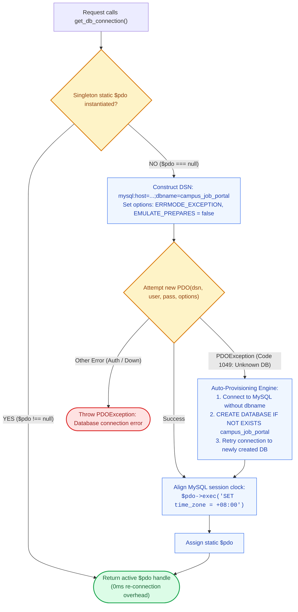

# 🗄️ `includes/db.php` — Database Connection Layer (PDO)

> [!abstract] 📌 Executive Summary
> `includes/db.php` is the **relational database connection layer** for MySQL / MariaDB on XAMPP. It implements:
> 1. **PDO Singleton Pattern (`get_db_connection`)**: Ensures exactly one active database connection is shared across each web request, preventing connection pool exhaustion.
> 2. **Cross-Platform Timezone Synchronization**: Unconditionally aligns PHP (`date_default_timezone_set('Asia/Manila')`) with the MySQL session clock (`SET time_zone = '+08:00'`), resolving the notorious XAMPP bug where European server defaults made Philippine job postings appear "from the future".
> 3. **Error 1049 Auto-Provisioning**: If MySQL throws error code 1049 (`Unknown database 'campus_job_portal'`), the driver automatically connects to the MySQL server root, issues `CREATE DATABASE IF NOT EXISTS`, and reconnects transparently.
> 4. **Strict Security Options**: Disables emulated prepared statements (`PDO::ATTR_EMULATE_PREPARES => false`) to enforce native parameterized query protection.

---

## 🏛️ Placement in System Architecture



---

## 🔍 Detailed Function-by-Function Breakdown

### 1. Environment Variable Fallbacks (Lines 7–12)
```php
if (!defined('DB_HOST')) define('DB_HOST', getenv('DB_HOST') ?: '127.0.0.1');
if (!defined('DB_PORT')) define('DB_PORT', getenv('DB_PORT') ?: '3306');
if (!defined('DB_NAME')) define('DB_NAME', getenv('DB_NAME') ?: 'campus_job_portal');
if (!defined('DB_USER')) define('DB_USER', getenv('DB_USER') ?: 'root');
if (!defined('DB_PASS')) define('DB_PASS', getenv('DB_PASS') !== false ? getenv('DB_PASS') : '');
if (!defined('DB_CHARSET')) define('DB_CHARSET', 'utf8mb4');
```
* Reads environment variables from `.env` or system environment, falling back safely to local XAMPP defaults (`root` user, empty password, `3306` port).

---

### 2. Timezone Alignment (Lines 14–19 & Line 45)
```php
if (function_exists('date_default_timezone_set')) {
    @date_default_timezone_set('Asia/Manila');
}
```
* **The Problem**: Default XAMPP installations on Windows set PHP to `Europe/Berlin` while MySQL operates in local system time (`+08:00`), causing application timestamps to mismatch database records by 6–7 hours.
* **The Solution**: Explicitly sets PHP's timezone to `'Asia/Manila'`, and upon opening the PDO connection, immediately executes:
  ```php
  $pdo->exec("SET time_zone = '+08:00'");
  ```
  Using the numeric offset `'+08:00'` ensures compatibility even if MySQL's named timezone tables are not installed.

---

### 3. PDO Singleton Engine: `get_db_connection()` (Lines 27–66)
```php
function get_db_connection(): PDO
```
* **Static Memoization**: Uses `static $pdo = null;`. The first call creates the connection; subsequent calls return the existing instance.
* **Security & Optimization PDO Options (Lines 33–36)**:
  ```php
  $options = [
      PDO::ATTR_ERRMODE            => PDO::ERRMODE_EXCEPTION,
      PDO::ATTR_DEFAULT_FETCH_MODE => PDO::FETCH_ASSOC,
      PDO::ATTR_EMULATE_PREPARES   => false
  ];
  ```
  * `PDO::ATTR_EMULATE_PREPARES => false`: **Critical for Security**. Forces MySQL to perform true server-side parameter binding, completely eliminating second-order SQL injection vectors that can bypass PHP client-side emulated prepares.
  * `PDO::ATTR_ERRMODE => PDO::ERRMODE_EXCEPTION`: Forces all query failures to throw catchable `PDOException`s rather than silently returning false.

---

### 4. Error 1049 Auto-Provisioning (Lines 47–62)
```php
if ($e->getCode() == 1049) {
    $server_dsn = "mysql:host=" . DB_HOST . ";port=" . DB_PORT . ";charset=" . DB_CHARSET;
    $server_pdo = new PDO($server_dsn, DB_USER, DB_PASS, $options);
    $server_pdo->exec("CREATE DATABASE IF NOT EXISTS `" . DB_NAME . "` CHARACTER SET " . DB_CHARSET . " COLLATE utf8mb4_unicode_ci");
    // Re-try connection
    $pdo = new PDO($dsn, DB_USER, DB_PASS, $options);
}
```
* If a new developer or evaluator runs the project on fresh XAMPP where the schema hasn't been imported yet, MySQL returns error `1049: Unknown database`.
* Instead of crashing, `db.php` connects to the MySQL server, creates the `campus_job_portal` database with `utf8mb4_unicode_ci` encoding, and reconnects seamlessly.

---

### 5. Health Check: `is_db_connected()` (Lines 73–80)
```php
function is_db_connected(): bool
```
* Returns `true` if PDO is active and queryable, `false` otherwise. Used by `system-checks.php` for platform readiness verification.

---

## 🛡️ Security & Panel Defense Talking Points

> [!tip] 🎤 High-Yield Defense Q&A for this File
> 
> **Q: Why did you set `PDO::ATTR_EMULATE_PREPARES` to `false`?**
> * **Answer:** *"By default, PHP's PDO emulates prepared statements by substituting variables client-side before sending the query to MySQL. Setting `PDO::ATTR_EMULATE_PREPARES => false` turns off client emulation and forces native server-side prepared statements. This guarantees that user input is transmitted to MySQL as pure data parameters in a separate protocol packet, making SQL Injection impossible."*
> 
> **Q: How does `db.php` handle timezones across PHP and MySQL?**
> * **Answer:** *"In line 18, we lock PHP to `'Asia/Manila'` (`date_default_timezone_set`), and in line 45, we run `$pdo->exec(\"SET time_zone = '+08:00'\")`. This ensures that PHP's `time()` function and MySQL's `NOW()` function are synchronized to the exact same second, preventing application timestamps from displaying 'posted in the future' errors."*
