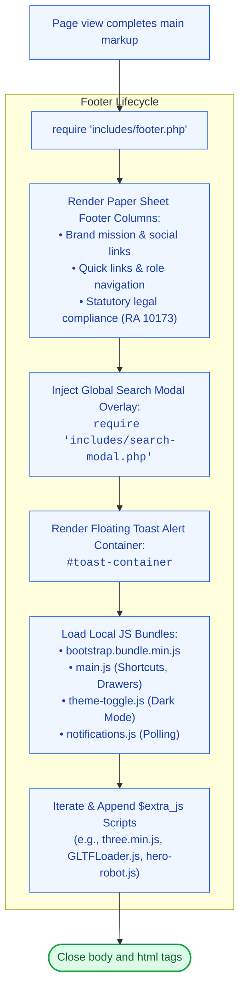

# 🦶 `includes/footer.php` — Shared Footer & Script Orchestrator

> [!abstract] 📌 Executive Summary
> `includes/footer.php` closes the standard HTML document across all pages. It handles:
> 1. **Institutional Legal & Compliance Navigation**: Renders footers linking to Data Privacy (RA 10173), Terms of Service, and the 20-Hour Student Work Policy.
> 2. **Global Component Injections**: Injects the `Ctrl+K` Spotlight Search modal overlay ([includes/search-modal.php](file:///c:/xampp/htdocs/Final-Campus-Job-Posting-System/includes/search-modal.php)) and asynchronous Toast alert containers.
> 3. **Script Orchestration**: Loads local offline JavaScript bundles (Bootstrap 5, `main.js`, `theme-toggle.js`, `notifications.js`) and dynamic page-specific scripts passed via `$extra_js`.

---

## 🏛️ Placement in System Architecture



---

## 🔍 Detailed Function-by-Function Breakdown

### 1. Legal Compliance Links (Lines 10–75)
* Surfaces permanent footers with direct links to:
  * `privacy.php`: Data Privacy Act of 2012 compliance.
  * `terms.php`: Student assistantship conduct.
  * `faqs.php?open=2#faq-2`: Explains the 20-hour weekly cap.
  * `about-us.php#developers`: The 6-developer team matrix.

---

### 2. Search Modal Overlay (Lines 77–80)
```php
require_once __DIR__ . '/search-modal.php';
```
* Ensures the `Ctrl+K` Spotlight Search modal is permanently available in the DOM on every authenticated and public view.

---

### 3. Dynamic Script Injections (`$extra_js`) (Lines 125–150)
```php
if (!empty($extra_js) && is_array($extra_js)) {
    foreach ($extra_js as $js_file) {
        $src = (strpos($js_file, 'http') === 0) ? $js_file : $base_url . $js_file;
        echo '<script src="' . htmlspecialchars($src) . '"></script>' . PHP_EOL;
    }
}
```
* Allows individual controllers to inject custom scripts (e.g. `index.php` injecting Three.js and the 3D robot mascot) without cluttering the global bundle.

---

## 🛡️ Security & Panel Defense Talking Points

> [!tip] 🎤 High-Yield Defense Q&A for this File
> 
> **Q: How does `footer.php` handle script loading for offline local evaluations?**
> * **Answer:** *"All core JavaScript files (Bootstrap 5 bundle, notification poller, theme toggler, and search shortcuts) are hosted locally within the `assets/` and `assets/vendor/` directories. No external CDN requests are required, ensuring zero layout breakage during offline capstone evaluations."*
