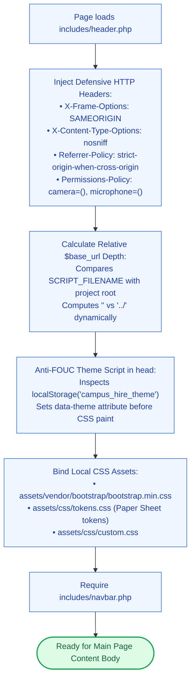

# 🛡️ `includes/header.php` — Global Security Headers & HTML Skeleton

> [!abstract] 📌 Executive Summary
> `includes/header.php` is the **foundational HTML shell** rendered across every page on the platform. It handles:
> 1. **Defensive HTTP Security Headers**: Mitigates Clickjacking, MIME sniffing, and unauthorized hardware access before output starts.
> 2. **Dynamic Relative Depth Calculation (`$base_url`)**: Resolves directory nesting (`../`) automatically, whether running in the root or in nested subdirectories (`student/`, `employer/`, `admin/`).
> 3. **Anti-FOUC Theme Bootstrapper**: Inlines a fast JavaScript theme check in `<head>` to prevent the jarring white "flash" when loading in Dark Mode.
> 4. **Offline Local Vendor Assets**: Binds local Bootstrap 5, Bootstrap Icons, `tokens.css`, and `custom.css`.

---

## 🏛️ Placement in System Architecture



---

## 🔍 Detailed Function-by-Function Breakdown

### 1. HTTP Security Headers (Lines 7–12)
```php
if (!headers_sent()) {
    header('X-Frame-Options: SAMEORIGIN');
    header('X-Content-Type-Options: nosniff');
    header('Referrer-Policy: strict-origin-when-cross-origin');
    header('Permissions-Policy: camera=(), microphone=(), geolocation=()');
}
```
* `X-Frame-Options: SAMEORIGIN`: **Clickjacking Defense (CWE-1021)**. Prohibits external sites from embedding campus pages inside hidden `<iframe>`s to hijack user clicks.
* `X-Content-Type-Options: nosniff`: Prevents browsers from guessing (MIME sniffing) non-script files into executable JavaScript.
* `Permissions-Policy`: Restricts browser hardware access (camera, microphone, geolocation), protecting student privacy.

---

### 2. Dynamic Relative Path Depth Resolver (Lines 22–36)
```php
$project_root = str_replace('\\', '/', realpath(dirname(__DIR__)));
$script_file = isset($_SERVER['SCRIPT_FILENAME']) ? str_replace('\\', '/', realpath($_SERVER['SCRIPT_FILENAME'])) : '';
$script_dir = $script_file ? dirname($script_file) : '';

if ($script_dir && strpos($script_dir, $project_root) === 0) {
    $rel = trim(substr($script_dir, strlen($project_root)), '/');
    $depth = $rel === '' ? 0 : substr_count($rel, '/') + 1;
    $base_url = $depth > 0 ? str_repeat('../', $depth) : '';
}
```
* **Why this matters**: Root pages (e.g. `index.php`) need `assets/css/...`, whereas portal pages (e.g. `student/jobs.php` or `admin/reports.php`) need `../assets/css/...`.
* Instead of hard-coding paths, this algorithm computes relative depth dynamically, eliminating broken links across diverse server environments.

---

### 3. Anti-FOUC Dark Mode Injection (Lines 46–53)
```html
<script>
(function(){
  var t = localStorage.getItem('campus_hire_theme');
  if (!t) t = window.matchMedia('(prefers-color-scheme: dark)').matches ? 'dark' : 'light';
  document.documentElement.setAttribute('data-theme', t);
  document.documentElement.setAttribute('data-bs-theme', t);
})();
</script>
```
* **Flash of Unstyled Content (FOUC)**: If theme classes are applied after HTML rendering via deferred JavaScript, dark mode users experience a jarring white flash.
* By placing this tiny synchronous script directly in the `<head>` before stylesheets load, the DOM receives `data-theme="dark"` before the first paint cycle.

---

## 🛡️ Security & Panel Defense Talking Points

> [!tip] 🎤 High-Yield Defense Q&A for this File
> 
> **Q: What security headers are implemented in the application?**
> * **Answer:** *"In `includes/header.php` (Lines 7–12), we send four defensive headers on every request:
>   1. `X-Frame-Options: SAMEORIGIN` to stop Clickjacking attacks.
>   2. `X-Content-Type-Options: nosniff` to block MIME sniffing.
>   3. `Referrer-Policy: strict-origin-when-cross-origin` to protect sensitive URLs.
>   4. `Permissions-Policy` to lock down camera, microphone, and geolocation hardware."*
