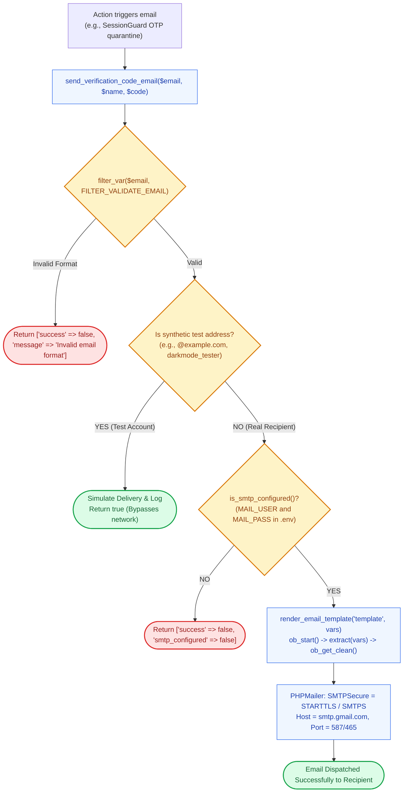

# ✉️ `includes/mailer.php` — Centralized SMTP Email Dispatcher

> [!abstract] 📌 Executive Summary
> `includes/mailer.php` is the **transactional email engine** of the platform, powered by the bundled **PHPMailer** library. It manages:
> 1. **Authenticated SMTP Delivery**: Configures TLS/SSL secure SMTP dispatch via environment credentials (`MAIL_HOST`, `MAIL_PORT`, `MAIL_USERNAME`, `MAIL_PASSWORD`).
> 2. **Synthetic Mailbox Safeguards**: Detects test accounts (`darkmode_tester`, `@example.com`, `@test.local`, `.invalid`) and simulates successful delivery without attempting external network calls, preventing test suite timeouts and SMTP rate-limiting.
> 3. **Output-Buffered Email Templating (`render_email_template`)**: Uses PHP output buffering (`ob_start()`) to compile structured HTML emails (`includes/templates/verification-code-email.php` and `password-reset-email.php`).
> 4. **Institutional Message Formatting**: Sends OTP codes and password reset links with fallback plaintext `AltBody` representations.

---

## 🏛️ Placement in System Architecture



---

## 🔍 Detailed Function-by-Function Breakdown

### 1. SMTP Configuration Inspector: `is_smtp_configured()` (Lines 15–20)
```php
function is_smtp_configured(): bool
```
* Calls `load_env()` and checks if `MAIL_USERNAME` and `MAIL_PASSWORD` are defined and non-empty. Used across the UI to show informative notices if outbound email is unconfigured during offline local testing.

---

### 2. Core Transport Engine: `send_campus_email()` (Lines 22–84)
```php
function send_campus_email(string $recipient_email, string $recipient_name, string $subject, string $html_body): bool
```
* **Step 1: Syntax Validation**: Validates `$recipient_email` using PHP's native `filter_var(..., FILTER_VALIDATE_EMAIL)`.
* **Step 2: Synthetic Mailbox Safeguard (Lines 35–46)**:
  ```php
  $lower_email = strtolower($recipient_email);
  if (
      str_contains($lower_email, 'darkmode_tester') ||
      str_contains($lower_email, 'test_') ||
      str_contains($lower_email, '@example.com') ||
      str_contains($lower_email, '@test.local') ||
      str_ends_with($lower_email, '.invalid')
  ) {
      error_log("Campus Mailer simulated delivery for synthetic test address: {$recipient_email}");
      return true;
  }
  ```
  Prevents unit tests and demo evaluations from hitting external mail servers or throwing exceptions when testing dummy addresses.
* **Step 3: PHPMailer Configuration (Lines 56–78)**:
  * Uses `isSMTP()`.
  * Selects `PHPMailer::ENCRYPTION_SMTPS` for port 465 or `PHPMailer::ENCRYPTION_STARTTLS` for port 587.
  * Sets UTF-8 character encoding (`$mail->CharSet = 'UTF-8'`).
  * Injects `$mail->AltBody = strip_tags($html_body)` so recipients using text-only email clients can still read the message.

---

### 3. Template Rendering Engine: `render_email_template()` (Lines 86–95)
```php
function render_email_template(string $template_name, array $vars = []): string
```
* **Output Buffering Mechanism**:
  1. Checks if `includes/templates/{$template_name}.php` exists.
  2. Runs `extract($vars, EXTR_SKIP)` to unpack data keys into local PHP variables safely.
  3. Uses `ob_start()`, `require $file`, and `ob_get_clean()` to compile the template into a clean HTML string.

---

### 4. Specialized Transactional Dispatchers (Lines 97–144)

#### `send_password_reset_email(string $email, string $name, string $reset_link): bool` (Lines 97–104)
* Renders `password-reset-email.php` with the student/employer name and secure reset URL, dispatching it with subject `"Reset your password"`.

#### `send_verification_code_email(string $email, string $name, string $code): array` (Lines 106–144)
* Evaluates SMTP configuration status.
* Renders `verification-code-email.php` containing the 6-digit confirmation OTP.
* Returns an array with status, message, and `smtp_configured` boolean flag.

---

## 🛡️ Security & Panel Defense Talking Points

> [!tip] 🎤 High-Yield Defense Q&A for this File
> 
> **Q: What happens if an evaluator tests the system on a computer without an internet connection or SMTP credentials?**
> * **Answer:** *"In `is_smtp_configured()` and `send_verification_code_email()` (Lines 115–120), the system checks if SMTP credentials are set. If offline or unconfigured, the application does not crash; instead, it returns `smtp_configured: false`, flashes a gentle warning banner, and in demo mode logs the verification code so the evaluator can complete registration without an external mail server."*
> 
> **Q: What is the purpose of the 'Synthetic Mailbox Safeguard'?**
> * **Answer:** *"In lines 35–46, `send_campus_email()` intercepts automated testing email addresses (`@example.com`, `darkmode_tester`, `.invalid`). It simulates successful delivery and logs the event without making external network calls, preventing our SMTP account from being blacklisted for spam or bouncing."*
