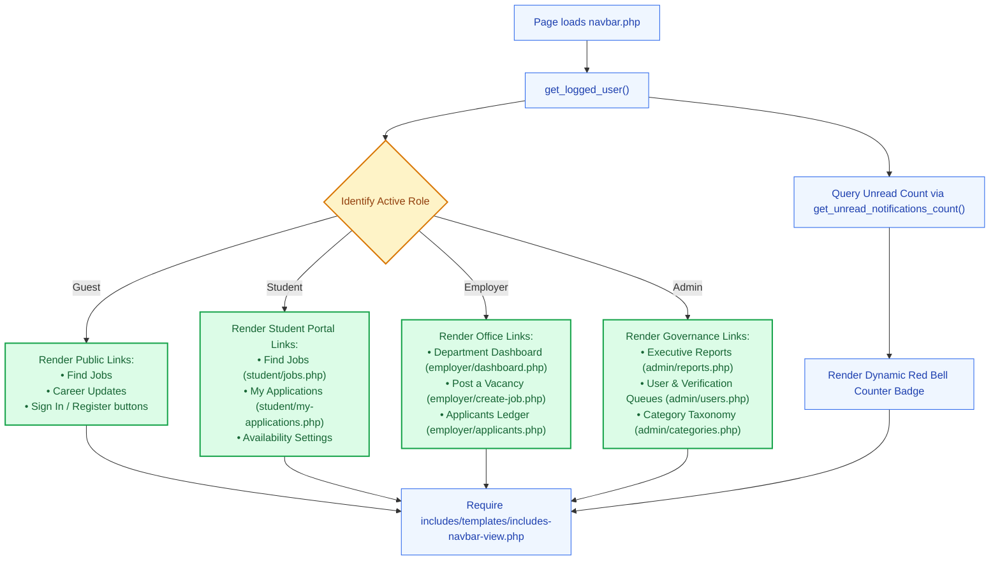

# 🧭 `includes/navbar.php` — Dynamic Role-Aware Navigation Bar

> [!abstract] 📌 Executive Summary
> `includes/navbar.php` is the **contextual navigation bar controller**. It determines the visitor's authenticated role (`student`, `employer`, `admin`, or guest), queries live unread notification counters, dynamically resolves deep dashboard routes, and delegates presentation to `includes/templates/includes-navbar-view.php`.

---

## 🏛️ Placement in System Architecture



---

## 🔍 Detailed Function-by-Function Breakdown

### 1. Context & Role Resolution (Lines 6–14)
```php
require_once __DIR__ . '/auth-check.php';
$current_user = get_logged_user();
$current_script = basename($_SERVER['PHP_SELF'] ?? '');
$dashboard_link = $base_url . get_role_dashboard_url($current_user['role'] ?? 'student');
```
* **Active Script Detection**: Uses `basename($_SERVER['PHP_SELF'])` to mark the active page link with `.active` styling.
* **Role Dashboard Link**: Maps to the canonical destination using `get_role_dashboard_url()`.

---

### 2. Live Notification Badging (Lines 15–16)
```php
$user_unread_notifs_count = ($current_user && function_exists('get_unread_notifications_count')) 
    ? get_unread_notifications_count($current_user['id']) 
    : 0;
$user_recent_notifs = ($current_user && function_exists('get_user_notifications')) 
    ? get_user_notifications($current_user['id'], 5) 
    : [];
```
* Queries real-time notification counts directly for the authenticated user, feeding both the red bell badge and the quick-view dropdown menu.

---

### 3. Template Delegation (Line 18)
```php
require __DIR__ . '/templates/includes-navbar-view.php';
```
* Follows the platform's strict Separation of Concerns, delegating HTML markup to the view template.

---

## 🛡️ Security & Panel Defense Talking Points

> [!tip] 🎤 High-Yield Defense Q&A for this File
> 
> **Q: How does the navigation bar adapt dynamically between students, employers, and administrators?**
> * **Answer:** *"In `includes/navbar.php`, the controller inspects the session role via `get_logged_user()`. If the user is an employer, it renders links to post vacancies and review candidates. If the user is an admin, it surfaces governance links to audit queues and reports. If the user is a student, it provides job browsing and application tracking. Unauthorized links are never rendered in the client DOM."*
