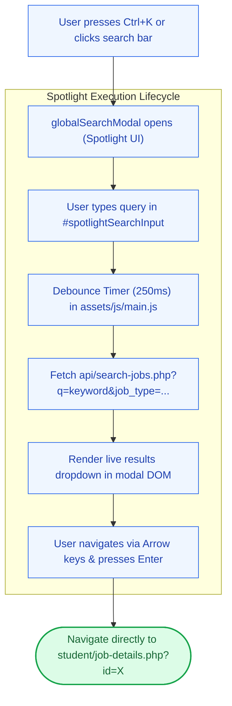

# 🔍 `includes/search-modal.php` — Floating Spotlight Search Modal

> [!abstract] 📌 Executive Summary
> `includes/search-modal.php` renders the global **Spotlight Search Overlay** (`Ctrl+K`). Inspired by modern desktop command palettes, it provides:
> 1. **Keyboard-First Navigation**: Opened instantly with `Ctrl+K` / `Cmd+K` and dismissed with `ESC`.
> 2. **Debounced Live Search**: Queries `api/search-jobs.php` as the user types, rendering instantaneous search results without full page reloads.
> 3. **Quick Filter Chips**: Allows students to filter on-the-fly by Job Type (`Student Assistant`, `Part-Time`, `Internship / OJT`) or Work Setup (`On-Campus`, `Hybrid`, `Remote`).
> 4. **Keyboard Arrow Selection**: Enables navigating search results via `ArrowUp` / `ArrowDown` and opening via `Enter`.

---

## 🏛️ Placement in System Architecture

---

## 🔍 Detailed Component Breakdown

### 1. Header Bar & Input Wrapper (Lines 16–47)
* Input `#spotlightSearchInput` with `autocomplete="off"` and `spellcheck="false"`.
* Clear button `#spotlightClearBtn` that appears when characters are typed.
* Keyboard badges showing `ESC` to close.

---

### 2. Fast Filter Chips (Lines 50–75)
* Instant filter buttons:
  * `All Roles`
  * `Student Assistant`
  * `Part-Time Job`
  * `Internship / OJT`
  * `On-Campus`
  * `Hybrid / Remote`
* Clicking a chip immediately updates the AJAX query payload without leaving the modal.

---

### 3. Asynchronous Results Stage (Lines 77–115)
* Contains empty states, loading spinner (`.spotlight-loading`), zero-results alerts, and result list containers (`#spotlightResultsList`).

---

## 🛡️ Security & Panel Defense Talking Points

> [!tip] 🎤 High-Yield Defense Q&A for this File
> 
> **Q: How is Spotlight Search optimized for quick discovery?**
> * **Answer:** *"Rather than requiring students to navigate to a dedicated search page and wait for full page refreshes, the Spotlight Search modal is permanently loaded in the DOM via `footer.php`. Triggered by `Ctrl+K`, it queries `api/search-jobs.php` with a 250ms debounce and allows keyboard arrow navigation, offering a desktop-grade search experience."*
