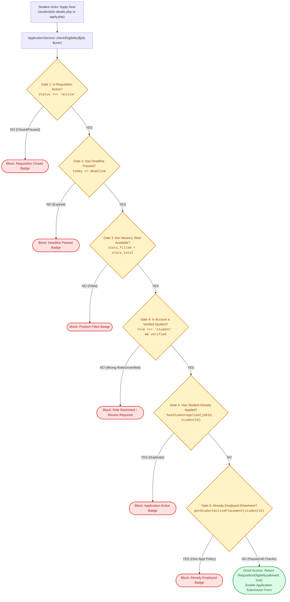

# 📝 `includes/services/application-service.php` — Application Lifecycle & Eligibility Engine

> [!abstract] 📌 Executive Summary
> `includes/services/application-service.php` is a **deep domain module** responsible for managing the end-to-end candidate pipeline. It encapsulates:
> 1. **RequisitionEligibility Value Object**: An immutable domain evaluation determining whether a student is legally and operationally allowed to apply for a campus job.
> 2. **Multi-Constraint Gating**: Evaluates requisition status, application deadline, slot capacity limits, verification status, and duplicate submission prevention.
> 3. **High-Performance Querying & Ranking**: Powers the employer applicant roster with multi-faceted search (department, status, fit tier, keyword) and candidate availability sorting.

---

## 🏛️ Placement in System Architecture



---

## 🔍 Detailed Function-by-Function Breakdown

### 1. `class RequisitionEligibility` (Lines 11–86)
An immutable Value Object encapsulating the outcome of an eligibility evaluation.
* **Constructor Properties**:
  * `private readonly bool $allowed`: True if the candidate can submit.
  * `private readonly ?string $reason`: Internal machine code (`'closed'`, `'deadline_passed'`, `'slots_filled'`, `'already_applied'`, `'unverified_student'`, `'unauthorized_role'`).
  * `private readonly string $message`: User-friendly descriptive notification.
  * `private readonly ?string $applicationStatus`: Current progress status if already submitted.
  * `private readonly ?array $existingApplication`: Existing record payload.
* **`public function badge(): array` (Lines 40–85)**:
  * Maps each reason directly to UI styling (`bg`, `label`, `icon`, `desc`), standardizing UI badges across job cards and detail banners without duplicate inline templates.

---

### 2. `ApplicationService::checkEligibility()` (Lines 92–172)
```php
public static function checkEligibility(int|array $jobOrId, ?array $user = null): RequisitionEligibility
```
Evaluates all eligibility rules sequentially:
1. **Job Existence Check**: Returns `not_found` if the ID is invalid.
2. **Requisition Status Gate**: Blocks paused or closed requisitions.
3. **Deadline Gate**: Compares current server date (`date('Y-m-d')`) against `$job['deadline']`.
4. **Slot Capacity Gate**: Evaluates `slots_filled >= slots_total`.
5. **Role Gating**: Blocks non-students (e.g., employers or admins) from submitting candidate applications.
6. **Administrative Verification Gate**: Ensures the student account has completed university registration review (`verification_status === 'verified'`).
7. **Duplicate Prevention**: Calls `getStudentApplication()` to ensure a candidate cannot submit duplicate applications for the same job vacancy.
8. **One-Appointment Policy Gate**: Calls `getStudentActivePlacement($userId)` to ensure the candidate is not already appointed as a Student Assistant in another campus office. Returns `already_employed` if an active contract is held elsewhere.

---

### 3. Atomic Application State & Placement Queries (Lines 174–370)

#### `getStudentActivePlacement(int $studentId): ?array` (Lines 258–290)
* Queries the database for any active appointment (`LOWER(status) IN ('accepted', 'hired', 'accepted / hired')`) held by the student across campus departments.
* Returns the application row hydrated with job title, department, employer organization, pay rate, and work setup.
* Powers the institutional One-Appointment Policy gate.

#### `getStudentPlacementSummary(int $studentId, ?int $currentJobId = null): array` (Lines 295–370)
* Provides hiring supervisors with complete applicant pipeline visibility during candidate evaluation:
  * `is_employed`: Boolean flag indicating if candidate currently holds an active appointment elsewhere.
  * `active_placement`: Job details and department of current appointment if active.
  * `other_applications`: List of all applications submitted to other offices.
  * `other_pending_count` & `other_eval_count`: Aggregated count of competing applications currently pending review or under evaluation across campus.

#### `hasStudentApplied(int $jobId, int $studentId): bool` (Lines 210–230)
* **Optimization**: Fast atomic SQL query executing `SELECT 1 FROM applications WHERE job_id = :job_id AND student_id = :student_id LIMIT 1`. Avoids fetching heavy rows when only a boolean check is needed.
* **Dual Datastore Fallback**: If MySQL PDO fails, falls back to parsing `data/applications.json`.

#### `getStudentApplication(int $jobId, int $studentId): ?array` (Lines 235–250)
* Returns the most recent application submitted by the student for that specific vacancy.

#### `getApplicantCount(int $jobId): int` (Lines 375–395)
* Executes `SELECT COUNT(*) FROM applications WHERE job_id = :job_id` to provide instantaneous count badges on employer dashboard cards.

---

### 4. Advanced Candidate Search & Ranking Engine: `search()` (Lines 249–401)
```php
public static function search(array $filters = []): array
```
Powers the employer candidate evaluation drawer with deep filtering and sorting:
* **SQL Multi-Table Inner Join**:
  * Joins `applications a` with `jobs j`, `users u`, and `student_profiles sp` in a single query.
  * Extracts academic metrics: `student_number`, `course`, `year_level`, `birthdate`, `age`.
* **Dynamic Parameterized Filters**:
  * Filters by `student_id`, `job_id`, `department`, `employer_id`, `status` (grouped semantically), and `search` query (matching name, email, course, or job title).
* **Schedule Compatibility Scoring**:
  * Iterates results and attaches `schedule_summary` (computed via `get_schedule_summary()`).
  * Enables filtering by `fit_tier` (`optimal`, `moderate`, `limited`, `conflict`).
* **Candidate Ranking (`rank_sort`)**:
  * `sched_desc`: Highest schedule compatibility score first.
  * `sched_asc`: Lowest compatibility score first.
  * `name_asc` / `name_desc`: Alphabetical student sorting.
  * `date_asc` / `date_desc`: Chronological submission date sorting.

---

## 🛡️ Security & Panel Defense Talking Points

> [!tip] 🎤 High-Yield Defense Q&A for this File
> 
> **Q: How does the system prevent a student from spamming multiple applications to the same position?**
> * **Answer:** *"In `ApplicationService::checkEligibility()` (Line 155), we perform an atomic query `SELECT 1 FROM applications WHERE job_id = :job AND student_id = :student`. If a prior application exists, the service returns a `RequisitionEligibility` instance with `allowed: false` and reason `already_applied`. The front-end disables the button, replaces it with an 'Application Active' badge, and prevents form submission."*
> 
> **Q: How do you handle race conditions when two students apply for the last remaining slot simultaneously?**
> * **Answer:** *"Eligibility is evaluated twice: first when the student views the application page, and second inside the transaction right before the application record is committed. Line 127 checks if `slots_filled >= slots_total`. If the quota was filled between the student loading the form and clicking submit, the submission is rejected."*
> 
> **Q: Why use a Value Object (`RequisitionEligibility`) instead of a simple boolean?**
> * **Answer:** *"A boolean only tells us 'yes' or 'no'. By returning a `RequisitionEligibility` object, the service delivers the exact domain reason (`deadline_passed`, `slots_filled`, `already_applied`), user-facing explanatory text, and pre-calculated CSS badge tokens, eliminating scattered if/else rendering logic across views."*
