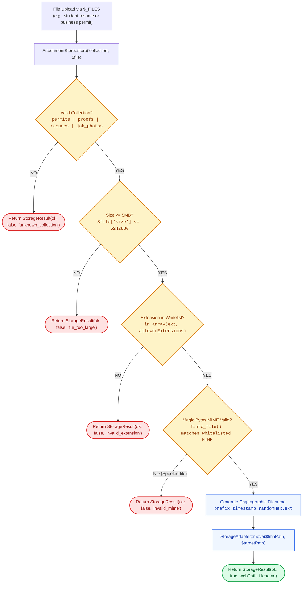

# 📁 `includes/services/attachment-store.php` — Document & Media Storage Engine

> [!abstract] 📌 Executive Summary
> `includes/services/attachment-store.php` is the **document upload authority** for the platform. It manages institutional attachments—including student resumes, employer business permits, and Certificate of Registration (COR) verification proofs.
> 
> To safeguard against malicious uploads (such as PHP webshells disguised as PDFs), it enforces:
> 1. **Strict Storage Collections**: Whitelisted directories, extensions, and MIME rules per document type.
> 2. **Deep MIME Inspection**: Validates binary magic bytes using PHP's `finfo` rather than trusting user-submitted headers.
> 3. **Cryptographic Filename Hashing**: Renames files with cryptographically random hex prefixes (`bin2hex(random_bytes(4))`) to neutralize Path Traversal (CWE-22) and file overwrite vulnerabilities.
> 4. **Swappable Storage Adapters**: Decouples upload logic via `StorageAdapter` (`HttpStorageAdapter` for web requests vs. `LocalDiskAdapter` for automated CLI test fixtures).

---

## 🏛️ Placement in System Architecture



---

## 🔍 Detailed Function-by-Function Breakdown

### 1. `interface StorageAdapter` & Implementations (Lines 9–71)
* **`interface StorageAdapter`**: Defines the contract for filesystem persistence: `move()`, `ensureDirectory()`, `exists()`, `delete()`, `isUploadedFile()`.
* **`HttpStorageAdapter`**: The production web adapter. Uses PHP's native `is_uploaded_file()` and `move_uploaded_file()` to enforce secure HTTP multipart upload validation.
* **`LocalDiskAdapter`**: Used in automated unit and E2E test suites where files are simulated on local disk rather than uploaded via HTTP POST.

---

### 2. `class StorageResult` (Lines 73–101)
An immutable Value Object returned by upload attempts:
* `isOk(): bool`: True on successful storage.
* `path(): ?string`: Relative web path to file (e.g., `uploads/resumes/resume_1790401200_a1b2c3d4.pdf`).
* `filename(): ?string`: Generated secure filename.
* `errorCode(): ?string`: Machine error code (`'no_file'`, `'file_too_large'`, `'invalid_extension'`, `'invalid_mime'`).
* `errorMessage(): string`: Sanitized, user-facing error message.

---

### 3. Collection Security Policies (Lines 106–152)
Configures whitelisted policies for each document collection:
* **`resumes`**:
  * Dir: `uploads/resumes`
  * Ext: `['pdf', 'doc', 'docx']`
  * MIMEs: `application/pdf`, `application/msword`, `application/vnd.openxmlformats-...`
  * Max Size: 5MB
* **`proofs`** (Student Certificate of Registration / ID):
  * Dir: `uploads/proofs`
  * Ext: `['pdf', 'jpg', 'jpeg', 'png']`
  * MIMEs: `application/pdf`, `image/jpeg`, `image/png`
* **`permits`** (Employer Business Permits / DTI Certificates):
  * Dir: `uploads/permits`
  * Ext: `['pdf', 'jpg', 'jpeg', 'png']`
* **`job_photos`** & **`category_photos`**:
  * Dir: `uploads/jobs`, `uploads/categories`
  * Ext: `['jpg', 'jpeg', 'png', 'webp']`

---

### 4. `AttachmentStore::store()` (Lines 168–265)
```php
public static function store(string $collection, ?array $file): StorageResult
```
The central upload validation sequence:
1. **Error Check**: Validates `$_FILES['error'] === UPLOAD_ERR_OK`.
2. **Size Enforcement**: Checks byte size against collection policy (5MB cap).
3. **Extension Whitelisting**: Extracts `pathinfo($origName, PATHINFO_EXTENSION)` and matches against permitted extensions.
4. **Binary MIME Inspection**: Invokes `self::detectMimeType($tmpName)`.
5. **Cryptographic Filename Generation**:
   ```php
   $safeExt = $ext;
   $hash = bin2hex(random_bytes(4));
   $safeFilename = $policy['prefix'] . time() . '_' . $hash . '.' . $safeExt;
   ```
6. **Persistence**: Invokes `adapter->move($tmpName, $targetPath)` and returns the resulting `StorageResult`.

---

### 5. `AttachmentStore::detectMimeType()` (Lines 267–285)
```php
private static function detectMimeType(string $path, string $fallback = ''): string
```
* **Security Deep Dive**: Attackers can easily spoof HTTP multipart headers (e.g., uploading a PHP script with `Content-Type: application/pdf`).
* `detectMimeType()` uses PHP's **Fileinfo extension** (`finfo_open(FILEINFO_MIME_TYPE)`) to read the actual binary signature (magic bytes) from disk. It only falls back to `$fallback` if `finfo` is unavailable in the server runtime.

---

## 🛡️ Security & Panel Defense Talking Points

> [!tip] 🎤 High-Yield Defense Q&A for this File
> 
> **Q: How does `AttachmentStore` protect against File Upload Web Shell attacks (CWE-434)?**
> * **Answer:** *"We implement a 3-layer security defense:
>   1. **Extension Whitelist**: Only non-executable extensions (`pdf`, `docx`, `png`, `jpg`) are allowed. Any file with a `.php`, `.phtml`, or `.exe` extension is rejected immediately.
>   2. **Magic Byte Verification**: Rather than trusting the browser's `Content-Type` header, we inspect the file's raw binary magic bytes using PHP's `finfo_file()` to ensure a renamed script is caught.
>   3. **Filename Neutralization**: Files are never stored under their uploaded name. They are renamed using timestamps and cryptographically secure random bytes (`random_bytes(4)`), preventing Directory Traversal attacks (CWE-22)."*
> 
> **Q: How do you prevent unauthorized users from downloading student resumes?**
> * **Answer:** *"Direct access to uploaded documents is restricted. In `uploads/.htaccess`, direct script execution is disabled. Furthermore, all resume viewing passes through `view-resume.php`, which validates the viewer's active session and verifies that only the applicant, the hiring supervisor, or an administrator can stream the file."*
