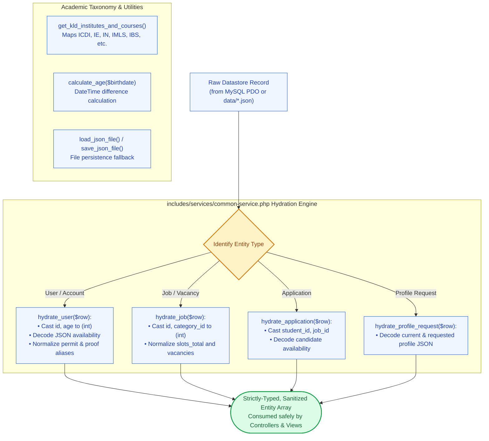

# 🛠️ `includes/services/common-service.php` — Hydration Helpers & Shared Utilities

> [!abstract] 📌 Executive Summary
> `includes/services/common-service.php` provides foundational data hydration, JSON file persistence shims, academic taxonomy mappings, and flash alerts:
> 1. **Data Hydration Pipeline**: Standardizes raw records coming from either PDO MySQL associative arrays or JSON files into strictly-typed arrays (`hydrate_user`, `hydrate_job`, `hydrate_application`, `hydrate_category`, `hydrate_profile_request`, `hydrate_update`).
> 2. **JSON Fallback Persistence Shims (`load_json_file`, `save_json_file`)**: Reads and safely writes JSON datasets with pretty-printing and UTF-8 flags.
> 3. **KLD Academic Taxonomy (`get_kld_institutes_and_courses`)**: Official institute and degree program mapping for Kolehiyo ng Lungsod ng Dasmariñas (KLD).
> 4. **Domain Enums & Date Helpers**: `get_year_levels()`, `get_job_types()`, `get_work_setups()`, `get_employer_types()`, `calculate_age()`, and `format_display_date()`.

---

## 🏛️ Placement in System Architecture



---

## 🔍 Detailed Function-by-Function Breakdown

### 1. Institutional Date Formatter: `format_display_date()` (Lines 9–21)
```php
function format_display_date(string|int|null $datetime, bool $include_time = false): string
```
* **Graceful Handling of Open Deadlines**: Nulls, `'0000-00-00'`, or `'open'` return `'Open'`.
* Standardizes dates across the system to formal university format (e.g., `'October 14, 2026'`).

---

### 2. Entity Hydration Engine (Lines 27–188)
* `hydrate_user(mixed $row): ?array`: Type-casts IDs, decodes nested JSON availability arrays, normalizes aliases (`permit_file`, `proof_file`, `organization_name`), and guarantees default `is_email_verified = 1`.
* `hydrate_job(mixed $row): ?array`: Casts `category_id`, `employer_id`, `vacancies`, and `slots_total`.
* `hydrate_application(mixed $row): ?array`: Unpacks student availability slots.
* `hydrate_profile_request(mixed $row): ?array`: Decodes `current_profile` and `requested_profile` JSON blobs.
* `hydrate_update(mixed $row): ?array`: Unpacks author credentials.

---

### 3. Domain Enums & Academic Taxonomy (Lines 193–250 & Lines 323–363)

#### `get_year_levels(): array` (Lines 193–203)
* Standardized undergraduate year classifications: `'1st Year'`, `'2nd Year'`, `'3rd Year'`, `'4th Year'`, `'5th Year'`, `'Graduate Student'`, `'Alumnus'`.

#### `calculate_age(?string $birthdate): ?int` (Lines 212–224)
* Uses PHP's `DateTime` and `diff()` to calculate student age accurately based on server date.

#### `get_kld_institutes_and_courses(): array` (Lines 323–352)
* Comprehensive map of KLD academic units:
  * **Institute of Computing and Digital Innovation (ICDI)**: BSIS, BSCS, BSDS.
  * **Institute of Engineering (IE)**: BSCE.
  * **Institute of Nursing (IN)**: BSN.
  * **Institute of Medical Laboratory Science (IMLS)**: BSMLS.
  * **Institute of Midwifery (IM)**: BSM.
  * **Institute of Behavioral Sciences (IBS)**: BSP.
  * **Institute of Governance and Development Studies (IGDS)**: BSSW.

#### `get_kld_courses_flat(): array` (Lines 354–363)
* Flattens all KLD programs into a single array for select dropdowns.

---

### 4. JSON Datastore Shims (Lines 380–403)

#### `load_json_file(string $filename): array` (Lines 380–392)
* Fallback loader mapping JSON filenames (`users.json`, `jobs.json`) to their respective getter functions.

#### `save_json_file(string $filename, array $data): bool` (Lines 394–403)
* Atomically persists data to `DATA_DIR` using `JSON_PRETTY_PRINT | JSON_UNESCAPED_UNICODE`.

---

## 🛡️ Security & Panel Defense Talking Points

> [!tip] 🎤 High-Yield Defense Q&A for this File
> 
> **Q: Why does the application maintain an institutional taxonomy like `get_kld_institutes_and_courses()`?**
> * **Answer:** *"Student assistantship opportunities frequently require specific academic backgrounds (e.g., MIS requires ICDI students, while campus clinics require Nursing or Midwifery students). By hard-coding the university's academic taxonomy in `get_kld_institutes_and_courses()`, we prevent registration errors, sanitize dropdown inputs, and enable precision candidate filtering."*
> 
> **Q: How does `save_json_file()` ensure JSON data integrity?**
> * **Answer:** *"In `save_json_file()` (Line 394), the system verifies that `DATA_DIR` exists and is writable, and executes `json_encode()` with `JSON_PRETTY_PRINT` and `JSON_UNESCAPED_UNICODE` before committing via `file_put_contents()`, preventing data corruption or encoding malformations."*
