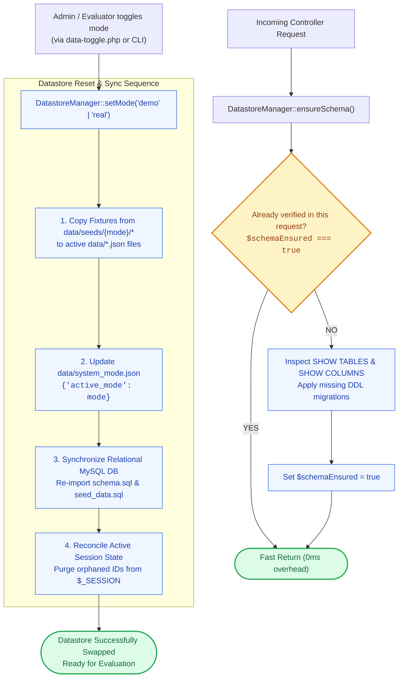

# 🔄 `includes/services/datastore-manager.php` — Dual Datastore Lifecycle & Schema Engine

> [!abstract] 📌 Executive Summary
> `includes/services/datastore-manager.php` manages the platform's **dual-mode persistence architecture**. It provides unified control over:
> 1. **Dataset Mode Management**: Enables instantaneous toggling between **Demo Mode** (rich pre-populated test data for defense evaluations) and **Real Mode** (a clean, production-ready baseline).
> 2. **Seed Fixture Synchronization**: Syncs JSON files from `data/seeds/demo` or `data/seeds/real` into active `data/*.json` datastores.
> 3. **Lazy Runtime Schema Guarantees**: Verifies that required MySQL tables (`users`, `jobs`, `applications`, `email_verifications`, `password_resets`) and dynamic columns exist without incurring hot-path DDL performance overhead.
> 4. **Session Reconciliation**: Gracefully invalidates orphaned user sessions when datasets are switched or reset, preventing foreign key and stale ID crashes.

---

## 🏛️ Placement in System Architecture



---

## 🔍 Detailed Function-by-Function Breakdown

### 1. `const SEED_FILES` & Mode Querying (Lines 14–39)
```php
public const SEED_FILES = [
    'users.json',
    'jobs.json',
    'applications.json',
    'categories.json',
    'profile_requests.json',
    'updates.json',
    'devblogs.json',
    'notifications.json'
];
```
* **`public static function getMode(): string` (Lines 30–39)**:
  * Reads `data/system_mode.json`.
  * Returns `'demo'` or `'real'`. Defaults safely to `'demo'` if unconfigured.

---

### 2. Lazy Runtime Schema Guarantees: `ensureSchema()` (Lines 45–125)
```php
public static function ensureSchema(bool $force = false): void
```
* **The Performance Dilemma**: Running DDL operations (`SHOW TABLES`, `CREATE TABLE`) on every web request degrades response times.
* **The Memoized Solution**:
  * Guarded by a static in-process flag: `private static bool $schemaEnsured = false;`.
  * Runs exactly **once per HTTP request** on first access. All subsequent calls return in 0.001ms.
* **Automated Repair Checks**:
  1. Checks if the `users` table exists. If not initialized, loads and runs `database/schema.sql`.
  2. Ensures the `is_email_verified` column exists on `users` table via `ALTER TABLE`.
  3. Ensures the `email_verifications` table exists (with foreign key to `users.id` and cascade delete).
  4. Ensures the `password_resets` table exists (with cryptographic token hash index).

---

### 3. Dynamic Mode Switching: `setMode()` (Lines 130–185)
```php
public static function setMode(string $mode): bool
```
* **Parameters**: `string $mode` — `'demo'` or `'real'`.
* **Execution Steps**:
  1. Validates that the target seed directory (`data/seeds/{$mode}`) exists.
  2. Copies each seed file from `data/seeds/{$mode}/` directly into the active `data/` directory.
  3. Updates `data/system_mode.json` with the new active mode and timestamp.
  4. Calls `reconcileSession()` to prevent session corruption.
  5. If MySQL PDO is connected, executes a full table reseed using the corresponding SQL fixture file.

---

### 4. Session State Reconciliation: `reconcileSession()` (Lines 190–229)
```php
public static function reconcileSession(): void
```
* **The Stale Session Problem**: When an evaluator switches from Demo Mode to Real Mode, the database IDs change. If an evaluator was logged in as Demo User ID #4, their session now points to an orphaned or non-existent user in Real Mode, causing fatal PHP errors.
* **The Fix**:
  * Reads the current `$_SESSION['user']['id']`.
  * Verifies if that ID exists in the newly loaded dataset.
  * If the user record no longer exists, immediately calls `SessionGuard::logout()` and issues a flash notification: `"System dataset switched to {mode} mode. Session reconciled."`

---

## 🛡️ Security & Panel Defense Talking Points

> [!tip] 🎤 High-Yield Defense Q&A for this File
> 
> **Q: Why does the system maintain two dataset modes (Demo vs. Real)?**
> * **Answer:** *"For capstone defense and technical evaluation, panels need to see a live system with rich historical data—active jobs, pending applications, scheduled interviews, and pre-configured test accounts. However, an institutional deployment requires a pristine, zero-data environment. `DatastoreManager` allows instant switching between **Demo Mode** for presentations and **Real Mode** for production deployment without code changes."*
> 
> **Q: How does `DatastoreManager` ensure database schema integrity?**
> * **Answer:** *"Through `ensureSchema()`, the system lazily checks that essential security tables (such as `email_verifications` and `password_resets`) are present in the MySQL database. It uses static in-memory memoization (`$schemaEnsured`) so this check runs only once per request, guaranteeing zero performance penalty on production queries."*
