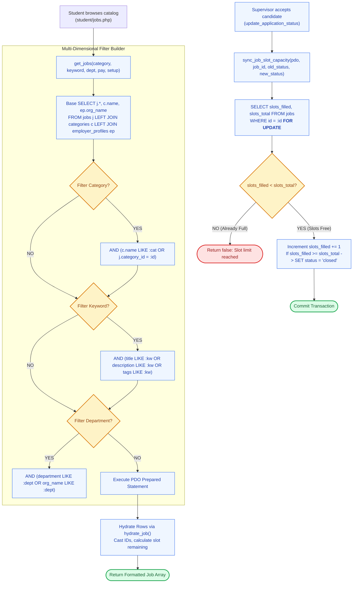

# 💼 `includes/services/job-service.php` — Requisitions & Category Engine

> [!abstract] 📌 Executive Summary
> `includes/services/job-service.php` is the **core requisition and vacancy authority** of the platform. It encapsulates:
> 1. **Faceted Job Search (`get_jobs`)**: Powers the student job catalog with multi-dimensional filtering (category, keyword, department, pay structure, work setup, and employer type) via parameterized SQL queries with JSON datastore fallbacks.
> 2. **Transactional Slot Capacity Synchronization (`sync_job_slot_capacity`)**: Uses **`SELECT ... FOR UPDATE` (pessimistic row locking)** to manage vacancy quotas without race conditions when applicants are hired or revoked.
> 3. **Vacancy Requisition Lifecycle (CRUD)**: `create_job()`, `update_job()`, and `delete_job()` while enforcing institutional labor policies (such as the **20 hours per week** ceiling).
> 4. **Department Taxonomy Management**: `get_categories()`, `create_category()`, `update_category()`, and `delete_category()` with icon bindings.
> 5. **Application Management**: `create_application()`, `update_application_status()`, and `delete_application()`.

---

## 🏛️ Placement in System Architecture



---

## 🔍 Detailed Function-by-Function Breakdown

### 1. Faceted Job Search: `get_jobs()` (Lines 9–175)
```php
function get_jobs(
    string|array|null $category = null,
    ?string $keyword = null,
    ?string $department = null,
    ?string $pay_type = null,
    ?string $job_type = null,
    ?string $employer_type = null,
    ?string $work_setup = null,
    int|string|null $employer_id = null
): array
```
* **Dynamic Filter Parameters**: Category, keyword, department, pay type, work setup, and employer ID.
* **SQL Parameterization**: Dynamically appends clauses (`AND (c.name LIKE :cat OR j.category_id = :id)`) and binds parameters safely.
* **Datastore Fallback**: If MySQL PDO fails, falls back to parsing `data/jobs.json`.

---

### 2. Transactional Quota Management: `sync_job_slot_capacity()` (Lines 513–553)
```php
function sync_job_slot_capacity(PDO $pdo, int $job_id, string $old_status, string $new_status): bool
```
* **Critical Race Condition Defense**:
  When two hiring supervisors simultaneously accept candidates for the final slot, standard database updates can cause over-hiring.
* **Algorithm**:
  1. **Transitioning TO `'accepted'` (Lines 514–538)**:
     * Executes `SELECT slots_filled, slots_total, vacancies FROM jobs WHERE id = :job_id FOR UPDATE`.
     * The `FOR UPDATE` clause places an exclusive row-level lock on the job record until the transaction completes.
     * Evaluates `slots_curr >= slots_max`. If full, immediately aborts and returns `false`.
     * Increments `slots_filled` and automatically updates status to `'closed'` if all slots are exhausted:
       ```sql
       UPDATE jobs SET
           slots_filled = slots_filled + 1,
           status = CASE WHEN slots_filled >= slots_total THEN 'closed' ELSE status END,
           updated_at = NOW()
       WHERE id = :job_id
       ```
  2. **Transitioning AWAY from `'accepted'` (Lines 540–550)**:
     * Decrements `slots_filled` (`GREATEST(0, slots_filled - 1)`).
     * If the job was previously closed due to full slots, automatically restores status to `'active'`.

---

### 3. Requisition Management (CRUD) (Lines 230–335)

#### `create_job(array $data, ?array $photo_file = null): int` (Lines 230–254)
* **Purpose**: Creates a new campus vacancy.
* **Policy Enforcement**: Caps weekly hours to a maximum of 20 (`min(20, (int)$data['hours_per_week'])`).
* Stores responsibilities and qualifications as JSON-encoded arrays.
* Returns the new primary key `lastInsertId()`.

#### `update_job(int|string $id, array $data, ?array $photo_file = null): bool` (Lines 256–312)
* Updates vacancy details, location, pay rate, and status.

#### `delete_job(int|string $id): bool` (Lines 314–335)
* Deletes the requisition and cascading application records.

---

### 4. Category Taxonomy Engine (Lines 600–710)
* `get_categories(): array`: Fetches all campus categories along with computed active requisition counts.
* `get_category_by_id(int|string $id): ?array`
* `create_category(array $data, ?array $icon_file = null): int`
* `update_category(int|string $id, array $data, ?array $icon_file = null): bool`
* `delete_category(int|string $id): bool`

---

### 5. Application Pipeline Operations (Lines 450–511 & Lines 555–600)

#### `create_application(array $data, ?array $resume_file = null): array` (Lines 450–511)
* Inserts application record with submitted availability grid slots, cover letter, and resume path.
* Catches PDO error code `23000` (unique constraint violation) to return user-friendly duplicate notice: `"You have already submitted an application for this position."`.

#### `update_application_status(int|string $id, string $status, string $notes = '', ?string $interview_date = null, ?string $interview_time = null, ?string $interview_location = null, ?string $interview_type = null): bool` (Lines 555–600)
* Invokes `sync_job_slot_capacity()` inside a transaction.
* If interview is scheduled, stores interview details and triggers notification.

#### `delete_application(int|string $id): bool` (Lines 720–740)
* Allows application removal / student self-service withdrawal.

---

## 🛡️ Security & Panel Defense Talking Points

> [!tip] 🎤 High-Yield Defense Q&A for this File
> 
> **Q: How does `job-service.php` prevent over-hiring when multiple supervisors evaluate candidates at the same time?**
> * **Answer:** *"In `sync_job_slot_capacity()` (Line 515), we use **pessimistic row locking** via `SELECT ... FOR UPDATE`. When an applicant is accepted, MySQL locks that specific requisition row until the transaction finishes. It checks `slots_filled >= slots_total`. If another supervisor accepted a candidate a split-second earlier and filled the last slot, the query safely rejects the second acceptance, preventing over-hiring."*
> 
> **Q: How does the system automatically re-open a job if a hired student cancels or declines?**
> * **Answer:** *"In Lines 540–550, if an application transitions away from `'accepted'`, `sync_job_slot_capacity()` automatically decrements `slots_filled`. If the job was closed because it was previously full, it dynamically switches the requisition status back to `'active'` so other students can apply."*
