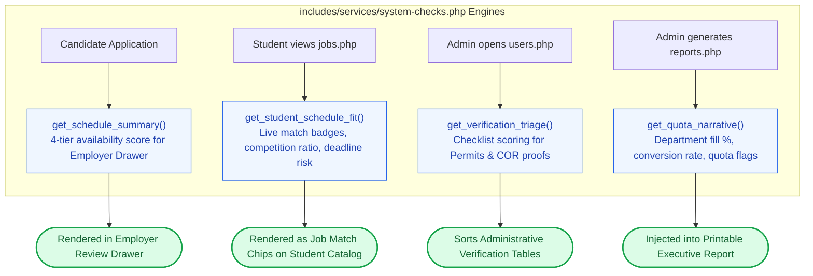

# 🩺 `includes/services/system-checks.php` — Schedule Heuristics & Health Auditing

> [!abstract] 📌 Executive Summary
> `includes/services/system-checks.php` houses deterministic business logic for **candidate schedule heuristics**, **triage queues**, and **executive analytics**:
> 1. **Candidate Schedule Compatibility (`get_schedule_summary`)**: Evaluates a student's declared Mon–Sat Weekly Availability Matrix slots (each shift = 4 hours) into 4 institutional tiers (`optimal`, `moderate`, `limited`, `conflict`).
> 2. **Student Job-Fit Matcher (`get_student_schedule_fit`)**: Powers the real-time match badges (`Strong fit`, `Moderate`, `Limited`) on `student/jobs.php` by analyzing student free hours, workload cap warnings, competition ratios, and deadline urgency.
> 3. **Verification Queue Triage Engine (`get_verification_triage`)**: Deterministic document completeness scoring for pending employer permits and student COR profile change requests in `admin/users.php`.
> 4. **Department Quota Narrative (`get_quota_narrative`)**: Computes executive analytics (hiring funnel, fill percentages, conversion rates, and quota overload flags) for printable reports in `admin/reports.php`.

---

## 🏛️ Placement in System Architecture



---

## 🔍 Detailed Function-by-Function Breakdown

### 1. Candidate Schedule Summary: `get_schedule_summary()` (Lines 29–101)
```php
function get_schedule_summary(array $application, ?array $job = null): array
```
* Computes candidate availability from declared 4-hour shifts:
  * **Conflict (`0 slots`)**: Score `10`, Red alert badge (`No Shift Input`).
  * **Limited (`1–2 slots`)**: Score `40–60`, Yellow badge (`Limited (4–8h)`).
  * **Moderate (`3–4 slots`)**: Score `70–80`, Green badge (`Moderate (12–16h)`).
  * **Optimal (`5+ slots`)**: Score `90–100`, Accent green badge (`Optimal (20h max)`).

---

### 2. Student Job-Fit Matcher: `get_student_schedule_fit()` (Lines 104–207)
```php
function get_student_schedule_fit(array $student, array $job, int $applicant_count = 0): array
```
* **Purpose**: Evaluates candidate fit in real-time as students browse jobs on `student/jobs.php`.
* **Metrics Calculated**:
  1. **Overlap Percentage**: `round(($hours / 20) * 100)%` against the 20-hour weekly cap.
  2. **Evening Count**: Flags students with evening-only availability who may conflict with daytime office hours.
  3. **Competition Index**:
     * `low`: `< 1.0` applicants per slot.
     * `medium`: `1.0` to `2.0` applicants per slot.
     * `high`: `> 2.0` applicants per slot.
  4. **Deadline Risk**: Flags positions expiring within 7 days (`deadline_risk = 'high'`).
  5. **Workload Warning**: Alerts students if declared shifts exceed 20 hours (`"Prioritize coursework"`).

---

### 3. Verification Queue Triage: `get_verification_triage()` (Lines 218–355)
```php
function get_verification_triage(array $pending_users, array $pending_profile_requests): array
```
* **Purpose**: Evaluates uploaded institutional documents in `admin/users.php`.
* **Employer Accreditation Checklist**:
  * Verifies uploaded Business Permit / MOA document.
  * Checks accreditation number format.
  * Checks organization name and contact person.
* **Student Profile Request Checklist**:
  * Verifies Certificate of Registration (COR) document upload.
  * Audits degree program and year level changes against university taxonomy.
* **Output**: Calculates a completeness percentage and attaches structured checklist pills for administrative inspectors.

---

### 4. Executive Quota Narrative: `get_quota_narrative()` (Lines 366–418)
```php
function get_quota_narrative(array $departments, int $total_jobs, int $total_apps, int $total_hired, int $total_interviews): array
```
* **Purpose**: Analyzes campus hiring funnels for `admin/reports.php`.
* **Metrics**:
  * `interview_rate`: Percentage of applicants shortlisted for interview.
  * `hire_rate`: Percentage of applicants accepted into positions.
  * `fill_pct`: Headcount fulfillment against university office quotas.
  * `conversion`: Ratio of total applicants to hired candidates.
* **Automated Audit Flags**:
  * *`Quota exceeded`*: Department hired more student assistants than authorized.
  * *`Stalled pipeline`*: Office has 5+ applicants but 0 hires.
  * *`Dormant this term`*: Department has 0 active postings and 0 applicants.

---

## 🛡️ Security & Panel Defense Talking Points

> [!tip] 🎤 High-Yield Defense Q&A for this File
> 
> **Q: How does `get_student_schedule_fit()` assist students during job discovery?**
> * **Answer:** *"In `student/jobs.php`, each job card displays dynamic chips generated by `get_student_schedule_fit()`. It calculates whether the student's declared free hours match the position, computes competition levels (e.g. `2 applicants per slot`), flags impending deadlines, and warns students if a role would push them past the university's 20-hour weekly labor ceiling."*
> 
> **Q: How does `get_verification_triage()` prevent administrative backlog?**
> * **Answer:** *"In `admin/users.php`, `get_verification_triage()` automatically scores document completeness for pending employer business permits and student COR change requests. It highlights missing fields or placeholder documents with visual red flags, allowing administrators to audit submissions efficiently."*
