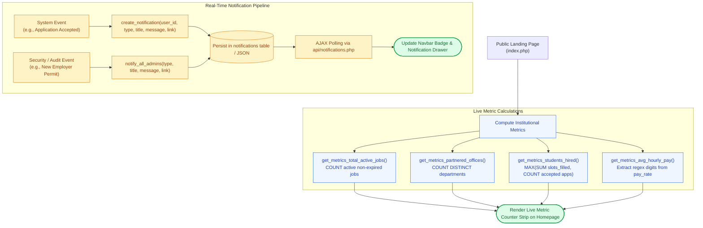

# 📊 `includes/services/system-service.php` — System Metrics & Messaging Engine

> [!abstract] 📌 Executive Summary
> `includes/services/system-service.php` manages platform-level telemetry, asynchronous messaging, and public content feeds:
> 1. **Institutional Metrics**: Powers the live metrics strip on `index.php` (Total Active Jobs, Partnered Offices, Students Hired, Average Hourly Wage).
> 2. **Notification Dispatch (`create_notification`, `notify_all_admins`)**: Manages in-app alerts (application updates, interview bookings, document audit notices) with user-isolated read/unread tracking.
> 3. **Career Updates & Advisories (`get_career_updates`)**: Complete CRUD operations for institutional hiring announcements and system patch notes.
> 4. **Developer Logs (DevBlogs)**: Serves the sprint engineering logs that power the 3D DevBlog stage on `about-us.php`.

---

## 🏛️ Placement in System Architecture

---

## 🔍 Detailed Function-by-Function Breakdown

### 1. Institutional Homepage Metrics (Lines 9–75)

#### `get_metrics_total_active_jobs(): int` (Lines 9–22)
* Computes active requisitions where deadline is either open or `>= CURDATE()`.

#### `get_metrics_partnered_offices(): int` (Lines 24–32)
* Counts distinct department entities actively hosting student assistantship positions.

#### `get_metrics_students_hired(): int` (Lines 34–47)
* Reconciles `SUM(slots_filled)` on jobs against `COUNT(status = 'accepted')` in applications, taking `max($job_filled, $app_accepted)` to prevent discrepancies.

#### `get_metrics_avg_hourly_pay(): string` (Lines 49–75)
* Extracts numeric figures from pay rates using regex (`preg_match('/(\d+(?:\.\d+)?)/')`), calculates the arithmetic mean, and formats as `"₱85"`.

---

### 2. Career Updates & Advisories (Lines 91–283)

#### `get_career_updates(): array` (Lines 91–111)
* Queries `updates` joined with `users` and `employer_profiles` to display author credentials (`name`, `author_role`, `author_office`).

#### `get_career_update_by_id(int|string|null $id): ?array` (Lines 113–135)
* Single announcement lookup.

#### `get_latest_career_updates(int $limit = 3, int|string|null $exclude_id = null): array` (Lines 137–165)
* Powers the related announcements sidebar on `update-detail.php`.

#### `create_career_update()`, `update_career_update()`, `delete_career_update()` (Lines 200–283)
* Administrative publishing controls.

---

### 3. Notification Dispatch & Polling (Lines 324–415)

#### `create_notification(int|string $user_id, string $type, string $title, string $message, ?string $link = null, string $icon = 'bi-bell', string $badge_color = 'primary'): int` (Lines 324–345)
* Inserts an alert record into `notifications` with `is_read = 0`.
* Returns the new primary key `lastInsertId()`.

#### `notify_all_admins(string $type, string $title, string $message, ?string $link = null, string $icon = 'bi-shield-check', string $badge_color = 'warning'): int` (Lines 347–362)
* Queries all accounts where `role = 'admin'` and broadcasts the alert to each administrator's inbox. Used for security events, employer accreditation requests, and student COR change audits.

#### `get_user_notifications(int|string $user_id, int $limit = 20): array` & `get_unread_notifications_count(int|string $user_id): int` (Lines 365–410)
* Returns user notifications and unread badge counts, strictly filtered by `user_id`.

---

### 4. Interactive DevBlogs Engine (Lines 285–322)
* `get_devblogs(): array`: Reads `data/devblogs.json` to feed the 3D DevBlog stage on `about-us.php`.

---

## 🛡️ Security & Panel Defense Talking Points

> [!tip] 🎤 High-Yield Defense Q&A for this File
> 
> **Q: How does `notify_all_admins()` alert the university when a partner employer registers?**
> * **Answer:** *"In `notify_all_admins()` (Line 347), the system queries all active administrator accounts (`SELECT id FROM users WHERE role = 'admin'`) and creates an individual notification for each administrator with a direct link to `admin/users.php#employer-permit-section`, ensuring all compliance officers are notified of pending accreditations."*
> 
> **Q: How does `get_user_notifications()` prevent data leakage between users?**
> * **Answer:** *"All notification reads and updates are strictly parameterized with the authenticated user's ID (`WHERE user_id = :user_id`). Users cannot view or acknowledge another user's notifications by tampering with request parameters."*
