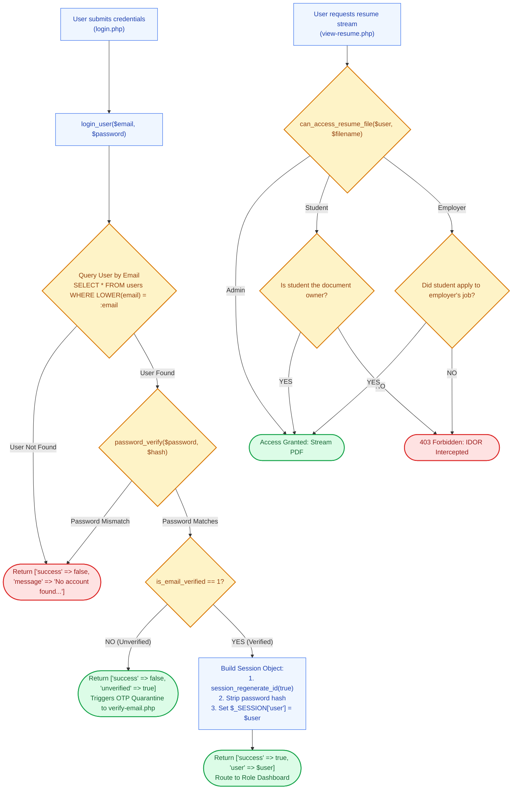

# 👤 `includes/services/user-service.php` — Identity & Profile Governance Engine

> [!abstract] 📌 Executive Summary
> `includes/services/user-service.php` is the **identity and authentication foundation** of the platform. It encapsulates:
> 1. **Credential Authentication (`login_user`)**: Validates credentials via `password_verify()`, handles legacy plaintext-to-hash upgrades on the fly, isolates unverified accounts for OTP verification, and prevents session fixation attacks with `session_regenerate_id(true)`.
> 2. **Evaluator Quick-Fill (`quick_login`)**: Powers 1-click test evaluation credentials for defense demonstrations.
> 3. **Authorization & IDOR Protection**: Four strict authorization contracts (`can_manage_job`, `can_review_application`, `can_view_student_resume`, `can_access_resume_file`) preventing Insecure Direct Object References (CWE-639).
> 4. **CSRF Protection Engine**: Timing-attack immune token generation and verification (`generate_csrf_token()`, `verify_csrf_token()`) using `hash_equals()`.
> 5. **Multi-Role Registration (`register_user`)**: Provisions Student, University Office, and Partner accounts with password hashing via `PASSWORD_DEFAULT`.
> 6. **Administrative Verification Queues**: Powers employer accreditation (`update_employer_verification`) and student academic credential audits (`create_profile_request`, `approve_profile_request`, `reject_profile_request`).
> 7. **Email OTP & Password Recovery**: Manages time-limited 6-digit confirmation codes (`create_email_verification_code`) and cryptographic reset tokens.

---

## 🏛️ Placement in System Architecture



---

## 🔍 Detailed Function-by-Function Breakdown

### 1. Dynamic Session Refresh: `get_logged_user()` (Lines 13–31)
```php
function get_logged_user(): ?array
```
* **Live DB Synchronization**: On every invocation, queries `get_user_by_id((int)$_SESSION['user']['id'])` to pull the latest verification status, profile edits, and permissions directly from the database into `$_SESSION['user']`, stripping the password hash before caching.

---

### 2. Cross-Site Request Forgery (CSRF) Defense (Lines 80–112)

#### `generate_csrf_token(): string` (Lines 83–90)
* Generates a 64-character cryptographic token: `bin2hex(random_bytes(32))`.
* Stores it in `$_SESSION['csrf_token']` and returns it for embedding in HTML forms.

#### `verify_csrf_token(?string $token): bool` (Lines 95–111)
* Validates tokens using PHP's constant-time comparison: `hash_equals($_SESSION['csrf_token'], $token)`. Neutralizes timing-attack vectors.

---

### 3. Insecure Direct Object Reference (IDOR) Authorization Gates (Lines 118–245)

#### `can_manage_job(array|int|string $job_or_id, ?array $user = null): bool` (Lines 118–138)
* Verifies whether the active user owns the specified job requisition:
  * Admins always return `true`.
  * Employers return `true` **only if** `(int)$job['employer_id'] === (int)$user['id']`.
  * Students and guests return `false`.

#### `can_review_application(array|int|string $app_or_id, ?array $user = null): bool` (Lines 140–161)
* Verifies whether an employer is authorized to evaluate an applicant:
  * Looks up the application's parent `job_id`.
  * Passes the parent job to `can_manage_job()`. Prevents Office A from viewing or modifying applicants who applied to Office B.

#### `can_view_student_resume(mixed $app = null, int|string|null $student_user_id = null, ?array $user = null): bool` (Lines 163–201)
* Authorization rules for viewing resumes:
  * Admins: Allowed.
  * Students: Allowed **only if** viewing their own resume (`$app['student_id'] === $user['id']`).
  * Employers: Allowed **only if** the student applied to one of the employer's active vacancies.

#### `can_access_resume_file(?array $user, string $filename): bool` (Lines 203–245)
* Document-level gate called directly by `view-resume.php`.
* Queries database to verify if `$filename` belongs to a valid student profile or application linked to the requesting user:
  * **Admins**: Granted global access to audit candidate credentials.
  * **Students**: Permitted if the requested file matches their persistent **Profile Resume** (`$user['resume_file']` or `$user['resume']`) or any application they previously submitted.
  * **Employers**: Permitted only if the candidate submitted that resume file to a vacancy owned by the active employer.

#### `update_user_profile(int $user_id, string $role, array $data): bool` (Lines 1240–1310)
* Updates core user attributes (`name`, `phone`, `office_location`, `website`) and role-specific extension tables:
  * For **Students**: Serializes the 18-slot `availability` matrix and updates or clears the stored profile resume column (`student_profiles.resume_file`).
  * For **Employers**: Updates company profile details and accreditation references.

---

### 4. Authentication Engine: `login_user()` & `quick_login()` (Lines 344–415)

#### `login_user(string $email, string $password): array` (Lines 344–393)
* **Return Signature**:
  ```php
  ['success' => bool, 'unverified' => bool, 'user' => ?array, 'message' => string]
  ```
* **Algorithm**:
  1. Queries user by email using case-insensitive `LOWER(email) = LOWER(:email)`.
  2. If missing, returns failure: `"No account found with this email address."`.
  3. Evaluates password via `password_verify($password, $stored_hash)`.
  4. If hash algorithm needs upgrade (`password_needs_rehash`), updates hash transparently.
  5. Includes automatic plaintext migration: if an old seed had plaintext passwords, verifies match and immediately upgrades to `password_hash($password, PASSWORD_DEFAULT)`.
  6. Checks email verification status: if `is_email_verified === 0` and role is not admin, returns `['success' => false, 'unverified' => true, 'user' => $user]`.
  7. Invokes `session_regenerate_id(true)` to eliminate session fixation.
  8. Strips password hash and commits `$user` to `$_SESSION['user']`.

#### `quick_login(string $role, int|string|null $user_id = null): ?array` (Lines 395–415)
* Powers the 1-click demo evaluation chips on `login.php`.
* Instantly populates and authenticates a pre-configured Student, Employer, or Administrator account without manual typing.

---

### 5. Multi-Role Registration: `register_user()` (Lines 248–342)
```php
function register_user(array $data): array
```
* **Validation & Provisioning**:
  1. Checks for duplicate email or Student ID.
  2. For Students: Enforces institutional `@kld.edu.ph` domain constraint.
  3. Hashes password using `password_hash($data['password'], PASSWORD_DEFAULT)`.
  4. Sets `is_email_verified = 0` (places account in Verification Quarantine).
  5. For Employers: If registered as `approved_partner`, locks `verification_status = 'pending_approval'` pending business permit audit.

---

### 6. Administrative Verification Queues (Lines 485–520 & Lines 860–1070)

#### `update_employer_verification(int|string $id, string $status, string $notes = ''): bool` (Lines 490–515)
* **Purpose**: Used in `admin/users.php` to approve or reject external employer partners.
* **Transition**:
  * `'verified'`: Approves employer, unlocks job posting capabilities, and issues confirmation notification.
  * `'rejected'`: Rejects accreditation with logged administrative reason.

#### `create_profile_request()` (Lines 861–920)
* Used in `settings.php` when a student requests modification of locked academic fields (Student ID, Degree Program, Year Level).
* Stores current profile snapshot, requested profile data, reason, and uploaded Certificate of Registration (COR) proof in `data/profile_requests.json`.

#### `approve_profile_request(int|string $request_id, string $admin_notes = ''): bool` (Lines 1010–1052)
* **Transactional Execution**:
  1. Starts MySQL transaction: `$pdo->beginTransaction()`.
  2. Updates student's profile in `student_profiles` table.
  3. Updates request status to `'approved'` with timestamp and admin notes.
  4. Commits transaction: `$pdo->commit()`.
  5. Refreshes active session if student is logged in.
  6. Dispatches notification to student.

#### `reject_profile_request(int|string $request_id, string $admin_notes = ''): bool` (Lines 1054–1080)
* Marks request as `'rejected'` and logs feedback notes explaining why the submitted COR was insufficient.

---

### 7. Email Verification (OTP) & Password Recovery (Lines 760–850)
* `create_email_verification_code(int $user_id): string`: Generates a cryptographically random 6-digit numeric OTP, stores the hash and a 15-minute expiration timestamp in `email_verifications`.
* `verify_email_code(int $user_id, string $code): bool`: Validates OTP against expiration and attempt limits (max 5 attempts).
* `create_password_reset_token(string $email)`: Generates a 64-character hex token for password reset links with a 1-hour expiration.
* `consume_password_reset_token(string $token, string $new_password): bool`: Validates token, updates user password hash, and deletes token.

---

## 🛡️ Security & Panel Defense Talking Points

> [!tip] 🎤 High-Yield Defense Q&A for this File
> 
> **Q: How does the system defend against Insecure Direct Object References (IDOR / CWE-639) when employers view student resumes?**
> * **Answer:** *"In `can_view_student_resume()` and `can_access_resume_file()` (Lines 163–245), an employer is strictly forbidden from downloading arbitrary resumes by guessing URLs or file paths. The system queries the database to confirm that the student submitted an application to a vacancy owned by that specific employer (`(int)$job['employer_id'] === (int)$user['id']`). If no active application exists between the student and employer, access is blocked with a 403 Forbidden error."*
> 
> **Q: How does `login_user()` prevent Session Fixation attacks?**
> * **Answer:** *"In Line 384, as soon as `password_verify()` succeeds, the system immediately invokes `session_regenerate_id(true)`. This invalidates the old pre-login session ID on the server and issues a new cryptographic session cookie, preventing attackers from hijacking user sessions via pre-set session identifiers."*
> 
> **Q: Why are Student ID, Course, and Year Level locked in student profiles?**
> * **Answer:** *"Academic qualifications dictate student assistantship eligibility and pay rates. If students could freely edit their program or year level, they could commit academic misrepresentation to qualify for technical roles. To alter these fields, `create_profile_request()` mandates uploading an official Certificate of Registration (COR) for administrative review."*
