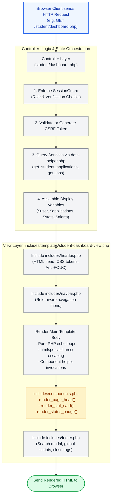

# 🎨 `includes/templates/` — Master Presentation Layer & MVC View Architecture

> [!abstract] 📌 Executive Summary
> The `includes/templates/` directory forms the **pure View layer** of the KLD Campus Job Posting System's Model-View-Controller (MVC) architectural design. It centralizes **32 specialized PHP view templates** and transactional email templates.
> 
> Under the system's strict architectural contract:
> 1. **Zero Persistence / Service Calls in Views**: Templates never initiate database queries (`$pdo` is strictly forbidden), call API endpoints, or mutate session state.
> 2. **Controller Preloading Contract**: Controllers (e.g. `student/dashboard.php`, `employer/create-job.php`) handle authentication (`SessionGuard`), execute service transactions, validate CSRF tokens, and assemble all display variables prior to invoking `require_once __DIR__ . '/../includes/templates/{view}.php'`.
> 3. **Universal Contextual Escaping**: All dynamic variables rendered in views pass through `htmlspecialchars()` to eliminate Cross-Site Scripting (XSS).
> 4. **Design System Componentization**: Views consume standardized reusable visual primitives from `includes/components.php` (`render_page_head`, `render_stat_card`, `render_status_badge`).

---

## 🏛️ MVC Request-to-Presentation Lifecycle



---

## 📂 The 32 View Templates: Functional Catalog

The templates in `includes/templates/` are cataloged into five functional architectural suites:

### 1. Public & Authentication Suite (8 Views)
| Template Filename | Triggering Controller | Functional Description | Key UI Components |
| :--- | :--- | :--- | :--- |
| `index-view.php` | `root/index.php` | Public landing page, hero statistics, featured vacancies, institutional benefits. | Hero banner, live vacancy carousels, role CTAs, dynamic counter cards. |
| `about-us-view.php` | `root/about-us.php` | Institutional mission, vision, compliance guidelines, university leadership. | Editorial paper layout, leadership grid, accreditation statements. |
| `faqs-view.php` | `root/faqs.php` | Interactive student and employer frequently asked questions. | Accordion FAQ cards, search filter input, office contact anchors. |
| `login-view.php` | `root/login.php` | Authentication portal with role discriminator tab, credential inputs, demo account quick-fill. | Two-column auth card, demo account selector modal, error alert banner. |
| `register-view.php` | `root/register.php` | Dual-role registration wizard (Student with COR upload vs Partner with Permit). | Dynamic tab toggles, file upload zone, client-side format validators. |
| `verify-email-view.php` | `root/verify-email.php` | 6-digit OTP verification screen with countdown resend timer. | Segmented 6-box digit input, resend button with countdown ticker. |
| `forgot-pass-view.php` | `root/forgot-pass.php` | Password recovery initiation request form. | Minimal paper card, institutional email input, anti-spam delay notice. |
| `reset-password-view.php` | `root/reset-password.php`| New password definition form with strength indicator. | Password strength meter, confirmation validator, submit button. |

---

### 2. Student Experience Suite (5 Views)
| Template Filename | Triggering Controller | Functional Description | Key UI Components |
| :--- | :--- | :--- | :--- |
| `student-dashboard-view.php` | `student/dashboard.php` | Student portal home: verification alert, quick stats, active applications, recommendations. | `render_page_head`, 4 stat cards, recent application list, contract alert. |
| `student-jobs-view.php` | `student/jobs.php` | Filterable campus job catalog with live search, department tags, hourly rates. | Filter sidebar, search input, vacancy card bento grid, pagination bar. |
| `student-job-details-view.php` | `student/job-details.php` | Full job requisition details: qualifications, hours, slots, employer accreditation. | Job overview banner, eligibility check badge, Apply button / lockout banner. |
| `student-apply-view.php` | `student/apply.php` | Two-step application submission form with resume selector and cover letter editor. | File picker with PDF previewer, cover letter textarea, policy acceptance checkbox. |
| `student-my-applications-view.php`| `student/my-applications.php` | Student application history, interview schedule details, and status tracker. | Status filter tabs, status badges, interview appointment cards, withdrawal modal. |

---

### 3. Employer & Campus Office Suite (6 Views)
| Template Filename | Triggering Controller | Functional Description | Key UI Components |
| :--- | :--- | :--- | :--- |
| `employer-dashboard-view.php` | `employer/dashboard.php` | Employer operations home: applicant pipeline metrics, active openings, quick post CTA. | Requisition pipeline counters, recent applicant table, fast vacancy action bar. |
| `employer-create-job-view.php` | `employer/create-job.php` | Job creation wizard enforcing 20-hour work cap, wage rates, and qualification tags. | Form inputs, hourly cap validator, tag badge manager, slot counter. |
| `employer-edit-job-view.php` | `employer/edit-job.php` | Requisition update interface allowing slot modifications or requisition closure. | Pre-filled form controls, requisition status selector (`active`/`closed`), save button. |
| `employer-applicants-view.php` | `employer/applicants.php` | Master candidate pipeline for all employer jobs with stage filtering. | Stage pill filters (`pending`, `reviewing`, `shortlisted`, `accepted`), applicant cards. |
| `employer-review-app-view.php` | `employer/review-app.php` | Single-candidate evaluation console: resume viewer, interview scheduling, hiring action. | PDF resume frame, interview date/time picker, status action dropdown, rejection modal. |
| `employer-updates-view.php` | `employer/updates.php` | Institutional feed and policy notices relevant to campus employers. | News card list, date badges, PDF guidelines download links. |

---

### 4. Administrative Management Suite (5 Views)
| Template Filename | Triggering Controller | Functional Description | Key UI Components |
| :--- | :--- | :--- | :--- |
| `admin-users-view.php` | `admin/users.php` | User account management console, Partner Permit Verification Queue, Student COR Queue. | Verification review modals, permit preview modal, role/status filter dropdowns. |
| `admin-categories-view.php` | `admin/categories.php` | Departmental taxonomy manager with custom icon selectors. | Category card grid, modal creation/editing form, icon selection preview. |
| `admin-reports-view.php` | `admin/reports.php` | Executive analytics dashboard, printable monochrome compliance audit reports. | Chart containers, statistical summary tables, `@media print` CSS trigger button. |
| `admin-updates-view.php` | `admin/updates.php` | Institutional announcement publisher, editor, and broadcast manager. | Rich markdown textarea, announcement table, target role selector, delete confirmation. |
| `admin-ai-settings-view.php` | `admin/ai-settings.php` | NVIDIA NIM & Gemini API key configuration, temperature sliders, failover diagnostics. | API key mask inputs, latency probe button, model capability checklist. |

---

### 5. Shared Presentation, Settings & Transactional Mail (8 Views)
| Template Filename | Consumer | Functional Description | Key UI Components |
| :--- | :--- | :--- | :--- |
| `settings-view.php` | `root/settings.php` | User account settings: password updates, contact number, profile notifications. | Tabbed settings panel, avatar preview, security credentials form. |
| `notifications-view.php` | `root/notifications.php`| Full-page chronological notifications feed with "Mark All as Read" action. | Notification list items, unread indicator dots, clear-all action trigger. |
| `updates-view.php` | `root/updates.php` | Public campus announcements and career fair bulletin feed. | Paginated announcement cards, category filter pills, reading time estimates. |
| `update-detail-view.php` | `root/update-detail.php`| Full-article reading view for a single institutional update. | Editorial typography layout, publish metadata, back navigation link. |
| `view-resume-view.php` | `root/view-resume.php` | Sandboxed browser PDF/image resume inspector with Anti-IDOR watermark. | Sandboxed iframe PDF embedder, applicant metadata strip, download button. |
| `includes-navbar-view.php` | `includes/navbar.php` | Master top navigation bar rendering responsive menus based on active session role. | Brand logo, role nav links, unread notification counter bell, user dropdown. |
| `verification-code-email.php` | `includes/mailer.php` | Branded HTML email layout delivering 6-digit registration verification OTP. | Responsive email table, 32px bold OTP token display, 15-minute expiry notice. |
| `password-reset-email.php` | `includes/mailer.php` | Branded HTML email layout delivering secure password reset recovery URL. | Institutional logo, action CTA button, raw link fallback, 30-minute expiry alert. |

---

## 🛡️ Architectural Guardrails & Security Enforcement

### 1. Strict Output Encoding (`htmlspecialchars`)
To prevent Stored XSS attacks (e.g. an employer crafting a malicious job title or a student injecting JavaScript into their cover letter), view templates enforce escaping on every user-supplied string:
```php
<h3 class="job-card__title">
    <?= htmlspecialchars($job['title'], ENT_QUOTES, 'UTF-8') ?>
</h3>
<p class="job-card__dept">
    <?= htmlspecialchars($job['department'] ?? 'General Campus', ENT_QUOTES, 'UTF-8') ?>
</p>
```

### 2. Separation of Concerns (Zero DDL / SQL in Views)
* Views **never** call `get_db_connection()`, `$pdo->prepare()`, or `file_put_contents()`.
* If a view requires data that the controller did not provide, the controller must be updated to pass that data rather than having the view fetch it directly. This guarantees testability and prevents unexpected side effects during rendering.

### 3. Anti-FOUC (Flash of Unstyled Content) & Token Theming
The presentation layer uses standard CSS custom properties (`--color-ink`, `--color-paper`, `--accent`, `--border-color`) loaded synchronously in `includes/header.php`. This guarantees consistent rendering across both light and dark display modes without layout shifts.

---

## 🎓 Panel Defense Q&A: Presentation Layer

### Q1: "Why did your team build custom PHP view templates instead of using a template engine like Blade or Twig?"
> **Answer:** "Using vanilla PHP templates (`includes/templates/*-view.php`) adheres to the **Zero External Dependency** philosophy required for lightweight campus deployment on standard XAMPP/Apache servers. Native PHP is itself a powerful templating engine that executes with zero parsing overhead or compilation lag. By strictly enforcing our **Controller Preloading Contract** and isolating HTML inside `includes/templates/`, we achieve complete architectural separation of concerns without introducing heavy Composer dependencies or runtime cache directories."

### Q2: "How do you protect your views against Cross-Site Scripting (XSS) when rendering user-submitted text?"
> **Answer:** "Every dynamic variable outputted within our view templates is filtered using `htmlspecialchars($variable, ENT_QUOTES, 'UTF-8')`. Furthermore, where complex HTML rendering is needed (such as badge pills or stat cards), we channel the rendering through centralized helper functions in `includes/components.php`, ensuring consistent and safe sanitization across the entire system."

### Q3: "What prevents an unauthorized student from accessing an employer or admin view template directly?"
> **Answer:** "All views are protected by our two-tier gating architecture:
> 1. View files in `includes/templates/` do not execute autonomously; they expect variables already instantiated by their parent controller. Direct access produces no data.
> 2. More importantly, controllers enforce `SessionGuard::requireRole('employer')` or `SessionGuard::requireRole('admin')` before any template file is ever required. If a student attempts to load `employer/create-job.php`, the controller blocks execution and redirects to an unauthorized quarantine page before the view template is loaded."
