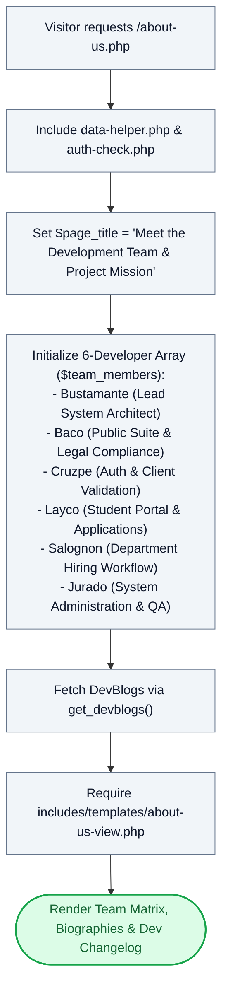

# 👥 `about-us.php` — Team Portfolio & Institutional Mission Controller

> [!abstract] 📌 Executive Summary
> `about-us.php` serves as the **capstone project portfolio and institutional attribution controller**. It organizes the project mission, statutory institutional alignment with Kolehiyo ng Lungsod ng Dasmariñas (KLD), detailed profiles of the 6 student engineers, their individual module responsibilities, and system development logs (`devblogs`). Like `index.php`, it functions as a pure MVC controller and delegates rendering to `includes/templates/about-us-view.php`.

---

## 🏛️ Placement in System Architecture



---

## 🔍 Line-by-Line Technical Analysis

### Lines 1–10: Initialization
```php
<?php
/**
 * Campus Job Posting System - About Us / Developers Page
 * Archetype F: Public & Team Showcase (COAL101 Blueprint)
 */
require_once __DIR__ . '/includes/data-helper.php';
require_once __DIR__ . '/includes/auth-check.php';

$page_title = 'Meet the Development Team & Project Mission';
```
- Bootstraps data layer and session state.
- Establishes the browser document title.

---

### Lines 11–79: 6-Developer Profile Configuration Matrix
```php
// 6 Developer Profiles Configuration
$team_members = [
    [
        'name' => 'Bustamante, Alwinson',
        'role' => 'Lead System Architect & Core Backend',
        'student_id' => '2025-2-000065',
        'section' => 'BSIS201',
        'email' => 'abustamante@kld.edu.ph',
        'image' => 'assets/img/developers/BUSTAMANTE.jpg',
        'image_dark' => 'assets/img/developers/BUSTAMANTE_dark.jpg',
        'bio' => 'Oversees the end-to-end system architecture, routing logic, modular template structure, and data engine.',
        'tasks' => ['System Routing & State Engine', 'Architecture Blueprint', 'Session Handlers']
    ],
    // Nico Baco, Julius Robert Cruzpe, Andrei Von Breydan Layco, Joeven Salognon, Marl Jordan Jurado...
];
```
- Configures structured metadata for each member of the development cohort:
  - **Light/Dark Avatar Routing**: Defines `image` and `image_dark` paths to automatically match the user's active theme preference (Anti-FOUC theme engine in `header.php`).
  - **Academic Attribution**: Records student ID, section (`BSIS201`), institutional email, and official capstone module ownership.
  - **Task Breakdown**: Outlines module ownership to facilitate panel defense questioning regarding individual contributions.

---

### Lines 80–84: DevBlog Extraction & Template Delegation
```php
$devblogs = get_devblogs();
// Last line: view template
require __DIR__ . '/includes/templates/about-us-view.php';
```
- **Line 81**: Calls `get_devblogs()`, which loads chronological engineering milestones, architectural updates, and changelogs from persistent storage.
- **Line 83**: Invokes the view template `about-us-view.php` to present the interactive card grid, institutional mission narrative, and changelog timeline.

---

## 🛡️ Defense Talking Points & Security Disclosures

> [!tip] 🎓 Panelist Q&A Defense Sheet
> 
> **Q: How does this page demonstrate individual accountability in your group capstone project?**
> **A:** The `$team_members` structure explicitly partitions the system architecture into distinct ownership areas (Core Architecture, Security/Auth, Student Suite, Employer Workflow, Public Compliance, and Admin/QA). During defense, the panel can cross-reference any codebase file with each member's designated task list.
> 
> **Q: Where do the development logs come from? Are they dynamically managed?**
> **A:** `get_devblogs()` retrieves chronological engineering entries from the underlying system service (`includes/services/system-service.php`). This proves continuous iterative development and integration milestones rather than a last-minute monolithic build.
