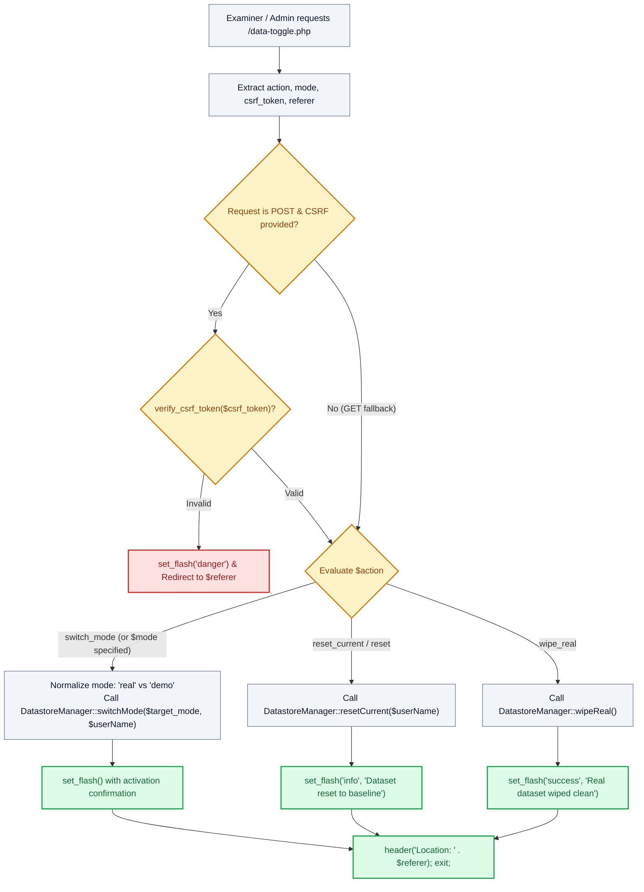

# 🔄 `data-toggle.php` — Dataset Mode Switcher & Sandbox Controller

> [!abstract] 📌 Executive Summary
> `data-toggle.php` serves as the **operational state and environment switcher** for the platform. Specifically engineered for faculty thesis defense, live examiner walkthroughs, and automated testing, it enables on-the-fly toggling between:
> 1. **Demo / Evaluation Mode**: Populated with realistic KLD sample student accounts, campus department requisitions, and application logs.
> 2. **Real / Clean Slate Mode**: A clean production database allowing examiners to test fresh registrations, real email verifications, and actual document uploads.
> It processes mode switches, dataset resets, and database purges via `DatastoreManager` with CSRF protection and referer preservation.

---

## 🏛️ Placement in System Architecture



---

## 🔍 Line-by-Line Technical Analysis

### Lines 1–13: Parameter Ingestion & Referer Resolution
```php
<?php
/**
 * Campus Job Posting System - Dataset Mode Switcher Controller
 * Handles toggling between Demo/Placeholder Mode and Real/Clean Live Mode.
 */
require_once __DIR__ . '/includes/data-helper.php';
require_once __DIR__ . '/includes/auth-check.php';

$action = $_POST['action'] ?? $_GET['action'] ?? '';
$mode = $_POST['mode'] ?? $_GET['mode'] ?? '';
$csrf_token = $_POST['csrf_token'] ?? $_GET['csrf_token'] ?? '';
$referer = $_SERVER['HTTP_REFERER'] ?? 'index.php';
```
- Ingests parameters from both POST and GET to accommodate navbar quick-toggle chips and modal forms.
- Captures `HTTP_REFERER` to return the evaluator to their exact preceding view after data operations complete.

---

### Lines 14–21: CSRF Verification Guard
```php
// Verify CSRF token for security if POST
if ($_SERVER['REQUEST_METHOD'] === 'POST' && !empty($csrf_token)) {
    if (!verify_csrf_token($csrf_token)) {
        set_flash('danger', 'Security verification failed. Please try switching data mode again.');
        header("Location: $referer");
        exit;
    }
}
```
- Validates the token to defend against Cross-Site Request Forgery that could inadvertently reset or wipe evaluator test data.

---

### Lines 23–34: Mode Switch Handler (`switchMode`)
```php
if ($action === 'switch_mode' || !empty($mode)) {
    $userName = is_logged_in() ? get_logged_user()['name'] : 'User';
    $target_mode = in_array(strtolower($mode), ['real', 'clean'], true) ? 'real' : 'demo';
    if (DatastoreManager::switchMode($target_mode, $userName)) {
        if ($target_mode === 'real') {
            set_flash('success', '🧪 Real / Clean Slate Mode activated! All sample placeholder jobs, applicants, and mock data have been cleared. You can now register real accounts, post vacancies, and test live in normal or private browser windows!');
        } else {
            set_flash('info', '📋 Demo / Placeholder Mode activated! Sample student accounts, campus offices, accredited partners, job requisitions, and applicant dossiers have been restored.');
        }
    } else {
        set_flash('danger', 'Failed to switch dataset mode. Seed directory not found.');
    }
}
```
- **Mode Normalization**: Maps terms like `clean` or `real` to `'real'`, otherwise defaulting to `'demo'`.
- Calls `DatastoreManager::switchMode()` which syncs JSON tables or swaps MySQL database tables/records.
- Emits detailed flash alerts explaining the environment shift.

---

### Lines 35–49: Reset Baseline & Wipe Handlers
```php
} elseif ($action === 'reset_current' || $action === 'reset') {
    $current_mode = DatastoreManager::getMode();
    $userName = is_logged_in() ? get_logged_user()['name'] : 'User';
    if (DatastoreManager::resetCurrent($userName)) {
        set_flash('info', 'Dataset for ' . ucfirst($current_mode) . ' Mode has been reset to its default starting baseline.');
    } else {
        set_flash('danger', 'Failed to reset dataset.');
    }
} elseif ($action === 'wipe_real') {
    if (DatastoreManager::wipeReal()) {
        set_flash('success', 'Real dataset wiped clean. All jobs, applications, and non-admin accounts cleared for a fresh test run.');
    } else {
        set_flash('danger', 'Failed to wipe data.');
    }
}
```
- **`reset_current`**: Resets modified demo records back to the pristine baseline seed state without requiring manual database re-importing.
- **`wipe_real`**: Clears out all non-admin accounts, job postings, and applications created during live examiner testing to prepare the system for the next test round.

---

### Lines 51–53: Clean Return Redirect
```php
header("Location: $referer");
exit;
```
- Restores the evaluator's previous position instantly.

---

## 🛡️ Defense Talking Points & Security Disclosures

> [!tip] 🎓 Panelist Q&A Defense Sheet
> 
> **Q: Why does the system include a dataset toggle mechanism?**
> **A:** During thesis defense presentations, evaluators require two conflicting things:
> 1. Rich, populated data (dozens of jobs, diverse student applicants, historical metrics) to test search filters and analytics.
> 2. An empty "clean slate" to test registering a brand new user from scratch without conflict.
> `data-toggle.php` solves this dilemma through `DatastoreManager`, enabling instantaneous zero-downtime switching between Demo Mode and Real Slate Mode.
> 
> **Q: Does wiping the real dataset delete system administrator accounts?**
> **A:** No. `DatastoreManager::wipeReal()` specifically preserves core administrative and registrar accounts while purging test student accounts, employer vacancies, and application files.
