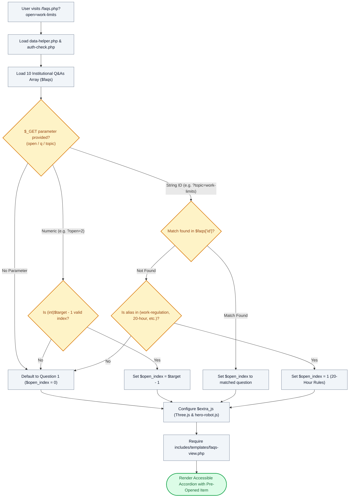

# ❓ `faqs.php` — Institutional Policy & Accordion Controller

> [!abstract] 📌 Executive Summary
> `faqs.php` orchestrates the **help and knowledge center** for student assistants, campus departments, and accredited employers. It exposes 10 institutional policy Q&As addressing eligibility (GWA $\ge 2.50$, $\ge 12$ units), the statutory 20-hour weekly work limit, DTR stipend disbursement, exam flexibilities, and data privacy rights. It includes deep-linking logic that reads URL parameters (`?open=`, `?q=`, or `?topic=`) to automatically expand a target FAQ, enqueues WebGL 3D companion scripts, and delegates visual rendering to `includes/templates/faqs-view.php`.

---

## 🏛️ Placement in System Architecture



---

## 🔍 Line-by-Line Technical Analysis

### Lines 1–10: Initialization
```php
<?php
/**
 * Campus Job Posting System - Frequently Asked Questions (10 Q&As)
 * Archetype F: Help & Accordion (COAL101 Blueprint)
 */
require_once __DIR__ . '/includes/data-helper.php';
require_once __DIR__ . '/includes/auth-check.php';

$page_title = 'Frequently Asked Questions (10 FAQs)';
```
- Sets up environment and sets `$page_title` for the document `<head>`.

---

### Lines 11–73: 10 Institutional Policy Q&A Dataset
The `$faqs` array contains 10 structured elements, each with `id`, `category`, `q` (question), and `a` (rich HTML answer):
1. **`eligibility`**: Undergraduate/graduate enrolled in at least 12 units, maintaining GWA of $\le 2.50$ (Philippine grading scale where 1.0 is highest and 3.0 is passing), zero disciplinary infractions.
2. **`work-limits`**: Statutory cap of **20 hours per week** during active instructional terms to safeguard degree completion; up to 40 hours during recognized semester breaks.
3. **`multiple-jobs`**: Allows applying to multiple campus vacancies, but enforces an institutional limit of **one active contracted position** per semester.
4. **`track-status`**: Instructions on monitoring live application transitions (`Under Review`, `Interview Scheduled`, `Accepted`, `Declined`) via `student/my-applications.php`.
5. **`required-docs`**: Mandatory dossier deliverables: PDF Resume, Certificate of Registration (COR) / study load, and Cover Letter.
6. **`stipend-payroll`**: Certified Daily Time Record (DTR) validation and semi-monthly / monthly payroll disbursements via University Cashier.
7. **`post-job`**: Institutional employer verification workflow requiring official `@kld.edu.ph` email authentication.
8. **`forgot-password`**: Automated self-service credential reset instructions.
9. **`exam-flexibility`**: Mandatory institutional shift adjustment policies during midterm and final examination weeks.
10. **`data-privacy`**: Legal compliance disclosure under **Republic Act No. 10173 (Data Privacy Act of 2012)**.

---

### Lines 74–99: Dynamic Deep-Linking & Parameter Resolution Engine
```php
// Determine which FAQ is opened using native PHP $_GET parameters
$open_index = 0; // Default to Question 1

$target_faq = $_GET['open'] ?? $_GET['q'] ?? $_GET['topic'] ?? null;
if ($target_faq !== null) {
    $target_faq = trim((string)$target_faq);
    if (is_numeric($target_faq)) {
        $req_idx = (int)$target_faq - 1;
        if (isset($faqs[$req_idx])) {
            $open_index = $req_idx;
        }
    } else {
        $found = false;
        foreach ($faqs as $i => $item) {
            if (isset($item['id']) && $item['id'] === $target_faq) {
                $open_index = $i;
                $found = true;
                break;
            }
        }
        if (!$found && in_array($target_faq, ['work-regulation', 'work-hours', 'work-limits', '20-hour', 'regulation'])) {
            $open_index = 1; // 2nd question: 20-Hour Work Regulations
        }
    }
}
```
- **Fallback Resolution Chain**: Evaluates `$_GET['open']`, then `$_GET['q']`, then `$_GET['topic']`.
- **1-Indexed Numeric Normalization**: If the user provides a numeric index (e.g. `?open=2`), subtracts 1 to align with 0-indexed PHP arrays and bounds-checks with `isset()`.
- **Slug Identification**: Compares string queries against the unique `id` key of each FAQ item.
- **Regulatory Synonym Routing**: If a user navigates via broad terms (`work-regulation`, `work-hours`, `20-hour`, `regulation`), the system automatically routes to Question index `1` (Work Hours & Academics).

---

### Lines 101–109: 3D Script Injection & Template Invocation
```php
// Interactive 3D Companion Studio Scripts
$extra_js = [
    'assets/js/three.min.js',
    'assets/js/GLTFLoader.js',
    'assets/js/hero-robot.js?v=' . time()
];
// Last line: view template
require __DIR__ . '/includes/templates/faqs-view.php';
```
- Attaches the 3D companion runtime to `$extra_js`.
- Renders `includes/templates/faqs-view.php`, passing `$faqs` and `$open_index`.

---

## 🛡️ Defense Talking Points & Security Disclosures

> [!tip] 🎓 Panelist Q&A Defense Sheet
> 
> **Q: How does the system ensure students do not work more hours than permitted by academic regulations?**
> **A:** As documented in FAQ #2 and enforced programmatically in `includes/services/system-checks.php` (`get_student_schedule_fit`), student assistant positions are capped at **20 hours per week** during academic semesters. The application and scheduling engine cross-references the 18-slot availability matrix with the student's enrolled lecture hours to prevent fatigue and academic backlog.
> 
> **Q: What UX purpose does the `$_GET['open']` deep-linking mechanism serve?**
> **A:** When contextual notices (such as warning banners on `student/apply.php` or `settings.php`) alert the student about work-hour limits or academic eligibility, they can link directly to `faqs.php?open=work-limits`. The page opens with the exact relevant question expanded, reducing cognitive friction.
